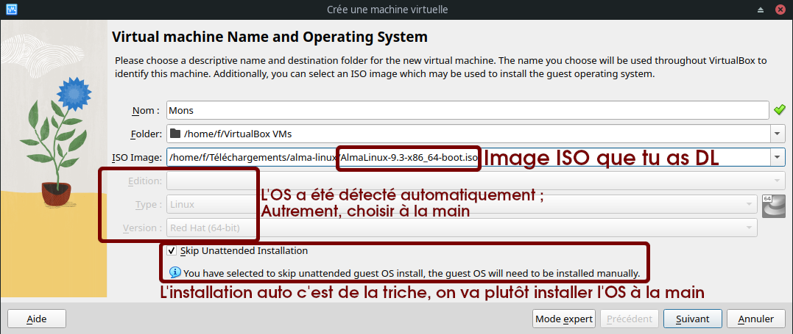

# 1.1 - Installation du système d'exploitation

## 1.1.0 Introduction

Il n'y a <b>pas UN, mais DES systèmes Linux</b>.

Contrairement à, par exemple, Windows ou MacOS, qui à la version près, donnent des installations très similaires, **deux systèmes basés sur Linux peuvent s'utiliser et s'administrer de façons complètement différentes**. 

Si vous êtes habitués à utiliser Windows 11 sur votre ordi (mauvaise habitude), vous n'aurez sûrement aucun mal à donner un coup de main à un collègue lui aussi sous Windows 11. Par contre, si vous êtes habitués à utiliser Ubuntu Desktop 22.04 avec environnement de bureau Gnome, vous pourriez avoir bien du mal à ne serait-ce qu'installer un logiciel sur le PC votre collègue sous Arch avec environnement de bureau i3 sans consulter la doc. D'ailleurs, votre box internet tourne sûrement sous Linux, tout comme votre téléphone sous Android qui est basé sur le noyau Linux.

**Linux à proprement parler n'est que le noyau** (*kernel*) de l'OS, c'est-à-dire, un programme assez balèze qui assure des fonctions bas-niveau, comme par exemple :
+ Gestion de la mémoire
+ Ordonnancement des processus
+ Interfaçage des entrées/sorties avec les pilotes matériels (lectures/écritures sur disques, transmission/réception de paquets sur cartes réseaux...)
    - NB : Les pilotes matériels sont des entités indépendantes "branchées" au noyau sous la forme de **modules**
+ Fourniture de services et d'abstractions aux applications
    - Par exemple, l'appel système `write` vous permet d'écrire dans un fichier sans vous préoccuper du type de média ou du système de fichier qui le stocke.
    - Ces interfaces ne sont généralement pas directement utilisées par les applications mais plutôt par des **libraries** comme *glibc* (la bibilothèque C standard GNU), qui offrent des interfaces plus haut niveau - par exemple, `printf` qui permet à un programme d'écrire un message formaté sur sa sortie standard. 

*Si cette notion de noyau n'est pas claire pour vous, faites l'analogie avec un fruit. Le noyau, c'est cette partie dure et indigeste, qui est au centre du fruit, sur laquelle repose la pulpe sucrée (les applications destinées aux utilisateurs). Bon, ça marche surtout avec des fruits comme la pêche ou l'abricot, mais un peu moins avec l'anacarde, je vous l'accorde.*

S'il y a autant de diversité au sein de l'écosystème Linux, c'est notamment parce que :
+ **Linux est polyvalent** : il est utilisé aussi bien sur les ordinateurs de bureau, que les serveurs et périphériques embarqués
+ **Linux se veut libre et customisable** : tous les composants du système sont modifiables à souhait, et pour chaque composant (par exemple, l'environnement de bureau) vous avez le choix parmi un grand nombre d'alternatives
+ La philosophie GNU/Linux encourage les projets hyper-spécialisés : en gros, plutôt que d'avoir un programme compliqué qui peut faire 5 choses différentes, on préfère avoir 5 programmes simples qui font 1 seule chose, mais qui la font bien.
+ L'écosystème Linux est conçu par un grand nombre de personnes différentes à travers le monde qui n'ont rien à voir entre elles.

 

Un système Linux complet est constitué de <b>plusieurs composants</b>.

+ **Le noyau Linux** (*kernel*)
    - C'est un projet *Open Source* : son code source est mis à disposition publiquement et gratuitement ([www.kernel.org](https://www.kernel.org)). Des milliers de développeurs y contribuent.
    - Une fois le code compilé, il prend la forme d'un exécutable que votre machine charge en mémoire lorsqu'elle démarre.
    - Il doit être compilé avec des paramètres l'adaptant spécialement à votre machine et à l'usage que vous souhaitez en faire.
        * Par exemple, vous avez intérêt à le compiler pour la bonne architecture de processeur
        * Sur des objets connectés, vous aurez tendance à éliminer toutes les fonctionnalités superflues pour ne garder que le nécessaire
+ **Les modules de kernel**
    - Certains sont des drivers pour votre matériel, d'autres des modules qui gèrent vos systèmes de fichiers ...
    - Par exemple, vous pouvez avoir besoin d'installer un module pour supporter une antenne WiFi externe ou lire une partition de disque utilisant NTFS (système de fichiers utilisé pour la partition système sous Windows)
    - La plupart des modules sont compilés en même temps que le noyau, et en général, les modules dont vous avez besoin sont chargés automatiquement au démarrage. Vous n'avez pas en vous en occuper, ouf.
+ **Les applications**
    - Tous les programmes avec lesquels vous interagissez :
        * Votre environnement graphique de bureau, si vous en avez un ...
        * Le shell qui interprète vos lignes de commandes...
        * Le gestionnaire de paquets avec lequel vous installez d'autres applications...
        * Votre navigateur, éditeur de texte, etc...
        * Un serveur web, un service qui synchronise l'horloge de votre ordinateur ...
            * NB : Ces applications que l'on exécute généralement en tâche de fond et qui restent actives longtemps sont appelées des *daemons*
    - NB : les utilitaires en ligne de commande les plus utilisés, comme par exemple `cp` qui sert à copier des fichiers, font partie des [*GNU Core Utils*, du projet *GNU*](https://fr.wikipedia.org/wiki/GNU_Core_Utilities). C'est pour cela que l'on entend souvent parler de GNU/Linux : ces applications sont installées sur pratiquement tous les systèmes Linux et sans elles, un système Linux ne servirait pas à grand chose.
+ **Les libraries**
    - Des "morceaux de code compilé" utilisés par les applications.
    - Les libraries peuvent être *statiquement* liées ou *dynamiquement* liées.
        * Une *statically linked library* est intégrée à l'exécutable de l'application. C'est facile à gérer, par contre ça vous fait un exécutable plus lourd sur disque et en mémoire.
        * Une *dynamically linked library* (ou un *shared object*) est chargée une bonne fois pour toutes, dans un espace mémoire partagé accessible à toutes les applications.
            * NB : c'est l'équivalent des *DLL* sous Windows
            * Un exemple de *shared object* incontournable est la *glibc* ([*GNU C Library*](https://fr.wikipedia.org/wiki/GNU_C_Library)), une implémentation de bibliothèque C standard implémentée pour le projet *GNU*. Enormément d'applications l'utilisent - elle sert aussi de base à d'autres langages de programmation plus simples que le C.

 

Et là normalement, vous vous dites : "c'est bien compliqué tout ça, je vais rester sur Windows finalement". Mais, ne partez pas tout de suite, parce que c'est justement pour ça qu'ont été inventées les distributions.

Nous allons donc :
+ <u>Expliquer ce qu'est une distribution Linux</u>
+ Présenter <u>les distributions Linux les plus répandues</u>
+ Vous proposer d'<u>installer une distribution pour serveurs</u>.

## 1.1.1 Qu'est-ce qu'une distribution

#### Principe d'une distribution

Une distribution, c'est en quelque sorte un colis qui <b>contient à lui seul tout le nécessaire pour obtenir un système Linux opérationnel</b>.

En installant la bonne distribution, **vous obtiendrez donc, automatiquement** :
+ **Un noyau paramétré comme il faut** pour votre matériel, avec **tous les modules nécessaires**
+ Des **applications et des librairies essentielles**
    - Par exemple, un gestionnaire de paquets pour pouvoir installer facilement d'autres applications
+ Des **applications et librairies dédiées à votre usage**
    - Par exemple, un environnement de bureau peu gourmand en ressources pour un vieux PC en fin de vie

C'est un peu comme quand vous commandez un PC déjà monté, sans vous embêter à choisir les composants un par un et à modifier la vitesse des ventilateurs ou la fréquence des CPU.

Une distribution se veut adaptée à un **type d'usage particulier** :
+ Serveurs
+ Postes de travail d'entreprise
+ PCs perso, voire plus spécifiquement :
    - Pour les jeux vidéo
    - Pour la bureautique
    - Pour le montage vidéo
    - Pour les vieux PC peu puissants...
+ Smartphones
+ Informatique embarquée
+ Et d'autres encore...

Certaines distributions ciblent aussi un **public particulier** : les débutants, les entreprises, les fous de la customisation...

 
Tl;dr : 

 

#### Dépôts de paquets, notion de "stabilité" et modèles de releases

+ La grande majorité des distributions proposent des **dépôts de paquets** (*repositories*) en ligne qui vous permettent de télécharger des applications, mais aussi des noyaux, libraries, modules et des mises à jour pour tout ce beau monde.
    - Ces paquets sont spécialement adaptés pour votre distribution. 
    - Le gestionnaire de paquets fourni par votre distribution vous permet d'**installer toutes leurs dépendances automatiquement.**
    - La communauté ou l'organisation qui gère ces dépôts peut être plus ou moins réactive pour les mettre à jour, d'où la notion de **stabilité**.

+ En fonction du type d'usage, du public visé, et de la configuration de leur gestionnaire de paquets, les distributions ont tendance à être **plus ou moins _stables_**.
    - <u>Plus une distribution est stable, moins votre système évoluera rapidement dans le temps</u> : vous ne **mettrez pas souvent à jour** vos applications, noyau, libraries et modules. L'évolution du système se fera sur des **cycles longs**.
        * Vous aurez donc **moins de risques d'avoir des bugs ou des failles de sécurité**.
        * Vous aurez par contre du mal à bénéficier des évolutions les plus récentes. 
            * Si un nouveau driver promettant d'améliorer drastiquement les performances de votre carte graphique est sorti, mais qu'il n'a pas encore été approuvé par les gestionnaires de votre dépôt, vous devrez l'installer par vos propres moyens ou attendre 6 mois qu'il soit intégré au dépôt de votre distribution.
    - À l'inverse, <u>une distribution qui ne se vante pas d'être stable vous proposera fréquemment des mises à jour et vous donnera un accès facile aux derniers paquets</u>. En revanche, vous avez plus de risques de connaître des bugs après une mise à jour.
    - Les **entreprises et les administrateurs de serveurs** ont donc naturellement tendance à privilégier les distributions **stables**, là où ce peut être frustrant pour un utilisateur de PC qui préfèrera souvent une distribution plus réactive.

+ Il y a deux **modèles de "releases"** pour la mise à jour des dépôts :
    - Les [**_point_** releases](https://vanillaos.org/blog/article/2023-01-31/point-vs-rolling-release-and-the-modern-solutions), ou *periodic* releases
        * Les dépôts sont versionnés et les nouvelles versions sont publiées à **intervalles longs et réguliers** (6-12 mois)
        * Généralement **plus stables**
        * Moins de risques d'échec de la mise à jour automatique
    - Les [**_rolling_** releases](https://wiki.manjaro.org/index.php/The_Rolling_Release_Development_Model)
        * Les dépôts sont mis à jour paquet par paquet, à n'importe quel moment, plutôt qu'à des intervalles réguliers
        * **Nouveautés disponibles rapidement**, souvent moins stable
        * Il faut faire ses mises à jour fréquemment et avant d'installer de nouveaux paquets, sinon on risque de casser des dépendances
    - Même pour des distributions optant pour les *point releases*, les __*bugfixes* et patches de sécurité sont déployés dès que possible__.
    - Il souvent possible d'activer des repos instables sur une distribution *point* releases pour bénéficier de paquets plus récents, mais c'est à proscrire en environnement de production !

 

## 1.1.2 Présentation des distributions Linux phare

Il existe toute une floppée de distributions. De plus, certaines distributions sont basées sur d'autres (on parle souvent de <b>familles</b> de distributions). Voyez par vous-mêmes :

+ [Liste (non-exhaustive) des distributions Linux grand-public](https://fr.wikipedia.org/wiki/Liste_des_distributions_GNU/Linux)
+ [Arbre généalogique des distributions Linux](https://fr.wikipedia.org/wiki/Liste_des_distributions_GNU/Linux#/media/Fichier:Liste_des_distributions_Linux.svg)
    - En général, connaître une distribution particulière vous donne les clefs pour maîtriser toute la famille à laquelle elle appartient.
        * Habitué à Ubuntu, vous n'aurez pas de soucis sur un Debian ou un Linux Mint...
        * Habitué à Alma Linux, vous n'aurez pas de soucis sur un RHEL ou un Fedora ... etc

|                     | Distribution              | Famille | Commerciale | Propres dépôts | Stabilité  | Release model             | Usage et public recommandé                                                  | Description |
|---------------------| ---------------------------- | ------- | ----------- | -------------- | ---------- | ------------------------- | --------------------------------------------------------------------------- | ----------- |
| &nbsp;&nbsp;&nbsp;&nbsp;&nbsp;&nbsp;&nbsp;&nbsp;&nbsp;  | **RHEL**                     | RHEL    | Oui         | Oui            | Très haute      | Point (=6 mois)           | **Production**/PC entreprise, débutants/intermédiaire                  | Très **populaire en entreprise**. **Importante stabilité**. Un **abonnement est nécessaire** pour l'utilisation de l'OS et des repos (version d'essai dispo). RedHat vend aussi du support, d'autres logiciels et conclut des partenariats avec des fournisseurs de services Cloud |
|   | **Alma Linux & Rocky Linux** | RHEL    |             | Oui            | Très haute      | Point (=6 mois)           | **Production**/PC domestique/PC entreprise, débutants/intermédiaire    | **Clones en tout point semblables à RHEL, mais non commerciaux** ; *NB : Rocky Linux remplace CentOS.*  Importante stabilité. Très populaire en entreprise. |
|  | **Fedora**                   | RHEL    |             | Oui            | Moyenne    | Point (~6-8 mois) | PC domestique/PC entreprise, intermédiaire                         | RHEL-like principalement pour usage Desktop ; Cycle de développement rapide plutôt que stabilité (**releases <u>majeures</u> fréquentes**), sert en quelque sorte de laboratoire à RedHat pour l'intégration de nouvelles features dans RHEL et ses clones. |
|  | **Debian**                   | Debian  |             | Oui            | Très haute | Point (~2 ans)            | **Production**/PC domestique/PC entreprise/conteneurs, intermédiaire   | Populaire et très stable. Pas aussi user-friendly qu'Ubuntu et ses forks |
|  | **Ubuntu**                   | Debian  | Non, mais support et partenariats     | Oui            | Haute      | Point (=6 mois)           | **Production**/PC domestique/PC entreprise/Mobile/conteneurs, débutant | Distribution extrêmement populaire et accessible aux débutants. Développement et gestion des repos par Canonical, qui se fait du blé en vendant du support et à travers des partenariats avec des fournisseurs Cloud. |
|  | Zorin OS                     | Debian  | Version pro | Non (Ubuntu)   | Haute      | Point (=6 mois)           | PC domestique/PC entreprise, débutant                                  | Comme un ubuntu ; Plusieurs environnements de bureau possibles (dont un Windows-Like et un MacOS-Like); Support natif du gestionnaire de paquets Flatpak installé par défaut pour les applications third-party |
|  | Pop! OS                      | Debian  |             | Oui   | Haute      | Point (=6 mois)           | PC domestique/PC entreprise, débutant                                  | Comme un Ubuntu avec un environnement de bureau différent et quelques fonctionnalités additionnelles, comme la possibilité de chiffer son disque à l'installation |
|  | Linux Mint               | Debian  |             | Oui            | Haute      | Point (~6 mois)           | PC domestique, débutant                                            | Distro desktop très populaire, facile d'utilisation même pour votre grand-mère, environnement de bureau Cinnamon ressemblant à Windows. |
|  | Elementary OS            | Debian  |             | Non (Ubuntu)       | Moyenne    | Point (=6 mois)           | PC domestique, débutant                                            | Environnement de bureau ressemblant fortement à celui de **MacOS** |
|  | **Kali Linux**               | Debian  |             | Oui            | Moyenne    | Rolling                   | PC domestique, intermédiaire/h4ck3r                                | Distro de hacking par excellence ; Beaucoup d'outils de pentest, possibilité de se log comme root sur l'environnement de bureau |
|  | **Arch**                     | Arch    |             | Oui            | Faible     | Rolling                   | PC domestique, avancé/bidouilleurs                                 | Difficile à installer, **bien pour découvrir les composants d'un système Linux**, doc bien fournie, **repos mis à jour fréquemment**. Sympa pour un Desktop, pas pour un serveur |
|  | **Manjaro**                  | Arch    |             | Oui            | Faible     | Rolling                   | PC domestique, intermédiaire                                       | Surcouche de Arch **facile à installer**, **nombreux environnements de bureau** possibles, **bonne prise en charge du matériel**, **large communauté d'utilisateurs** ; Bugs occasionnels |
|  | Garuda Linux             | Arch    |             | Non (Arch)     | Faible     | Rolling                   | PC domestique, intermédiaire                                       | Idem que pour Manjaro |
|  | Endeavour OS             | Arch    |             | Oui            | Faible     | Rolling                   | PC domestique, intermédiaire/avancé                                | Surcouche de Arch facile à installer, plusieurs environnements de bureau possibles, livrée avec peu d'applications par défaut (amateurs de lignes de commandes) ; Bugs occasionnels |
|  | **SUSE Linux Enterprise**    | SUSE    | Oui         | Oui            | Haute      | Point (~1 an)             | **Production**/PC entreprise, intermédiaire                            | Distro d'entreprises, tout à fait honorable ; Vente de services de support ; Contrairement à RedHat, ce ne sont pas des FDP et ils **ne se sont pas fachés avec les 3/4 de la planète.** |
|  | **OpenSUSE Leap**            | SUSE    |             | Oui            | Haute      | Point (~1 an)             | **Production**/PC enterprise/PC domestique, intermédiaire              | Clone non-commercial de SUSE Linux Enterprise ; Orientée **Desktop ou serveur de prod** |
|  | **OpenSUSE Tumbleweed**      | SUSE    |             | Oui            | Haute      | Rolling                   | PC entreprise / PC domestique, intermédiaire                       | Idem que OpenSUSE Leap mais avec rolling-releases ; Orientée **Desktop ou serveur maison** |
|  | **Alpine Linux**             | Alpine  |           | Oui            | Haute      | Point (=6 mois)           | Conteneurs, intermédiaire                                          | Distro **ultra-légère** massivement utilisée dans les **conteneurs** ; **Très peu d'utilitaires disponibles par défaut** ; N'utilise pas *systemd* mais *SysV Init* |
|  | Raspberry Pi OS          | Debian  |             | Oui            | Très haute | Point (~2 ans)            | Raspberry Pi, intermédiaire/bidouilleur                            | (Anciennement Raspbian) Un Debian optimisé pour le Raspberry Pi (leur distro officielle) ; Peut très bien servir de serveur Web, serveur FTP, NAS, endpoint VPN... |
|  | OpenWRT                  | OpenWRT |             | Oui            | Moyenne    | Point (=6 mois)           | Embarqué/Micro-ordinateur, intermédiaire/bidouilleur               | Distro utilisée pour faire des **équipements réseau** : routeur, access point, portail captif ... **Interface web pour la configuration en tant que routeur/access point**. Selon le matos, peut aussi très bien servir de serveur Web, serveur FTP, NAS, endpoint VPN... |
|  | Gentoo                   | Gentoo  |             | Oui            | Faible     | Rolling                   | PC domestique, sado-maso                                           |  ̶i̶n̶s̶t̶a̶l̶l̶ ̶g̶e̶n̶t̶o̶o̶ |

[Plus de distributions](https://en.wikipedia.org/wiki/Comparison_of_Linux_distributions)

## 1.1.3 Choisir une distribution Linux adaptée aux serveurs
#### Voici ce que l'on attend d'une distribution pour serveurs :
+ **Stabilité**
+ Vaste communauté, doc bien fournie
    - Pour avoir des chances de trouver des tutos, et de l'aide en cas de problème
+ Prise en charge sur une **longue durée**.
    - Mise à jour des dépôts, déploiement de correctifs
    - En entreprise, disponibilité des services de support
+ **Pas d'interface graphique ni d'applications superflues** (navigateur...)
    - Par soucis de performances, de taille de l'installation et de l'installateur ...
    - Il est toujours possible d'installer une interface graphique plus tard si nécessaire
+ Des applications et une configuration par défaut adaptées
    - Par exemple, un serveur SSH pour se connecter à distance

#### Nous recommandons l'une des deux distributions suivantes :
+ [**Ubuntu Server 22.04 LTS**](https://releases.ubuntu.com/22.04/)
    - _**"LTS"**_ signifie *"Long-Term Support"*. De telles versions d'Ubuntu sortent tous les deux ans et ont une **durée de support total garantie de 5 ans** à partir de leur date de sortie. Elles continuent ensuite de recevoir des **mises à jour de sécurité pendant 5 autres années**.
        * *NB : Ubuntu 24.04 LTS sortira en avril 2024.*
    - Vous aurez selon toute probabilité besoin de l'installateur `amd64`.
    - À privilégier si :
        * Vous souhaitez vous familiariser avec les **écosystèmes Debian et Ubuntu**
        * Votre objectif est de vous former pour rejoindre le **SIA**
+ [**Alma Linux 9**](https://almalinux.org/get-almalinux/)
    - Là aussi, l'on vous promet **5 ans de full-support** à partir de 2022 puis **5 autres années de maintenance (patchs de sécurité et bugfixes majeurs)**.
    - NB: Vous pourriez tout aussi bien opter pour Rocky Linux 9, qui est elle aussi quasiment identique à RHEL 9.
    - À privilégier si :
        - Vous souhaitez vous familiariser avec l'**écosystème RedHat**
        - Votre objectif est de vous former pour une **entreprise** qui utilise un RHEL-like
    - NB : les distributions RHEL-like proposent une interface web de gestion, [Cockpit](https://www.linuxtricks.fr/wiki/administrer-sa-machine-avec-cockpit-fedora-red-hat-et-derivees)
    - Vous aurez selon toute probabilité besoin de l'installateur `Intel/AMD x86_64`.
        * Nous recommandons l'image de type *"DVD"* (installation complète hors ligne).

## 1.1.4 Installation d'une distribution pour serveurs
Le tuto qui suit est destiné aux **grands débutants**. L'installation d'une distribution grand public est **très intuitive**, et vous trouverez facilement de la **doc en ligne**. N'hésitez donc pas à vous passer de ce tuto.

### 1.1.4.1 Installation sur une machine virtuelle

L'installation sur VM vous permettra d'utiliser Linux depuis votre système hôte.

Vous pourrez aussi créer plusieurs VMs pour simuler un parc de serveurs.

C'est très pratique pour se faire un système de test "jetable", que l'on peut bousiller sans soucis et supprimer quand on n'en veut plus. Mais ce peut aussi être un **moyen tout à fait sérieux d'héberger des services** de manière pérenne. 

D'ailleurs, la plupart des admins hébergent leurs services sur des VMs : cela offre en effet une **grande flexibilité dans la gestion** du système (allocation de ressources, duplication, sauvegarde, facilité de connexion à d'autres VMs...).

<i>NB : Le programme qui gère la virtualisation s'appelle un <b>"hyperviseur"</b>.</i>

+ _Lorsque le logiciel de virtualisation est installé par dessus un autre OS, à l'instar d'un VirtualBox installé sur Windows, on parle **d'hyperviseur de type 2**._
    - _VMware Workstation, VirtualBox ..._
+ _À l'inverse, lorsque le système de virtualisation fonctionne à même le matériel, on parle **d'hyperviseur de type 1** - ce type d'hyperviseurs, utilisé en production, est **beaucoup plus performant**._
    - _VMWare ESXi, ProxMox, oVirt ..._
    - _La plupart des services gérés par le SIA tournent un hyperviseur ProxMox._

#### 1.1.4.1.A Mise en place de la VM

Nous utiliserons <i>VirtualBox</i> pour notre exemple.

##### I. Créer la VM

+ **a. "Nouvelle"**
    - 
+ **b.  Définir les paramètres de la VM, notamment :** 
    - 
    - *Folder* : où stocker les fichiers de la VM sur le système hôte
    - __*ISO Image*__ : l'image ISO de l'installateur téléchargé
    - *Edition*, *Type*, *Version* : si pas détecté automatiquement, en fonction de la distribution installée.
    - Si l'option *Skip unattended installation* est disponible, décocher la case pour réaliser l'installation manuellement.
+ **c. Allouer des ressources à la VM** 
    - 
    - **Minimum 2048M de RAM**. Selon l'utilisation que vous prévoyez faire du serveur et votre matos, vous pouvez en mettre plus.
        * *NB: Si vous prévoyez de jouer plus tard avec Docker et Kubernetes, mettez plutôt 4096M de RAM*
    - **2 CPUs** pour être tranquille.
        * *NB: Si vous prévoyez de jouer plus tard avec Docker et Kubernetes, 4 CPU ne feront pas de mal, si vous pouvez vous le permettre.*
    - *NB : vous pourrez toujours facilement changer ces paramètres plus tard*
+ **d. Créer un disque virtuel pour le système** 
    - **20G** pour être tranquille.
        * *NB: Si vous prévoyez de jouer plus tard avec Docker et Kubernetes, 30G seront plus confortables*.
        * Vous pourrez toujours ajouter d'autres disques si besoin
    - **Allocation dynamique** : ce sera un peu plus lent en écriture, mais ça vous permet de n'occuper sur votre système hôte que l'espace réellement utilisé sur le disque virtuel.
    - 

##### II. Point sur les paramètres réseau de la VM

Par défaut, la VM est connectée à votre hôte <a href="https://www.virtualbox.org/manual/ch06.html">en mode "NAT"</a>, ce qui veut dire que votre VM communique avec le monde extérieur à travers l'IP de votre système hôte.

Nous allons pour le moment garder ce mode par défaut, qui facilite la connexion depuis le réseau WiFi de l'UTT. Il y a toutefois quelques choses à savoir :

+ Le mode NAT implique que, chaque fois que vous souhaiterez exposer un service, vous devrez **créer une règle NAT** ("Ouvrir un port" comme on dit parfois) sur votre système hôte pour accéder au service depuis l'extérieur de la VM.
    - E.g. *"Redirige les paquets pour 192.168.1.10:8080 vers 192.168.122.1:80"* pour exposer un serveur web qui écoute sur le port 80.
+ Cela complique aussi la communication inter-VMs

Si vous suivez ce tuto **<u>chez vous</u>**, préférez [le **mode "Bridge"**](https://www.virtualbox.org/manual/ch06.html) - votre **VM sera sur le même réseau local que votre système hôte**, comme si elle était elle aussi **directement connectée à votre box**. Vous pourrez facilement accéder à ses services depuis l'extérieur et configurer des règles spécialement pour votre serveur sur votre box. Vos VMs communiqueront facilement entre elles.

 Configurer le réseau de votre VM en mode "Bridge"

**ATTENTION** - Si vous configurez votre machine sur le <u>réseau WiFi de l'UTT, vous ne pourrez pas vous connecter en mode "Bridge". Dans ce cas, restez en mode NAT.</u>

+ **Configuration** > **Réseau**
+ Mode d'accès réseau : **Accès par pont**
+ Name : l'interface avec laquelle le système hôte accède à Internet
+ Advanced > Mode promiscuité : **Allow All**

##### III. Démarrer la VM

*Si votre souris se retrouve "coincée" dans la fenêtre de la VM, appuyez sur `Ctrl droite`*

#### 1.4.1.B Installation de la distribution

Nous choisissons Alma Linux 9 pour notre exemple.

L'installation d'Ubuntu Server se déroule de manière très similaire, mais l'installateur est légèrement moins facile d'utilisation (navigation avec le clavier, etc). Pour l'installation d'Ubuntu Server, vous pouvez vous référer par exemple à [ce tutoriel](https://ubuntu.com/tutorials/install-ubuntu-server#1-overview).

##### I. Booter sur l'installateur

+ Un menu GRUB2 s'affiche. Choisissez l'option **"Install Alma Linux 9"**
    - 

##### II. Configurer l'installation

+ **a. Sélectionnez votre langue d'installation.**
    - *NB: choisir l'anglais est une bonne pratique, car vous trouverez plus facilement de l'aide en cherchant les messages d'erreur*
    - 
+ **b. S'affiche ensuite un menu avec plusieurs sections. Commencez par la disposition de clavier.** 
    - 
    - *Vous pouvez supprimer la disposition par défaut et choisir celle qui vous convient.*
    - 
+ **c. Choisissez un mot de passe root**
    - L'utilisateur `root`, c'est le Chuck Norris de votre système, il peut absolument tout faire - par exemple, supprimer tous les fichiers du système. Il faut donc s'en servir uniquement quand nécessaire et faire très attention.
    - Désactivez tout de même l'option *"Lock root account"*, qui empêche le login en tant que `root` sur le système. Cela peut servir en cas de problème avec votre compte d'utilisateur.
    - 
+ **d. Créez votre compte utilisateur**
    - Cochez la case *"Make this user administrator"* : vous pourrez ainsi réaliser ponctuellement des actions en tant que `root` en préfixant vos commandes par `sudo` (super-user do...).
    - 
+ **e. Choisissez l'environnement "Server" tout court plutôt que "Server with GUI"**
    - 
    - Cela désactive l'interface graphique, qui ne vous sera à priori pas utile pour un serveur et qui consomme beaucoup de ressources.
        * Vous pourrez toujours l'installer plus tard.
    - Vous pouvez choisir des applications à télécharger dès maintenant
        * [*Guest Agents*](https://www.virtualbox.org/manual/ch04.html) : installe des paquets spéciaux pour les Linux virtualisés - presse-papier partagé, possibilité de faire un glisser déposer, possibilité de partager des fichiers via l'hyperviseur ...
        * [*Remote Management for Linux*](https://www.linuxtricks.fr/wiki/administrer-sa-machine-avec-cockpit-fedora-red-hat-et-derivees) : `cockpit`, interface web de gestion et monitoring du serveur
+ **f. Vérifiez la configuration réseau**
    - Si vous aviez choisi le mode "NAT", vous n'avez rien à faire. Votre VM a obtenu une IP automatiquement et peut se connecter à Internet.
    - Si vous aviez choisi le mode "Bridge", vous devriez avoir une IP dans le même subnet que l'interface du système hôte connectée à Internet. Vérifiez que vous êtes capable de  `ping` cette IP depuis le système hôte.
        * 
    - Choisissez un nom d'hôte.
+ **g. (Optionnel) Disques et partitionnement**
    - Dans notre cas, ce n'est pas compliqué, nous avons seulement un disque virtuel, vierge, que nous utilisons en entier pour installer Linux. **Nous ne touchons donc pas aux paramètres par défaut**.
        * 
    - Sur un hôte physique ou sur une VM de production, en revanche, il faut bien réfléchir au partitionnement et aux supports de stockage sous-jacents.
+ **h. (Optionnel) Appliquer un profil de sécurité**
    - Cela vous permet d'appliquer/vérifier automatiquement la conformité à une recommandation/norme de sécurité.
    - *NB: il n'y a pas d'équivalent sur l'installateur d'Ubuntu*
    - Le profil **ANSSI minimal** est *made in France* et peu exigeant, c'est un bon choix pour votre VM.
        * L'application du profil bloquera par exemple les paquets `telnet` et `telnet-server`, qui permettent une connexion à distance non-sécurisée vers et depuis un hôte distant.
        * 

##### III. Lancer l'installation

+ **a. Vérifiez vos paramètres et lancez l'installation.**
    - 
+ **b. Une fois l'installation terminée, vous êtes invité à redémarrer.**
    - 
    - Si après redémarrage, vous bootez à nouveau sur l'image ISO plutôt que sur votre système fraichement installé, vérifiez les paramètres de disque et de démarrage de la VM.

##### IV. Login, logout

+ **a. Vous voyez maintenant un magnifique prompt de login. Entrez votre nom d'utilisateur, puis votre mot de passe.**
    - 
    - Si le mot de passe ne passe pas, vérifiez que vous utilisez la bonne disposition de clavier. Si vous l'avez simplement oublié, il y a une [procédure de récupération](https://www-redhat-com.translate.goog/sysadmin/recover-root-passwd?_x_tr_sl=en&_x_tr_tl=fr&_x_tr_hl=fr&_x_tr_pto=sc) à suivre.
+ **b. Familiarisez-vous avec les contrôles de la console et du shell**
    - `Ctrl+L` : nettoyer l'écran.
    - `↓/↑` : naviguer dans les commandes précédentes. `Ctrl+R` : chercher une commande précédente par mot clef.
    - `Ctrl+A` / `Début` : début de ligne. `Ctrl+E` / `Fin` : fin de ligne.
    - `Ctrl+Alt+Suppr` : redémarrer.
    - `Alt+RetourArrière` : effacer un mot entier
    - `Alt+F1..F6` : changer de console. `Alt+←/→` : naviguer entre les consoles.
+ **c. Déconnectez-vous**
    - `exit` ou `logout`

##### V. (Optionnel) Activation de l'interface web de gestion d'Alma Linux

+ `sudo dnf install cockpit` (télécharger et installer le paquet `cockpit` - vous l'avez peut-être déjà)
    - Un mot de passe vous est demandé car vous agissez en tant que `root` : installer des paquets est une action privilégiée
    - *Astuce : si vous venez de taper une commande qui requiert des privilèges, mais avez oublié le `sudo`, il vous suffit d'entrer `sudo !!`.*
+ `sudo systemctl enable --now cockpit.socket` (active cockpit au démarrage et le démarre dès maintenant)
+ `sudo firewall-cmd --info-service cockpit` (affiche le port correspondant au service cockpit sur firewalld: `9090/tcp`)
+ `sudo firewall-cmd --add-service cockpit` (ouvre ce port sur le firewall - normalement, c'est déjà fait)

+ Si votre VM est réseautée en mode NAT, vous aurez besoin de [**créer une règle de redirection de ports**](https://nsrc.org/workshops/2014/sanog23-virtualization/raw-attachment/wiki/Agenda/ex-virtualbox-portforward-ssh.htm) pour rendre le service accessible depuis votre système hôte.
    - Redirigez le port de votre choix sur l'hôte, vers le port 9090 de la VM.
    - Pour accéder au service depuis votre hôte, vous devrez vous rendre sur `localhost:<port-hôte>` avec votre navigateur
+ Si votre VM est réseautée en mode Bridge, rendez-vous avec votre navigateur sur `<ip-vm>:9090`

---

### 1.1.4.2 Installation sur un hôte physique

Avec la même image ISO, vous pouvez aussi installer la distribution choisie directement sur un ordinateur (on parle d'installation <i>bare-metal</i>). Nous allons pour cela utiliser une clef USB bootable.

**ATTENTION** : L'installateur aura besoin de réserver de l'espace disque pour Linux. Si vous êtes amenés à supprimer ou à reformater des partitions existantes, vous **perdrez les données qu'elles contiennent**. Vous serez prévenu par l'installateur si la manip est risquée. <u>**En cas de doute, faites une sauvegarde de vos données et faites vous aider**.</u>

*NB : Si vous souhaitez faire cohabiter votre Linux avec un Windows, ou plusieurs Linux ensemble, renseignez vous sur le [dual boot](https://gcore.com/learning/dual-boot-ubuntu-windows-setup/) et sur [grub](https://documentation.suse.com/fr-fr/sles/12-SP5/html/SLES-all/cha-grub2.html.)*

#### I. Créer une clef USB bootable à partir de l'image ISO de la distribution

- Vous pouvez pour cela utiliser un utilitaire comme [Rufus](https://rufus.ie/en/), [Ventoy](https://www.ventoy.net/en/download.html) ou [UNetbootin](https://unetbootin.github.io/)
    * Ventoy est un peu plus avancé et permet notamment d'écrire un grand nombre d'images ISO sur une même clef, pratique pour tester des distributions ou pour se faire un couteau suisse de maintenance
- Ejectez proprement la clef USB après écriture de l'image.

#### II. Insérer la clef USB sur l'hôte physique et booter dessus.

- Au démarrage de la machine, la **pression répétée d'une certaine touche de clavier** permet d'accéder à un menu de configuration du firmware **(BIOS ou UEFI)** de votre carte mère ou à un simple **menu de démarrage**.
    * Essayer les touches `F10`, `Suppr`, `F2`, `F8`, `F12`, `Esc`. Appuyer de manière répétée dès le démarrage de la machine - un menu devrait s'ouvrir au bout de quelques secondes.
        * Sur un PC portable, essayer aussi les touches `F..` en combinaison avec la touche `Fn`
        * La touche en question est parfois indiquée au cours des premières secondes du démarrage : *"F12 for Boot Options"* ...
    * Si la bonne touche n'a pas été trouvée dans les temps, il faut redémarrer la machine - essayez `ctrl+alt+suppr` ou mettez l'ordinateur hors tension.
- Une fois le menu affiché, trouver **comment modifier l'ordre de boot**.
    * Il faut parfois aller chercher du côté des options avancées.
    * Une fois la bonne section trouvée, **identifier la partition bootable de la clef USB** et la placer en **première position de la séquence de démarrage**.
        * 
    * **Sauvegarder et quitter**.
        * Souvent, cette action est associée à la touche F10. Autrement, un moyen de sauvegarder et quitter vous est indiqué à l'écran.
    * NB : selon les firmwares, il est parfois possible de démarrer directement sur la clef sans avoir à réorganiser la séquence de boot, mais simplement en sélectionnant la partition.
        * 
- Vous devriez maintenant accéder à l'installateur de la distribution. Autrement ...
    * Vous n'avez peut être pas booté sur le bon périphérique
    * Vous n'avez peut-être pas bien préparé la clef USB
    * Vous avez peut-être un vieille machine équipée d'un firmware BIOS qui a du mal à trouver le bootloader sur votre clef. Faites vous aider.

#### III. Le reste de l'installation se déroule comme sur une machine virtuelle.

Toutefois, sur un hôte physique, prêter une attention particulière au <u><b>partitionnement des disques.</b></u>

- Premièrement, prendre garde de **ne pas écraser des données précieuses** ou la **partition d'un autre système d'exploitation par mégarde**.
- Réfléchir aussi à l'espace total que vous souhaitez allouer à votre nouveau système. Il peut être intéressant de garder de la place pour installer un nouvel OS à côté plus tard, par exemple.
- Enfin, réfléchir au schéma de partitionnement :
    * Généralement, en suivant les paramètres par défaut de l'installateur, l'on créée *a minima* les trois partitions suivantes :
        * une partition racine `/` d'au moins 15G, système de fichier EXT4, XFS, voire FS ou BTRFS (avancé). Flag `root`
        * une partition de *swap* (mémoire virtuelle, pour quand la RAM déborde) d'au moins 2G, ou plus si le serveur risque de manquer de RAM. Flag `swap`
        * sur une machine relativement récente, une EFI System Partition `/boot/efi` de 300M. Système de fichiers VFAT, flags `boot` et `esp`
            * Cette partition contiendra le **bootloader**, un programme chargé en mémoire par le firmware UEFI de votre machine lorsque vous démarrez. Le bootloader charge ensuite à son tour le noyau Linux (ou d'un autre système)
            * Les vieux ordinateurs avec firmware BIOS ne sont pas concernés et utilisent à la place un autre type de partitions.
    * **Ces paramètres conviendront tout à fait pour votre installation**. Toutefois, et bien que nous ne le recommandions pas à des débutants, sachez qu'[une bonne pratique](https://access.redhat.com/documentation/fr-fr/red_hat_enterprise_linux/6/html/installation_guide/s2-diskpartrecommend-x86) consiste à créer des partitions réservées pour certaines parties de l'arborescence, notamment :
        * `/var` et `/tmp`, qui contiennent de nombreux fichiers temporaires, pour éviter de saturer l'espace disponible sur le reste du système à cause de messages de log par exemple.
        * `/home`, répertoire où les utilisateurs stockent leurs données personnelles.
        * Parfois `/usr/bin`, qui contient la plupart des exécutables que vous installerez au cours de la vie de l'OS.

#### IV. Une fois qu'il a fini son boulout, l'installateur vous invite à redémarrer.

- Si la boot sequence avait été modifiée, accéder de nouveau au BIOS et redescendre la clef USB à la dernière position. Retirer la clef USB, sauvegarder et quitter.
- Sinon, simplement retirer la clef USB après le redémarrage.

---

### 1.1.4.3 Pour aller plus loin : Automatisation

Pour les organisations qui déploient fréquemment des serveurs, <b>l'installation et la configuration initiale peuvent être automatisées</b> :

- À partir d'un [*"template"* de machine virtuelle](https://www.noobunbox.net/virtualisation/vmware-workstation-creer-templates-vm)
- À partir d'un fichier de configuration fourni à l'installateur, comme le [*"Kickstart"* de RedHat](https://access.redhat.com/documentation/en-us/red_hat_enterprise_linux/6/html/installation_guide/sn-automating-installation)
- Par [amorçage PXE](https://www.it-connect.fr/le-boot-pxe-et-le-boot-ipxe-pour-les-debutants/)
- Une fois le système installé, à l'aide d'outils d'automatisation de configuration comme [*Cloud Init*](https://cloud-init.io/), massivement utilisé par les fournisseurs Cloud pour la configuration initiale d'un template de VM.
   * D'autres outils de gestion de configuration comme [*Ansible*](https://www.ansible.com/) ou [*Satellite*](https://www.redhat.com/fr/technologies/management/satellite) peuvent être utilisés à cette fin

 
