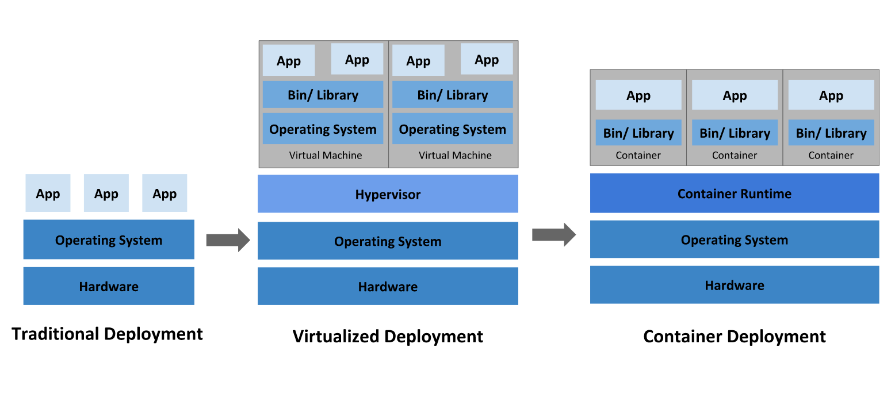
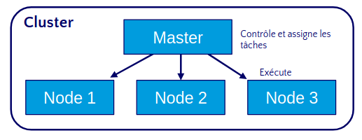
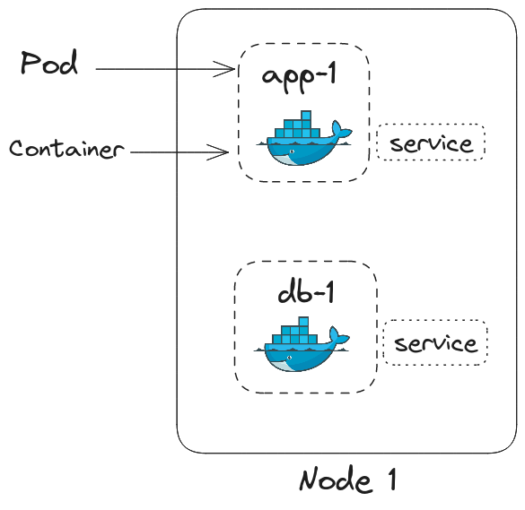
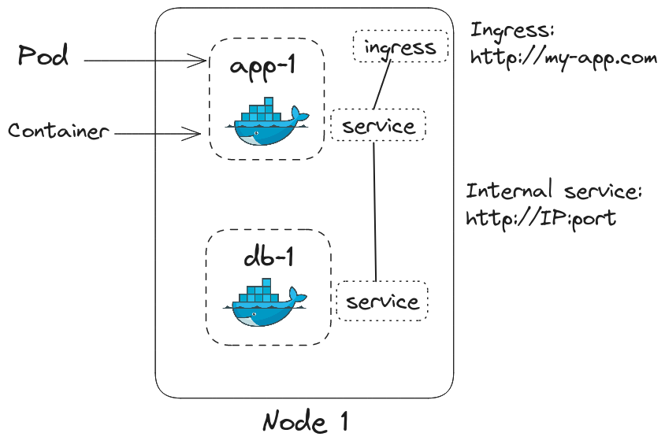
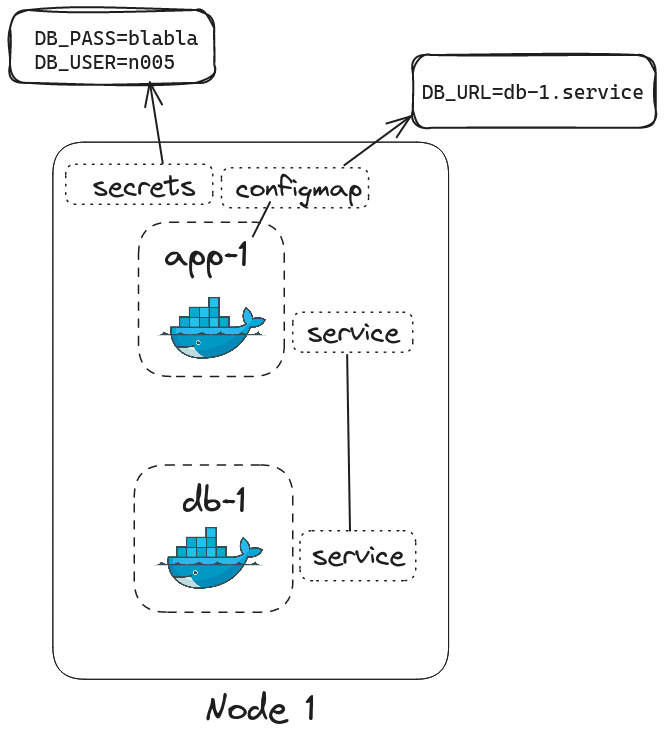

# 12.1 - Introduction à Kubernetes

Kubernetes est un orchestrateur de conteneurs open-source qui permet d'automatiser le déploiement, la mise à l'échelle et la gestion des applications conteneurisées. Il a été conçu par Google et est maintenant maintenu par la Cloud Native Computing Foundation (CNCF).

## 12.1.1 Pourquoi Kubernetes ?

**Kubernetes** est un outil développé à l'origine par Google pour pouvoir orchestrer des conteneurs Docker. Le but ce cet outil est de simplifier la gestion des conteneurs, en automatisant les tâches de déploiement, de mise à l'échelle et de gestion des applications conteneurisées.  

Vous avez vu comment gérer plusieurs conteneurs docker à l'aide de **docker compose**, vous avez aussi vu qu'il était possible de faire du **loadbalancing** avec Traefik pour quelques conteneurs. Mais que se passe-t-il si vous avez des **dizaines, des centaines ou des milliers** de conteneurs à gérer ? C'est là que Kubernetes entre en jeu.

L'idée de Kubernetes est d'avoir des fichiers de configuration qui décrivent l'état désiré de votre application -- à la manière d'un `docker-compose.yml` -- , et Kubernetes se charge de faire en sorte que l'état actuel de votre application corresponde à l'état désiré.

Objectif d'un outil d'orchestration comme Kubernetes :
- **Haute disponibilité** : Si un conteneur tombe en panne, Kubernetes peut redémarrer automatiquement le conteneur.
- **Mise à l'échelle automatique** : Kubernetes peut augmenter ou diminuer le nombre de conteneurs en fonction de la charge.
- **Reprise en cas d'incident** : Si un worker node tombe en panne, les conteneurs qu'il exécute peuvent être redéployés sur un autre worker node.

## 12.1.2 Architecture de Kubernetes
> Ça semble compliqué, mais ça va allez, on va prendre le temps de bien comprendre, d'être le plus clair, et de faire des exercices pour bien comprendre.

> La documentation officielle de Kubernetes est très bien faite, n'hésitez pas à la consulter : [https://kubernetes.io/docs/home/](https://kubernetes.io/docs/home/)

Une spécificité de Kubernetes est la façon dont on communique avec lui. On va utiliser une API pour tout faire.

### 12.1.2.A Principe d'un cluster Kubernetes

Un cluster Kubernetes est composé de plusieurs machines, appelées **nodes**. Il y a deux types de nodes dans un cluster Kubernetes :

- **Master node** : C'est le cerveau du cluster. Il gère les opérations de gestion du cluster, telles que le déploiement des applications, la mise à l'échelle des applications, etc. Il y a un seul master node dans un cluster Kubernetes.
- **Worker nodes** : Ce sont les machines qui exécutent les applications et les services. Les worker nodes sont les machines qui exécutent les conteneurs Docker. Il peut y avoir plusieurs worker nodes dans un cluster Kubernetes.

    

    > Le but de ce fonctionnement est de pouvoir **déployer des applications de manière distribuée**. Si un worker node tombe en panne, les applications qu'il exécute peuvent être redéployées sur un autre worker node.

### 12.1.2.B Composants d'un cluster Kubernetes

Un cluster Kubernetes est composé de plusieurs composants qui interagissent entre eux pour gérer les opérations de gestion du cluster. 

Il faut bien comprendre que chaque composant décrit par un fichier de configuration YAML, et que Kubernetes va lire ces fichiers pour déployer les composants, peut créer d'autres composants !

Voici les principaux composants d'un cluster Kubernetes :

#### Pods

Un **pod** est l'unité de base de Kubernetes, plus petit. C'est une abstraction qui représente un conteneur, c'est ce composant qui directement manipule les conteneurs. Usuellement, un pod est crée par application.

Un pod à une adresse IP unique, qui lui est attribuée lors de sa création. Néanmoins cette adresse IP n'est pas fixe, elle peut changer à chaque redémarrage du pod.

> TL;DR:
> - Un pod est une abstraction qui représente un conteneur.
> - Un pod a une adresse IP unique.
> - L'IP d'un pod n'est pas fixe.

#### Services

Un **service** est un composant qui permet de faire communiquer les pods entre eux. Un service expose un ensemble de pods en tant que service réseau. Un service peut avoir une adresse IP fixe, qui ne change pas.

Chaque service peut être associé à un ou plusieurs pods (avec des *selectors*), et Kubernetes se charge de répartir la charge entre les différents pods associés à un service.

Les adresses IP des services sont fixes, et peuvent être utilisées pour communiquer avec les pods associés au service, elle ne dépend plus du cycle de vie des pods.

Par exemple ici, on a deux pods, `app-1` et `db-1`, qui sont associés à un service.

Un service peut être de plusieurs types :
- **ClusterIP** : Le service est accessible uniquement à l'intérieur du cluster.
- **NodePort** : Le service est accessible depuis l'extérieur du cluster.
- **LoadBalancer** : Le service est accessible depuis l'extérieur du cluster, et un load balancer est créé pour répartir la charge entre les différents pods.

> TL;DR:
> - Un service permet de faire communiquer les pods entre eux.
> - Un service a une adresse IP fixe.

> Il existe aussi des service dit "Headless" qui ne possède pas d'adresse IP.

#### Ingress

Les services peuvent exposer un pod soit sur le Cluster avec *clusterIP*, soit sur l'extérieur avec *NodePort*. Néanmoins à chaque fois on doit connaître l'adresse IP du service pour pouvoir communiquer avec le pod. L'ingress permet de faire du routage en fonction de l'URL, et de rediriger les requêtes vers le service correspondant.

Par exemple ici, on a un ingress qui redirige les requêtes vers le service `app-1` via l'url `http://my-app.com`, au lieu de devoir connaître l'adresse IP et le port du service.

> TL;DR:
> - L'ingress permet de faire du routage en fonction de l'URL.
> - L'ingress permet de rediriger les requêtes vers le service correspondant.

#### ConfigMap et Secrets

Les **ConfigMap** et les **Secrets** sont des composants qui permettent de stocker des données de configuration et des secrets, respectivement. Elle sont l'équivalent des variables d'environnement dans un conteneur. La différence entre les deux est que les secrets sont encodés en base64.

Par exemple ici, on peut choisir l'url de la base de données avec un *configMap* (`DB_URL`) et le mot de passe (`DB_PASS`), utilisateur (`DB_USER`) de la base de données avec un *secret*:

> TL;DR:
> - Les ConfigMap permettent de stocker des données de configuration.
> - Les Secrets permettent de stocker des secrets.