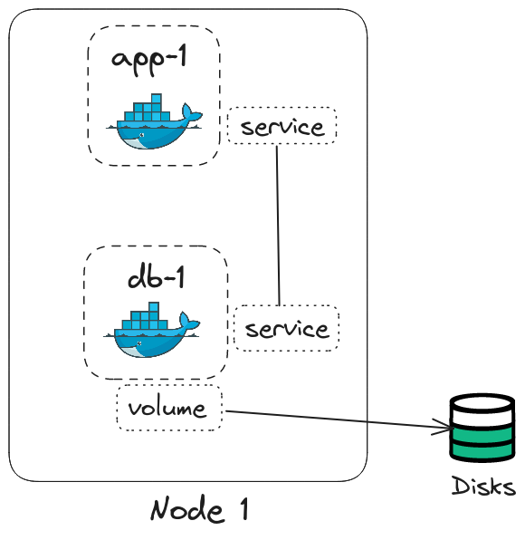
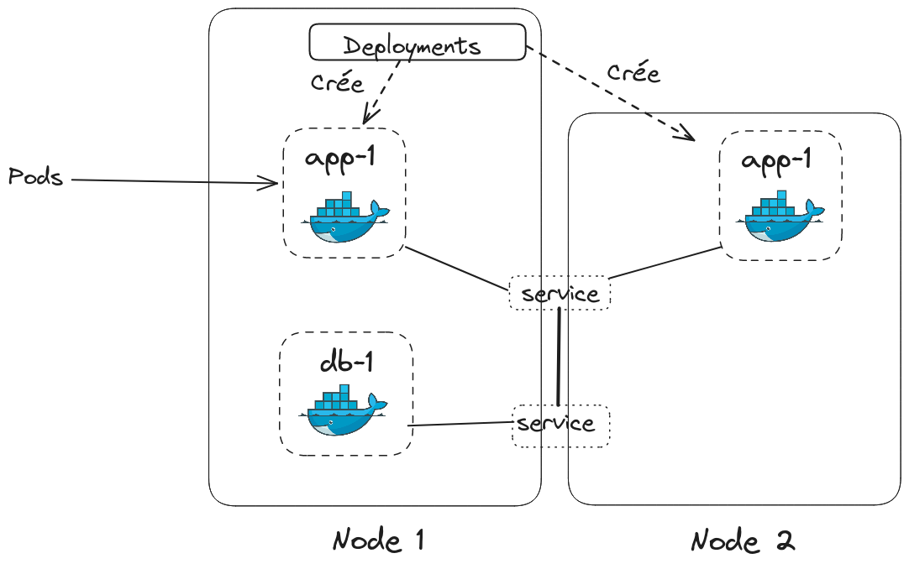

# 12.1 - Introduction à Kubernetes

Kubernetes est un orchestrateur de conteneurs open-source qui permet d'automatiser le déploiement, la mise à l'échelle et la gestion des applications conteneurisées. Il a été conçu par Google et est maintenant maintenu par la Cloud Native Computing Foundation (CNCF).

## 12.1.1 Pourquoi Kubernetes ?

**Kubernetes** est un outil développé à l'origine par Google pour pouvoir orchestrer des conteneurs Docker. Le but ce cet outil est de simplifier la gestion des conteneurs, en automatisant les tâches de déploiement, de mise à l'échelle et de gestion des applications conteneurisées.  

Vous avez vu comment gérer plusieurs conteneurs docker à l'aide de **docker compose**, vous avez aussi vu qu'il était possible de faire du **loadbalancing** avec Traefik pour quelques conteneurs. Mais que se passe-t-il si vous avez des **dizaines, des centaines ou des milliers** de conteneurs à gérer ? C'est là que Kubernetes entre en jeu.

L'idée de Kubernetes est d'avoir des fichiers de configuration qui décrivent l'état désiré de votre application -- à la manière d'un `docker-compose.yml` -- , et Kubernetes se charge de faire en sorte que l'état actuel de votre application corresponde à l'état désiré.

Objectif d'un outil d'orchestration comme Kubernetes :
- **Haute disponibilité** : Si un conteneur tombe en panne, Kubernetes peut redémarrer automatiquement le conteneur.
- **Mise à l'échelle automatique** : Kubernetes peut augmenter ou diminuer le nombre de conteneurs en fonction de la charge.
- **Reprise en cas d'incident** : Si un worker node tombe en panne, les conteneurs qu'il exécute peuvent être redéployés sur un autre worker node.

## 12.1.2 Architecture de Kubernetes
> Ça semble compliqué, mais ça va allez, on va prendre le temps de bien comprendre, d'être le plus clair, et de faire des exercices pour bien comprendre.

> La documentation officielle de Kubernetes est très bien faite, n'hésitez pas à la consulter : [https://kubernetes.io/docs/home/](https://kubernetes.io/docs/home/)

Une spécificité de Kubernetes est la façon dont on communique avec lui. On va utiliser une API pour tout faire.

### 12.1.2.A Principe d'un cluster Kubernetes

Un cluster Kubernetes est composé de plusieurs machines, appelées **nodes**. Il y a deux types de nodes dans un cluster Kubernetes :

- **Master node** : C'est le cerveau du cluster. Il gère les opérations de gestion du cluster, telles que le déploiement des applications, la mise à l'échelle des applications, etc. Il y a un seul master node dans un cluster Kubernetes.
- **Worker nodes** : Ce sont les machines qui exécutent les applications et les services. Les worker nodes sont les machines qui exécutent les conteneurs Docker. Il peut y avoir plusieurs worker nodes dans un cluster Kubernetes.

    

    > Le but de ce fonctionnement est de pouvoir **déployer des applications de manière distribuée**. Si un worker node tombe en panne, les applications qu'il exécute peuvent être redéployées sur un autre worker node.

### 12.1.2.B Composants d'un cluster Kubernetes

Un cluster Kubernetes est composé de plusieurs composants (ou *objects*) qui interagissent entre eux pour gérer les opérations de gestion du cluster. 

Il faut bien comprendre que chaque composant est décrit par un fichier de configuration YAML, qui sera interprété par Kubernetes pour déployer le composant.

Voici les principaux composants d'un cluster Kubernetes :

#### Pods

Un **pod** est l'unité de base dans Kubernetes. C'est une abstraction qui représente un ou plusieurs conteneurs s'exécutant sur un même nœud. Usuellement, un pod est crée par application.

Un pod à une adresse IP unique, qui lui est attribuée lors de sa création. Néanmoins cette adresse IP n'est pas fixe, elle peut changer à chaque redémarrage du pod.

On peut créer et gérer les pods individuellement, mais on passe le plus souvent par un *deployment* afin de gérer leur réplication, leur stratégie de mise à jour et leur placement.

> TL;DR:
> - Un pod est une abstraction qui représente un ou plusieurs conteneurs s'exécutant sur un même hôte.
> - Un pod a une adresse IP unique.
> - L'IP d'un pod n'est pas fixe.

#### Services

Un **service** est un composant qui permet de faire communiquer les pods entre eux. Un service expose un ensemble de pods en tant que service réseau. Un service peut avoir une adresse IP fixe, qui ne change pas.

Chaque service peut être associé à un ou plusieurs pods (avec des *selectors*), et Kubernetes s'occupe de répartir la charge entre les différents pods associés à un service.

Les adresses IP des services sont fixes, et peuvent être utilisées pour communiquer avec les pods associés au service, elle ne dépend plus du cycle de vie des pods.

Par exemple ici, on a deux pods, `app-1` et `db-1`, qui sont associés à un service.

Un service peut être de plusieurs types :
- **ClusterIP** : Le service est accessible uniquement à l'intérieur du cluster.
- **NodePort** : Le service est accessible depuis l'extérieur du cluster.
- **LoadBalancer** : Le service est accessible depuis l'extérieur du cluster, et un load balancer est créé pour répartir la charge entre les différents pods.

> TL;DR:
> - Un service permet de faire communiquer les pods entre eux.
> - Un service a une adresse IP fixe.

> Il existe aussi des services dits "Headless" qui ne possèdent pas d'adresse IP.

#### Ingress

Les services peuvent exposer un pod soit sur le Cluster avec *clusterIP*, soit sur l'extérieur avec *NodePort*. Néanmoins à chaque fois on doit connaître l'adresse IP du service pour pouvoir communiquer avec le pod. L'ingress permet de faire du routage en fonction de l'URL, et de rediriger les requêtes vers le service correspondant.

Par exemple ici, on a un ingress qui redirige les requêtes vers le service `app-1` via l'url `http://my-app.com`, au lieu de devoir connaître l'adresse IP et le port du service.

> TL;DR:
> - L'ingress permet de faire du routage en fonction de l'URL.
> - L'ingress permet de rediriger les requêtes vers le service correspondant.

#### ConfigMap et Secrets

Les **ConfigMap** et les **Secrets** sont des composants qui permettent de stocker des données de configuration et des secrets, respectivement. Elle sont l'équivalent des variables d'environnement dans un conteneur. La différence entre les deux est que les secrets sont encodés en base64.

Par exemple ici, on peut choisir l'url de la base de données avec un *configMap* (`DB_URL`) et le mot de passe (`DB_PASS`), utilisateur (`DB_USER`) de la base de données avec un *secret*:

> TL;DR:
> - Les ConfigMap permettent de stocker des données de configuration.
> - Les Secrets permettent de stocker des secrets.

#### Volumes

Les **volumes** sont des composants qui permettent de stocker des données. Les volumes sont montés dans les pods, et permettent de stocker des données qui doivent survivre au cycle de vie des pods.

Les données peuvent être stockées sur le disque local de la machine, ou sur un service de stockage externe, comme Amazon S3, Google Cloud Storage, etc.

Par exemple ici, on a un volume qui est monté dans le pod `db-1`, et qui permet de stocker des données qui doivent survivre au cycle de vie du pod.

> TL;DR:
> - Les volumes permettent de stocker des données.
> - Les données stockées dans un volume survivent au cycle de vie des pods.
> - Les données peuvent être stockées sur le disque local de la machine, ou sur un service de stockage externe.

#### Deployments

Un **deployment** est un composant qui permet de déployer et de mettre à jour des applications dans Kubernetes. Un deployment permet de définir l'état désiré de l'application, et Kubernetes se charge de faire en sorte que l'état actuel de l'application corresponde à l'état désiré.  

On utilise les deployments pour créer et gérer les pods : en effet, plutôt que de définir et gérer individuellement chaque instance d'une même application, on gère, via un deployment, plusieurs réplicas d'un même *template* de pod.

Les deployments définissent les paramètres de haute disponibilité de l'application :
- Ils définissent le nombre de réplicas de l'application, et Kubernetes se charge de faire en sorte que le nombre de réplicas actuel corresponde au nombre de réplicas désiré. 
- On peut choisir également comment sont répartis les pods - par exemple si on veut que les pods soient répartis de manière équitable sur les worker nodes.
- On peut définir la méthode de *healthcheck* (pour vérifier que les pods fonctionnent bien). Par exemple, un ping, une requête HTTP ...
- Enfin, on peut définir la stratégie de mise à jour des pods - par exemple, disons qu'en temps normal, quand tout va bien, 3 réplicas s'exécutent. L'on pourrait décider que lors d'une mise à jour, un pod au maximum soit arrêté afin qu'il y en ait toujours deux en train de s'exécuter - ou encore, de surcharger le nombre de réplicas, en créant un quatrième pod qui viendrait remplacer l'un des trois pods une fois complètement démarré.

**Attention**, chaque pod créé par un deployement est *stateless*, c'est à dire qu'il ne garde pas d'état, et que si il tombe en panne, il est recrée à l'identique de tous les autres pods.  
**On ne peut donc pas créer de bases de données avec** (car une base de données agit sur des données, imaginez si deux pods de la même base de données modifient les données en même temps).

Par exemple ici, on a un deployment qui définit l'état désiré de l'application `app-1`, avec 2 réplicas (une sur chaque node), et qui se charge de faire en sorte que l'état actuel de l'application corresponde à l'état désiré.

> TL;DR:
> - Un deployment permet de déployer et de mettre à jour des applications dans Kubernetes.
> - Un deployment agit un peu comme un blueprint pour les pods.
> - C'est l'asbtraction des pods
> - C'est le bon moyen pour déploier des applications sur Kubernetes
> - Les pods crée par un deployment sont stateless.

#### ReplicaSets

Un **replicaSet** est un composant qui permet de garantir un nombre spécifique de réplicas de pods. Un replicaSet permet de définir le nombre de réplicas de l'application, et Kubernetes se charge de faire en sorte que le nombre de réplicas actuel corresponde au nombre de réplicas désiré.  
Il est souvent crée automatiquement par un deployment.  
On y revient plus tard.

`TODO`

#### StatefulSets

Un **statefulSet** est un composant qui permet de garantir un nombre spécifique de réplicas de pods, mais contrairement à un replicaSet, les pods crée par un statefulSet sont stateful, c'est à dire qu'ils gardent un état.

Un statefulSet est utilisé pour les applications qui ont besoin de garder un état, comme une base de données.

`TODO`

#### DaemonSets

Un **daemonSet** est un composant qui permet de déployer un pod sur chaque worker node. Un daemonSet est utilisé pour les applications qui doivent être exécutées sur chaque worker node, comme un agent de monitoring.

`TODO`

#### Jobs

Un **job** est un composant qui permet d'exécuter une tâche à la demande. Un job est utilisé pour les tâches qui doivent être exécutées une seule fois, comme un script de migration de base de données.

`TODO`

#### CronJobs

Un **cronJob** est un composant qui permet d'exécuter une tâche à intervalle régulier. Un cronJob est utilisé pour les tâches qui doivent être exécutées régulièrement, comme un script de sauvegarde de base de données.

`TODO`
