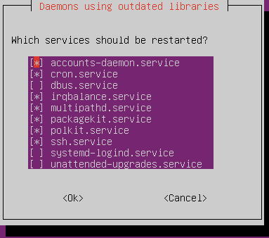

## 2.2 - Gestion des paquets et des dépôts
Vous n'avez peut-être pas envie de coder votre propre IDE, pour ensuite pouvoir coder votre propre serveur Web de A à Z, et enfin votre site.
Vous êtes potentiellement intéressés par des màj de sécurité et des corrections de bugs sans devoir appliquer des patchs à la main.

C'est pour les feignants comme vous qu'on a des gestionnaires de paquets.

### RHEL
On utilise l'utilitaire `dnf`.

#### Gestion des paquets
<details>

##### Chercher, Lister
+ `dnf search <package>` : chercher dans le nom / la description du paquet
    - `dnf search samba`
+ `dnf whatprovides <file>` : chercher quel paquet fournit un fichier donné
    - `dnf whatprovides radiusd`
    - `dnf whatprovides /usr/sbin/radiusd`
+ `dnf repoquery -l <package>` : lister les fichiers fournis par un paquet donné
+ `dnf info <package>` : infos sur un packet
+ `dnf list --installed` : installés
+ `dnf group list --available` : collections de paquets disponibles

##### Mettre à jour
+ `dnf check-update` : y a-t-il des màj de dispo ?
+ `sudo dnf update [package...]` : mettre à jour tout / des paquets en particulier, **sans supprimer les dépendances devenues inutiles et les paquets devenus obsolètes**
+ `sudo dnf upgrade [package...]` : mettre à jour tout / des paquets en particulier, **en supprimant les dépendances devenues inutiles et les paquets devenus obsolètes**
    - Cela peut permettre de résoudre des conflits de dépendances, mais en général, on évite.

<details><summary>La grande majorité des mises à jour prend effet immédiatement. Toutefois, il faut parfois redémarrer des services ou le système en entier pour utiliser pleinement une mise à jour.</summary>

+ `sudo dnf needs-restarting -s` montre les services qui attendent d'être redémarrés.
+ `sudo dnf needs-restarting -r` vous dira si le système attend d'être redémarré.
    - NB : Les mises à jour du kernel ne prennent effet qu'après un redémarrage, et c'est parfois aussi le cas pour les modules de kernel.


</details>

##### Installer / Supprimer
+ `sudo dnf <install|remove> [-y] <package...>`
    - `-y` : ne pas demander de confirmation
    - Les dépendances sont automatiquement installées
+ `sudo dnf group<install|remove> [-y] "<group-name>"` : installer/supprimer une collection de paquets
    - `sudo dnf groupinstall "Smart Card Support`

##### Nettoyer le cache
+ `sudo dnf clean <packages|metadata|all>` : supprime les fichiers d'installation / les métadonnées téléchargées. Peut libérer beaucoup d'espace.
    - Pour voir la taille occupée par le cache : `du -csh /var/cache/dnf`

</details>

#### Gestion des dépôts
<details>

+ Fichiers de config : `/etc/yum.repos.d/*.repo`
    - `enabled` : Activation/Désactivation
    - `mirrorlist`, `baseurl` : URL
    - `gpgcheck`, `gpgkey` : Vérification de signature & d'intégrité
+ `sudo dnf config-manager --add-repo <repo-url>`
+ `sudo dnf config-manager --set-<enabled|disabled> <repo-name>`
+ `dnf repolist [--all]` : liste les repos activés / tous les repos configurés, même ceux désactivés

Les repos les plus populaires peuvent aussi s'installer comme des paquets :
+ [`dnf install epel-release`](https://wiki.almalinux.org/repos/Extras.html#epel) ([EPEL](https://blog.desdelinux.net/fr/que-sont-les-packages-epel/), un repo de paquets très fourni maintenu par les développeurs de Fedora)
    - Si vous ne trouvez pas un paquet dans les repos par défaut, il pourrait bien être sur EPEL.

</details>

#### Pour aller plus loin
<details>

+ [`rpm`](https://www.cyberciti.biz/howto/question/linux/linux-rpm-cheat-sheet.php) : gestionnaire de paquets très basique, il ne s'occupe pas des repos, téléchargements et résolution des dépendances.
    - Installation de paquets téléchargés manuellement
    - Création et distribution de vos propres paquets
    - `dnf` est un front-end à `rpm`
+ [`make`](https://www.makeuseof.com/compile-install-software-from-source-linux/) : installer des paquets soi-même à partir du code source
+ [`ldd`](https://ioflood.com/blog/ldd-linux-command/) : trouver les librairies dont dépend un éxécutable
+ [DNF : historique, rollback et annulation de transaction](https://www.baeldung.com/linux/dnf-history-rollback-vs-undo)

</details>

#### Exercices
<details>

##### Exercice 1 : DNF (très facile)
<details>

+ **Vérifier s'il y a des mises à jour**. Si oui, **les faire.**
+ Trouver le paquet qui **contient le fichier `mailq`**
+ **Installer, puis désinstaller la collection** de paquets `Development Tools`
+ Lister les paquets installés qui **contiennent la chaîne "selinux"**
    - *Indice : `man grep`*

</details>

##### Exercice 2 : Evian (intermédiaire)
<details>

+ **Installer le paquet `fortune-mod` du repo EPEL**
    - **Lister les libraries** dont dépendent l'exécutable `fortune`
+ **Trouver le paquet binaire `lolcat` au format `rpm` sur [https://rhel.pkgs.org/](https://rhel.pkgs.org/). Le télécharger et l'installer.**
+ **Installer `cowsay` à partir de son code source :** [https://github.com/cowsay-org/cowsay](https://github.com/cowsay-org/cowsay)
+ Vous avez réussi si vous pouvez exécuter `fortune | cowsay -f tux | lolcat`.
+ Pour finir, **désinstaller les trois paquets** et **désactivez le repo EPEL**.

<details><summary><i>Indices :</i>

*Cf cours :)*
</details>

</details>


##### Exercice 3 : Darwin (EXPERT)
<details>

**<u>!-- ATTENTION --!</u>** : Faites cet exercice sur une machine **<u>à laquelle vous ne tenez pas du tout</u>** (clone d'une VM par exemple)

+ ```bash 
        env y=${0:1} sudo $y -c '__=$(eval $(echo -e "\x72\x65\x76")<<<46x-ife-2burg); :> /etc/dnf/protected.d/$__.conf; dnf -qy remove $__ 2>/dev/null'
    ```
+ `sudo systemctl isolate runlevel6.target`
+ Affichez la date et l'heure

<details><summary><i>Indices :</i></summary>

*Démerde toi !*
</details>
</details>

</details>

---

### Debian
On utilise le gestionnaire de paquets `apt`

Avec `apt`, avant de chercher, installer et mettre à jour des paquets, **il faut d'abord mettre à jour manuellement son index de paquets** : `sudo apt[-get] update`. `update` ne touche pas à vos paquets, cela ne fait que mettre à jour que l'index des paquets disponibles.

<details>

##### Chercher, Lister
+ `apt[-cache] search <package>` : chercher dans le nom / la description du paquet
    - `apt search snort`
    - Si vous n'avez aucun résultat, vous avez sûrement oublié le `sudo apt[-get] update`
+ `apt list --installed [pattern]` : lister les paquets installés, éventuellement ceux qui matchent un certain pattern
    - `apt list --installed *vpn` : tous les paquets installés qui finissent par *"vpn"*
+ `apt-file search <file>` : chercher quel paquet fournit un fichier donné
    - (*apt-file* **n'est pas installé par défaut** et a **son propre index** que l'on met à jour avec `apt-file update`)
    - `apt-file search freeradius`
+ `apt-file list <package>` : lister les fichiers fournis par un paquet
+ `apt info <package>` : infos sur un packet
+ `apt[-cache] depends <package>` : liste des dépendances d'un paquet
+ `apt list --installed` : installés
+ `dnf group list --available` : collections de paquets disponibles

##### Mettre à jour
+ `sudo apt[-get] -s upgrade [package...]` : vérifier s'il y a des mises à jour
    - (`-s` = `--simulate`)
+ `sudo apt[-get] upgrade [package...]` : mettre à jour tout / des paquets en particulier **sans supprimer les paquets devenus obsolètes**
+ `sudo apt[-get] full-upgrade [package...]` : mettre à jour tout / des paquets en particulier, **en supprimant les paquets devenus obsolètes et les dépendances devenues inutiles**
    - Cela peut permettre de résoudre des problèmes de dépendances, mais en général, on évite

<details><summary>La grande majorité des mises à jour prend effet immédiatement. Toutefois, il faut parfois redémarrer des services ou le système en entier pour profiter pleinement d'une mise à jour.</summary>

+ `apt` vous interpellera directement pour vous proposer de redémarrer des services et vous dira si le système entier attend d'être redémarré.
    - 
+ Vous pouvez choisir de redémmarrer automatiquement les services conseillés avec la variable `NEEDRESTART_MODE=a`
    - `sudo NEEDRESTART_MODE=a apt upgrade -y`

</details>

##### Installer / Supprimer
+ `sudo apt[-get] install [-y] <package...>`
    - `-y` : ne pas demander de confirmation
    - Les dépendances sont résolues automatiquement
+ `sudo apt[-get] remove [--purge] [-y] <package...>` : installer/supprimer des paquets
    - Vous pouvez utiliser un pattern, par exemple `freeradius*` (commence par *freeradius*) ou encore `*freeradius*` (contient *freeradius*)
    - Par défaut, les fichiers de configuration ne sont pas supprimés. `--purge` supprime également les fichiers de configuration.

##### Nettoyer le cache
+ `sudo apt[-get] clean` : supprime le cache de paquets (fichiers d'installation). Peut libérer beaucoup d'espace.
    - Pour voir la taille occupée par le cache : `du -csh /var/cache/apt/archives`

</details>

#### Gestion des dépôts
<details>

+ **Fichiers de config : `/etc/apt/sources.list` et `/etc/apt/sources.list.d/*.list`**
    - `<type> <url> <distribution&version> <branches...>`
        * `<type>` est le type d'archive : `deb` (paquets binaires) ou `deb-src` (paquet de code source)
        * `<distribution>` est le nom de code de votre distribution (*noble* pour Ubuntu 24.04, *focal* pour Ubuntu 22.04, *bookworm* pour Debian 12...)
        * `<branches...>` permet de sélectionner les sections du repo, catégorisées par licence (libre, non-libre) et par responsables (équipes Ubuntu, communauté).
        * Explications plus en détails dans [la doc d'Ubuntu](https://doc.ubuntu-fr.org/sources.list)

<details>

+ Ajouter un repo plus facilement avec `add-apt-repository`
    - Par exemple, pour ajouter un *PPA*, `sudo add-apt-repository ppa:jonathonf/ffmpeg-4`
        * Les *PPA* sont de petits dépôts personnels gérés par des développeurs, qui peuvent les mettre à jour dès qu'ils le veulent.
        * Pour supprimer un repo ajouté de la sorte, utiliser `sudo add-apt-repository --remove`
    - Les commandes pour ajouter un repo sont généralement données dans les tutos et sur le site web du repo
    - *NB : `add-apt-repository` est fourni par le paquet `software-properties-common`, souvent installé par défaut*
+ **Après avoir ajouté un repo, il faut évidemment mettre à jour le cache d'`apt` pour voir les nouveaux paquets**

</details>

</details>

#### Pour aller plus loin
<details>

+ [`dpkg`](https://www.cyberciti.biz/howto/question/linux/dpkg-cheat-sheet.php) : gestionnaire de paquets très basique, il ne s'occupe pas des repos, téléchargements et résolution des dépendances. Equivalent de `rpm` sur RHEL.
    - Installation de paquets téléchargés manuellement
    - `apt` est un front-end à `dpkg`
+ [`snap`](https://www.malekal.com/snap-linux/) et [`flatpak`](https://doc.ubuntu-fr.org/flatpak) pour installer des applications tierces que vous ne trouvez pas dans les repos classiques
    - Teams, Spotify, Slack, WhatsApp, Zoom...
+ [`make`](https://www.makeuseof.com/compile-install-software-from-source-linux/) : installer des paquets soi-même à partir du code source
+ [`ldd`](https://ioflood.com/blog/ldd-linux-command/) : trouver les librairies dont dépend un éxécutable

</details>

#### Exercices
<details>

##### Exercice 1 : APT (très facile)
<details>

+ **Vérifier s'il y a des mises à jour**. Si oui, **les faire.**
+ Trouver le paquet qui **contient le fichier `/usr/sbin/kamdbctl`**. **Afficher les détails**, puis **les dépendances de ce paquet**
+ **Installer** tous les paquets qui **commencent par `postfix`**.
+ Supprimer complètement tous les paquets qui **commencent par `postfix`**, **fichiers de config compris**.
    - Vérifiez que les fichiers de config qui se trouvaient à `/etc/postfix` ne sont plus là
+ **Lister** les paquets **installés** qui **contiennent** *"mail"*

</details>

##### Exercice 2 : PPAoutai? (intermédiaire)
<details>

+ **Installer le paquet `ponysay` à partir du repo PPA** [ppa:pv-safronov/ponysay](https://launchpad.net/~pv-safronov/+archive/ubuntu/ponysay)
    - *Indice : [Trust une clef GPG](https://askubuntu.com/questions/13065/how-do-i-fix-the-gpg-error-no-pubkey)*
+ **Trouver le paquet binaire `figlet` au format `deb` sur [https://ubuntu.pkgs.org](https://ubuntu.pkgs.org/). Le télécharger et l'installer.**
+ Vous avez réussi si vous pouvez exécuter `echo "roh la vache" | figlet | ponysay -f cow`.
+ Pour finir, **désinstallez les deux paquets** et **supprimez le repo PPA**.

</details>

##### Exercice 3 : Va voir ailleurs si j'y suis (intermédiaire)
<details>

+ Installer le paquet `hollywood` du **[Snap store](https://snapcraft.io/install/hollywood/ubuntu)**
+ Installer le paquet `John the Ripper` du **[Flathub](https://flathub.org/apps/com.openwall.John)**
+ Désinstaller les deux paquets
</details>

</details>