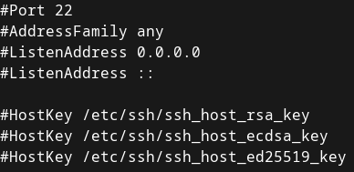

## 2.1 - Connexion à distance via SSH
Maintenant, deux solutions s'offrent à vous :
+ Chaque fois que vous voulez faire quelque chose sur votre serveur, vous vous déplacez en salle des machines en vous trimballant un écran et un clavier. Evidemment, vous n'aurez que la console toute pourrie où on peut pas scroll ni faire de copier-coller. Ah et au fait, vous ne pourrez faire qu'une chose à la fois sur votre serveur et vous ne pourrez vous occuper que d'un serveur à la fois.
+ Posé sur votre chaise roulante, vous utilisez SSH pour vous connecter à distance à vos serveurs, en utilisant votre émulateur de terminal préféré. Vous pouvez même leur envoyer des fichiers, automatiser des tâches ou lancer des applications graphiques.

Que choisissez-vous ?

### 2.1.A Présentation du protocole
<details><summary>SSH (<b>Secure SHell</b>) - est un protocole incontournable en administration système.</summary>

Il permet à un **client SSH** de se connecter à un **serveur SSH** de manière <u>sécurisée</u> pour **exécuter des commandes**, **transférer des fichiers** ou encore monter des tunnels.

<details><summary>La sécurité d'SSH repose sur...</summary>

+ **L'authentification du serveur**
    - *Comment être sûr que je parle bien à la bonne machine ? Je ne veux pas envoyer mon fichier confidentiel à n'importe qui.*
    - Le serveur est authentifié par **cryptographie asymmétrique** : vous approuvez sa clef publique, et il est le seul à posséder la clef privée associée.

+ **L'authentification du client**
    - *Je ne veux pas que n'importe qui puisse se connecter à mon serveur.*
    - Le client s'authentifie soit à l'aide d'un **mot de passe**, soit lui aussi par **cryptographie asymmétrique** auprès d'un serveur qui approuve sa clef publique.
    - Le client se connecte en tant qu'un certain **utilisateur** présent sur le système distant. Il acquiert uniquement les privilèges de cet utilisateur et de ses groupes.
+ **Le chiffrement de l'échange**
    - Avant toute chose
        * 
    - *Je ne veux pas que mon mot de passe, mes fichiers, et les commandes que je tape passent en texte clair sur le réseau*
    - La confidentialité de l'échange repose sur la **cryptographie symmétrique**.
        * Le secret partagé par les deux entités est temporaire et négocié grâce à des techniques d'**échange de clefs** (*"Kex"*)

<details><summary>Principe de l'authentification par <b>cryptographie asymmétrique</b> ou <i>Public Key Cryptography</i></summary>


* Bob génère une **paire de clef** : l'une est **privée**, l'autre **publique**.
    * Seule la clef privée peut déchiffrer ce que la clef publique a chiffré
* Bob **peut partager sa clef publique** avec Alice. Par contre, il fait très attention à ne **jamais montrer sa clef privée** à qui que ce soit.
* **Alice veut authentifier Bob**. Elle **génère donc un message aléatoire** et le **chiffre avec la clef publique de Bob**.
* Pour prouver son identité, **Bob déchiffre ce message avec sa clef privée et le renvoie à Alice**.
* Si le **message déchiffré est bien celui qu'Alice avait généré**, c'est que c'est bien Bob au bout du fil.
    * Evidemment, ça ne tient plus si Bob s'est fait voler sa clef privée.

*NB : On peut aussi utiliser la cryptographie asymmétrique pour assurer la confidentialité d'un message en plus de l'authentification de son auteur - Toutefois, cette technique a le défaut d'être très lente, donc on ne l'utilise que pour de petits messages. Souvent, on l'utilise pour chiffrer une clef secrète, que l'on peut ensuite partager à l'autre pour ensuite chiffrer le reste de l'échange par cryptographie symmétrique.*

</details>

Plus de détails sur [l'établissement d'une connexion SSH](https://www.digitalocean.com/community/tutorials/understanding-the-ssh-encryption-and-connection-process) et les [techniques cryptographiques employées](https://www.hostinger.fr/tutoriels/ssh-linux).
</details>

Le port standard sur lequel écoute un serveur SSH est le port **22/tcp**.
</details>

---

### 2.1.B Côté serveur
<details>

+ L'implémentation de serveur SSH la plus populaire est **`openssh-server`. Procurez-vous ce paquet**.
    - Vous avez sûrement déjà ce paquet suite à l'installation du serveur. Pour le vérifier : `which sshd`. Si l'exécutable n'est pas trouvé, installez le paquet.
        * RHEL : `sudo dnf install openssh-server`
        * Debian : `sudo apt-get update; sudo apt-get install`
+ Jetez un œil au **fichier de configuration de `sshd`** (*SSH daemon*), `/etc/ssh/sshd_config`
    - `sudo more /etc/ssh/sshd_config`
        * NB : `more` est un *pager*, qui vous permet de scroll avec les flèches du clavier et la barre d'espace. D'autres exemples de *pagers* sont `less` et `view`
        * 
    - Le fichier de config prend la forme `<Directive> <Valeurs...>`.
        * Les directives sont expliquées par `man sshd_config`
        * E.g. `PermitRootLogin prohibit-password` autorise le login de `root` via SSH à condition qu'il s'authentifie par clef privée.
        * Comme dans presque tous les fichiers de configuration, un `#` marque le début d'un commentaire mono-ligne
    - Comme pour la plupart des services : <u>après avoir modifié la configuration de `sshd`, vous devez **systématiquement redémarrer le service** pour que les changements prennent effet, puis **vérifier que le service fonctionne toujours**.</u>
        * `sudo systemctl restart sshd`
+ Vérifiez l'**état du service `sshd`** (*SSH daemon*)
    - `systemctl status sshd`
        * Si le service n'est pas démarré, lancez-le et activez-le au démarrage
            * `sudo systemctl start sshd; sudo systemctl enable sshd` ou simplement `sudo systemctl enable --now sshd`
+ Vérifiez que le **port `22/tcp` est ouvert sur le pare-feu du serveur**. Sinon, ouvrez le.
    - Vérifier :
        * RHEL : `sudo firewall-cmd --list-all`. Vous devriez avoir soit `ssh` dans la section *services*,  soit `22/tcp` dans la section *ports*.
            * 
        * Ubuntu : `sudo ufw status verbose`. Si autorisé, le port `22/tcp` précède `ALLOW IN`.
    - Ouvrir les ports :
        * RHEL : `sudo firewall-cmd --permanent --add-service ssh`
        * Ubuntu : `sudo ufw allow 22/tcp`
    - **NB : en production, il est hors de question d'ouvrir votre port SSH au monde entier**.
        * On **filtrerait sur la base de l'adresse IP source**, par exemple pour n'autoriser la connexion que depuis votre VPN et votre réseau local d'administration.
            * Pour des services pas trop critiques, on pourrait laisser SSH ouvert à tous sur le pare-feu du serveur mais filtrer au niveau du pare-feu-passerelle.
        * On aurait éventuellement un service comme `fail2ban` pour créer dynamiquement des règles de pare-feu bloquant les IP qui font trop de tentatives de connexion.
+ Faites un **test de connexion local**
    - `ssh localhost`
        * `ssh` provient du paquet `openssh-client[s]`

**_NB : Si vous avez une VM en mode NAT, il vous faudra une [règle de redirection de port](https://nsrc.org/workshops/2014/sanog23-virtualization/raw-attachment/wiki/Agenda/ex-virtualbox-portforward-ssh.htm) pour exposer votre service SSH au monde extérieur_**.

</details>

<details><summary><b>SSH, côté serveur : Exercices</b><br/></summary>

#### Exercice 1 : Modifier la configuration du serveur SSH (facile) 
<details>

Le but est :
+ <u>**D'afficher le message** `Interdiction de me hack, sinon je le dis à ma maman` **dès qu'un client se connecte à votre serveur, avant même qu'il ne rentre son mot de passe**</u>
    - Vous devrez stocker ce message dans `/etc/issue.net`.
    - *Indice :* `man sshd_config | grep Banner`
+ <u>**D'afficher le message** `Apéro vendredi 18h` **après un login réussi du client**</u>.
    - *Indice :* `man sshd_config | grep PrintMotd`, `man motd`

Vous aurez besoin d'un éditeur de texte comme [vi](https://linux.goffinet.org/administration/traitement-du-texte/editeur-de-texte-vi/) ou [nano](https://doc.ubuntu-fr.org/nano).

Vous pouvez tester la modification en vous connectant localement : `ssh localhost`.
</details>

#### Exercice 2 : Modifier les paramètres réseau du serveur SSH (facile) 
<details><summary>Pour des raisons de sécurité, un serveur a le plus souvent une interface réseau dédiée à l'administration, avec une adresse IP propre. C'est sur cette interface uniquement que l'on expose le service.</summary>

Même si vous n'avez sûrement quant à vous qu'une interface réseau, vous allez faire comme si, et durcir la configuration réseau du serveur SSH.

Le but est __de *bind* le serveur SSH à une seule adresse IP plutôt qu'à toutes les adresses du serveur__</u>
    - *Indice :* [*ListenAdress*](https://www.cyberciti.biz/tips/howto-openssh-sshd-listen-multiple-ip-address.html)

+ Vous pouvez tester la modification avec la commande : `ss -lt` (liste des sockets TCP en écoute de connexions entrantes).
    - Si le port `ssh` n'est plus en écoute sur `0.0.0.0` et `::`, mais sur les adresses que vous avez indiquées, vous avez réussi.

Indiquer la *"bind address"* est une bonne pratique que vous serez amenés à mettre en oeuvre avec tous vos services.
</details>

#### Exercice 3 : Contrôle d'accès basique (modéré) 
<details>

Vos objectifs sont :
+ **<u>Filtrer le trafic SSH selon l'IP source</u>** : autorisez uniquement `127.0.0.1` (localhost) et l'IP d'une autre machine sous votre contrôle.
    - *Indices :*
        * [firewall-cmd cheatsheet](https://gist.github.com/davydany/0ad377f6de3c70056d2bd0f1549e1017), [ufw cheatsheet](https://blog.rtsp.us/ufw-uncomplicated-firewall-cheat-sheet-a9fe61933330), [iptables cheatsheet](https://andreafortuna.org/2019/05/08/iptables-a-simple-cheatsheet/)
+ **Créer le groupe `noobs`, y ajouter votre utilisateur et <u>autoriser l'authentification par mot de passe uniquement aux utilisateurs du groupe `noobs`</u>**
    - *Indices :*
        - `man groupadd`, `man groupdel`
        - `usermod --help | grep -2 \\-G`
        - [*Match* statements](https://www.linuxquestions.org/questions/linux-security-4/securing-ssh-allow-denying-and-match-statements-4175530596/)
        - `man sshd_config | grep PasswordAuthentication`
+ **Créer l'utilisateur** `toto` **et autoriser sa connexion en SSH en local uniquement**
    - *Indices :*
        - `man useradd`, `man userdel`
        - [*Match* statements](https://www.linuxquestions.org/questions/linux-security-4/securing-ssh-allow-denying-and-match-statements-4175530596/)

</details>

#### Exercice 4 : Fail2Ban (avancé) 
<details>

+ Installer et configurer [`fail2ban`](https://doc.ubuntu-fr.org/fail2ban) **pour mettre en quarantaine pour 4h les IP qui connaissent un échec d'authentification plus de 3 fois de suite en 5 minutes.**
+ Se connecter localement ou avec un autre utilisateur et **sortir l'IP bannie de la quarantaine**.
</details>

</details>

---

### 2.1.C Côté client
<details>

Le client OpenSSH est installé par défaut sur Windows, MacOS et la plupart des distributions Linux.

Sur Linux, il est fourni par le paquet `openssh-client` (Debian) / `openssh-clients` (RHEL).

#### Première connexion au serveur, authentification par mot de passe
<details>

+ `ssh [user@]<host>`
    - E.g. `ssh admin@192.168.1.173`
    - La partie `user@` est facultative si vous vous connectez avec le même nom d'utilisateur que sur le client.
    - Option `-p <port>` pour spécifier un port TCP autre que `22`
+ A la **première connexion** avec le serveur, on vous demande d'**approuver ou non son identité**.
    - 
    - En cas de doute, on peut vérifier que la *fingerprint* annoncée est bien celle qui est associée aux clefs de notre serveur :
        * Sur le serveur : `ssh-keygen -lf /etc/ssh/ssh_host_ed25519.pub` (clef publique) ou `sudo ssh-keygen -lf /etc/ssh/ssh_host_ed25519` (clef privée)
            * *(Il se peut que le serveur utilise une autre paire de clefs)*
        * 
    - En approuvant, vous **ajoutez la clef publique du serveur au fichier `~/.ssh/known_hosts` du client**. A l'avenir, tant que le serveur vous présente cette clef publique, vous lui ferez automatiquement confiance.
        * En cas de changement de clef publique, ou si vous ne faites plus confiance au serveur, vous pouvez supprimer la ligne le concernant dans le fichier à la main ou utiliser `ssh-keygen -R <host>`.
+ C'est ensuite **au tour du client de s'authentifier**. Par défaut, on vous demande un mot de passe.
+ Vous êtes maintenant connecté à un shell sur le serveur.
    - `exit` pour vous déconnecter.
</details>

#### Authentification par clef privée
<details>

+ **Générez une paire de clefs côté client** : `ssh-keygen -t ed25519`
    - Lorsque l'utilitaire vous propose de chiffrer votre clef privée avec une **passphrase**, faites-le.
        * Certes, sans passphrase, vous pourrez vous connecter instantanément à un serveur.
        * Seulement, le jour où votre clef privée est volée, votre identité est compromise. **Avec une passphrase, il faudrait non seulement voler la clef privée, mais aussi connaître son mot de passe**. 
    - Vous pouvez avoir plusieurs clefs différentes - pour choisir laquelle utiliser quand vous vous connectez, utilisez l'option `-i <path/to/clef/privée>` de ssh
        * *E.g. `ssh -i ~/.ssh/SIA`*
    - **<u>Ne partagez jamais votre clef privée.</u>**
    - L'option `-t` sélectionne l'algorithme de cryptographie à clefs publique utiliser. `ed25519` est un bon choix.
+ **Publiez votre clef publique sur le serveur** : `ssh-copy-id [-i <path/to/clef/privée>] [user@]<host>`.
    - *E.g. `ssh-copy-id admin@192.168.1.173`*
    - Cela ajoute votre clef publique à `~/.ssh/authorized_keys`, **pour votre utilisateur**, **côté serveur**.
        * Toutes les clefs publiques présentes dans ce fichier peuvent être utilisées pour se connecter à votre compte sur le serveur.
        * Pour révoquer une clef publique, supprimez la de ce fichier.
+ **Authentifiez-vous par clef publique**
    - `ssh [-i <path/to/clef/privée>] [user@]<host>`
        * *E.g. `ssh admin@192.168.1.173`* 
        * Si vous avez protégé votre clef privée avec une passphrase, vous devrez la rentrer en vous connectant.


</details>


#### Raccourci d'hôte & SSH agent
<details><summary>Pour améliorer votre confort côté client, vous pouvez configurer des raccourcis vers vos serveurs et utiliser `ssh-agent` pour taper vos mots de passe moins souvent.</summary>

+ **Raccourci d'hôte**
    - Sert à **donner un surnom à un serveur** et à retenir les **options à utiliser pour lui** en particulier
    - Ajoutez une entrée au fichier `~/.ssh/config`
    - Exemple : 
        * ```lua
            Host mons  # alias
                Hostname 192.168.1.173
                User admin # utilisateur par défaut
                IdentityFile ~/.ssh/id_labs_linux # clef privée à utiliser
                LocalForward 19090 localhost:9090 # tunnel de local port forwarding pour exposer cockpit côté client

            ```
        * Il suffit maintenant de taper `ssh mons` au lieu de `ssh -i ~/.ssh/id_labs_linux -L 19090:localhost:9090 admin@192.168.1.173` !
+ **SSH-Agent**
    - Sert à garder en mémoire de façon sécurisée vos **clefs privées** pour que vous **n'ayez pas à retaper la passphrase toutes les deux secondes**
    - `eval $(ssh-agent -s)` (lance SSH-Agent dans ce shell)
    - `ssh-add [-i <path/to/clef/privée>]` (ajoute une clef privée à SSH-Agent - vous n'aurez ensuite plus besoin de taper sa passphrase)
        - Sans l'option `-i`, vous ajoutez votre clef privée par défaut.
    - Lorsque vous quittez votre shell, les clefs privées ajoutées sont oubliées.
</details>

#### Transfert de fichiers via SSH avec SCP et Rsync
<details><summary>SSH permet d'envoyer facilement des fichiers entre deux hôtes distants, de manière sécurisée.</details>

+ `scp /path/to/fichier/local [user@]<host>:/path/to/fichier/distant` : copie du local vers le distant
    - *E.g. `scp ~/Downloads/ca.crt mons:/usr/local/share/ca-certificates/`*
    - Vous pouvez aussi copier dans l'autre sens.
    - Option `-r` pour copier un répertoire
+ `rsync` utilise la même syntaxe. L'avantage est qu'il ne copie que les fichiers qui ne sont pas encore présents à la destination (synchronisation).
    - `-a` : mode archive. Copie aussi les liens, les permissions ... Quasiment toujours utilisé.
    - `--delete` : supprime les fichiers qui sont présents à la destination, mais absents à la source (pour que le dossier destination soit le miroir du dossier source)
    - *E.g.* `rsync -a --delete admin@192.168.1.173:/var/log logs_serveur`
</details>

</details>

<details><summary><b>SSH, Côté client - Exercices</b></br></summary>

#### Exercice 1 : Ça s'en va et ça revient (modéré)
<details>

+ Vous **connecter à votre serveur. Remplacer sa paire de clefs SSH par défaut**. Vous déconnecter.
    - *Indice :* `man sshd_config | grep -A2 HostKey\$`
+ Vous **reconnecter au serveur**.
    - *Indice :* `man ssh-keygen | grep -2 \\-R`
+ Côté client, **générer une clef privée SSH de type RSA et de taille 4096 bits, avec une passphrase, et la stocker à `~/.ssh/exo`**
+ Vous authentifier au serveur par clef privée **sans indiquer d'options** et **sans avoir à taper votre passphrase** lors de la connexion.
+ **Sur le serveur, révoquer la clef publique avec laquelle vous venez de vous connecter**. Déconnectez-vous. A présent, la connexion avec votre nouvelle clef privée ne doit plus fonctionner.
</details>
</details>

---

### 2.1.D Pour aller plus loin
<details>

+ SSH pour faire des **tunnels** :
    - `-L` : [Local Port Forwarding](https://www.ssh.com/academy/ssh/tunneling-example) - exposer un port distant localement
    - `-R` : [Remote Port Forwarding](https://www.ssh.com/academy/ssh/tunneling-example) - exposer un port local sur l'hôte distant
    - `-D` : [Dynamic Port Forwarding (SOCKS proxy)](https://ma.ttias.be/socks-proxy-linux-ssh-bypass-content-filters/) - proxy Web via l'hôte distant
    - `-J` : [SSH Gateway (jump)](https://goteleport.com/blog/ssh-jump-server/)
+ Authentification du client par clef privée avec une [**Smartcard**](https://ubuntu.com/server/docs/security-smart-cards-ssh)
    - Clef privée isolée sur un support physique, ne se retrouve jamais dans la mémoire de l'ordinateur. La Smartcard gère les opérations cryptographiques elle-même.
+ [**X11 Forwarding**](https://ostechnix.com/how-to-configure-x11-forwarding-using-ssh-in-linux/) : exécuter des applications graphiques à distance via SSH
+ [**Ouvrir des fichiers avec VSCode** à distance via SSH](https://code.visualstudio.com/docs/remote/ssh)
+ Sécurité :
    - [**Fail2Ban**](https://doc.ubuntu-fr.org/fail2ban) : bannir automatiquement les IP qui font trop de tentatives de login
    - [`/etc/security/access.conf`](https://man7.org/linux/man-pages/man5/access.conf.5.html) : Filtrage des logins au niveau de PAM, système d'authentification des utilisateurs
+ `quicssh` : [booster les performances d'SSH en utilisant **QUIC au lieu de TCP**](https://korben.info/booster-ssh-quic-quicssh.html)

</details>
