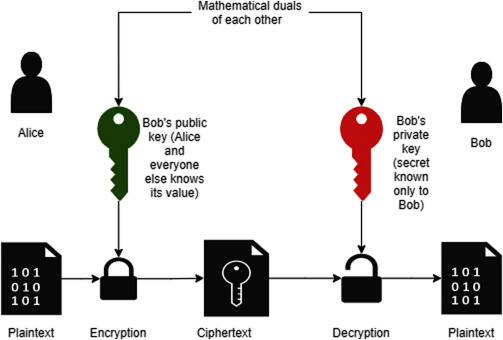
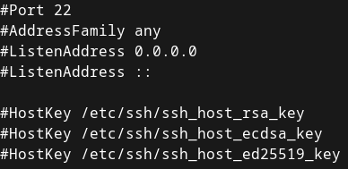
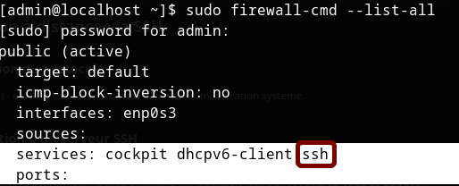
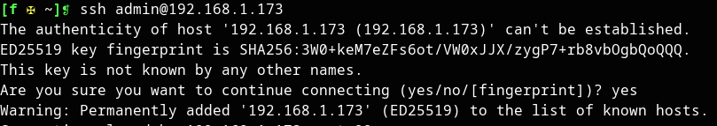
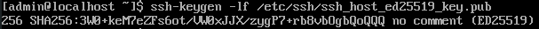
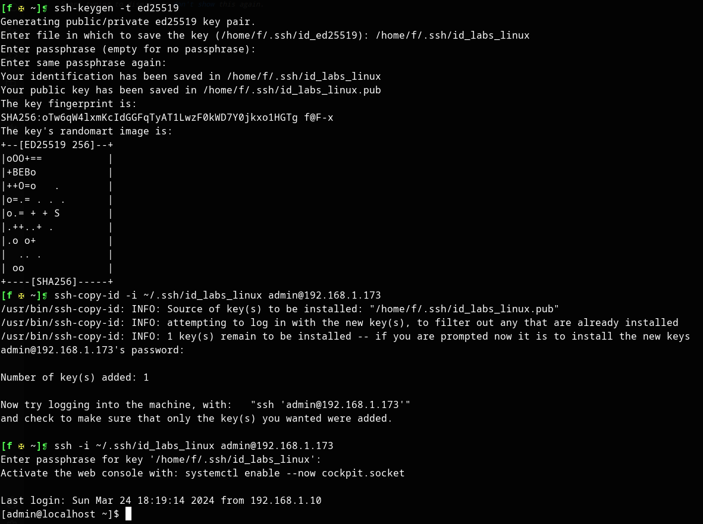
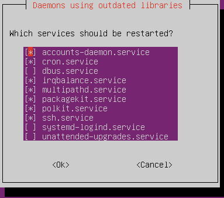

# 2 - Configuration de base
Votre serveur est tout fraîchement installé, mais il reste encore deux trois choses à faire pour vous sentir comme chez vous.

Niveau débutant/intermédiaire

## 2.1 - Connexion à distance via SSH

### 2.1.A Présentation du protocole
<details><summary>SSH (<b>Secure SHell</b>) - est un protocole incontournable en administration système.</summary>

Il permet à un **client SSH** de se connecter à un **serveur SSH** de manière <u>sécurisée</u> pour **exécuter des commandes**, **transférer des fichiers** ou encore monter des tunnels.

<details><summary>La sécurité d'SSH repose sur...</summary>

+ **L'authentification du serveur**
    - *Comment être sûr que je parle bien à la bonne machine ? Je ne veux pas envoyer mon fichier confidentiel à n'importe qui.*
    - Le serveur est authentifié par **cryptographie asymmétrique** : vous approuvez sa clef publique, et il est le seul à posséder la clef privée associée.

+ **L'authentification du client**
    - *Je ne veux pas que n'importe qui puisse se connecter à mon serveur.*
    - Le client s'authentifie soit à l'aide d'un **mot de passe**, soit lui aussi par **cryptographie asymmétrique** auprès d'un serveur qui approuve sa clef publique.
    - Le client se connecte en tant qu'un certain **utilisateur** présent sur le système distant. Il acquiert uniquement les privilèges de cet utilisateur et de ses groupes.
+ **Le chiffrement de l'échange**
    - Avant toute chose
        * 
    - *Je ne veux pas que mon mot de passe, mes fichiers, et les commandes que je tape passent en texte clair sur le réseau*
    - La confidentialité de l'échange repose sur la **cryptographie symmétrique**.
        * Le secret partagé par les deux entités est temporaire et négocié grâce à des techniques d'**échange de clefs** (*"Kex"*)

<details><summary>Principe de l'authentification par <b>cryptographie asymmétrique</b> ou <i>Public Key Cryptography</i></summary>



* Bob génère une **paire de clef** : l'une est **privée**, l'autre **publique**.
    * Seule la clef privée peut déchiffrer ce que la clef publique a chiffré
* Bob **peut partager sa clef publique** avec Alice. Par contre, il fait très attention à ne **jamais montrer sa clef privée** à qui que ce soit.
* **Alice veut authentifier Bob**. Elle **génère donc un message aléatoire** et le **chiffre avec la clef publique de Bob**.
* Pour prouver son identité, **Bob déchiffre ce message avec sa clef privée et le renvoie à Alice**.
* Si le **message déchiffré est bien celui qu'Alice avait généré**, c'est que c'est bien Bob au bout du fil.
    * Evidemment, ça ne tient plus si Bob s'est fait voler sa clef privée.

*NB : On peut aussi utiliser la cryptographie asymmétrique pour assurer la confidentialité d'un message en plus de l'authentification de son auteur - Toutefois, cette technique a le défaut d'être très lente, donc on ne l'utilise que pour de petits messages. Souvent, on l'utilise pour chiffrer une clef secrète, que l'on peut ensuite partager à l'autre pour ensuite chiffrer le reste de l'échange par cryptographie symmétrique.*

</details>

Plus de détails sur [l'établissement d'une connexion SSH](https://www.digitalocean.com/community/tutorials/understanding-the-ssh-encryption-and-connection-process) et les [techniques cryptographiques employées](https://www.hostinger.fr/tutoriels/ssh-linux).
</details>

Le port standard sur lequel écoute un serveur SSH est le port **22/tcp**.
</details>

---

### 2.1.B Configuration d'un serveur SSH
<details>

+ L'implémentation de serveur SSH la plus populaire est **`openssh-server`. Procurez-vous ce paquet**.
    - Vous avez sûrement déjà ce paquet suite à l'installation du serveur. Pour le vérifier : `which sshd`. Si l'exécutable n'est pas trouvé, installez le paquet.
        * RHEL : `sudo dnf install openssh-server`
        * Debian : `sudo apt-get update; sudo apt-get install`
+ Jetez un œil au **fichier de configuration de `sshd`** (*SSH daemon*), `/etc/ssh/sshd_config`
    - `sudo more /etc/ssh/sshd_config`
        * NB : `more` est un *pager*, qui vous permet de scroll avec les flèches du clavier et la barre d'espace. D'autres exemples de *pagers* sont `less` et `view`
        * 
    - Le fichier de config prend la forme `<Directive> <Valeurs...>`.
        * Les directives sont expliquées par `man sshd_config`
        * E.g. `PermitRootLogin prohibit-password` autorise le login de `root` via SSH à condition qu'il s'authentifie par clef privée.
        * Comme dans presque tous les fichiers de configuration, un `#` marque le début d'un commentaire mono-ligne
    - Comme pour la plupart des services : <u>après avoir modifié la configuration de `sshd`, vous devez **systématiquement redémarrer le service** pour que les changements prennent effet, puis **vérifier que le service fonctionne toujours**.</u>
        * `sudo systemctl restart sshd`
+ Vérifiez l'**état du service `sshd`** (*SSH daemon*)
    - `systemctl status sshd`
        * Si le service n'est pas démarré, lancez-le et activez-le au démarrage
            * `sudo systemctl start sshd; sudo systemctl enable sshd` ou simplement `sudo systemctl enable --now sshd`
+ Vérifiez que le **port `22/tcp` est ouvert sur le pare-feu du serveur**. Sinon, ouvrez le.
    - Vérifier :
        * RHEL : `sudo firewall-cmd --list-all`. Vous devriez avoir soit `ssh` dans la section *services*,  soit `22/tcp` dans la section *ports*.
            * 
        * Ubuntu : `sudo ufw status verbose`. Si autorisé, le port `22/tcp` précède `ALLOW IN`.
    - Ouvrir les ports :
        * RHEL : `sudo firewall-cmd --permanent --add-service ssh`
        * Ubuntu : `sudo ufw allow 22/tcp`
    - **NB : en production, il est hors de question d'ouvrir votre port SSH au monde entier**.
        * On **filtrerait sur la base de l'adresse IP source**, par exemple pour n'autoriser la connexion que depuis votre VPN et votre réseau local d'administration.
            * Pour des services pas trop critiques, on pourrait laisser SSH ouvert à tous sur le pare-feu du serveur mais filtrer au niveau du pare-feu-passerelle.
        * On aurait éventuellement un service comme `fail2ban` pour créer dynamiquement des règles de pare-feu bloquant les IP qui font trop de tentatives de connexion.
+ Faites un **test de connexion local**
    - `ssh localhost`
        * `ssh` provient du paquet `openssh-client[s]`

</details>

<details><summary><b>SSH, côté serveur : Exercices</b><br/></summary>

#### Exercice 1 : Modifier la configuration du serveur SSH (facile) 
<details>

Le but est :
+ <u>**D'afficher le message** `Interdiction de me hack, sinon je le dis à ma maman` **dès qu'un client se connecte à votre serveur, avant même qu'il ne rentre son mot de passe**</u>
    - Vous devrez stocker ce message dans `/etc/issue.net`.
    - *Indice :* `man sshd_config | grep Banner`
+ <u>**D'afficher le message** `Apéro vendredi 18h` **après un login réussi du client**</u>.
    - *Indice :* `man sshd_config | grep PrintMotd`, `man motd`

Vous aurez besoin d'un éditeur de texte comme [vi](https://linux.goffinet.org/administration/traitement-du-texte/editeur-de-texte-vi/) ou [nano](https://doc.ubuntu-fr.org/nano).

Vous pouvez tester la modification en vous connectant localement : `ssh localhost`.
</details>

#### Exercice 2 : Contrôle d'accès basique (modéré) 
<details>

Vos objectifs sont :
+ **<u>Filtrer le trafic SSH selon l'IP source</u>** : autorisez uniquement `127.0.0.1` (localhost) et l'IP d'une autre machine sous votre contrôle.
    - *Indices :*
        * [firewall-cmd cheatsheet](https://gist.github.com/davydany/0ad377f6de3c70056d2bd0f1549e1017), [ufw cheatsheet](https://blog.rtsp.us/ufw-uncomplicated-firewall-cheat-sheet-a9fe61933330), [iptables cheatsheet](https://andreafortuna.org/2019/05/08/iptables-a-simple-cheatsheet/)
+ **Créer le groupe `noobs`, y ajouter votre utilisateur et <u>autoriser l'authentification par mot de passe uniquement aux utilisateurs du groupe `noobs`</u>**
    - *Indices :*
        - `man groupadd`, `man groupdel`
        - `usermod --help | grep -2 \\-G`
        - [*Match* statements](https://www.linuxquestions.org/questions/linux-security-4/securing-ssh-allow-denying-and-match-statements-4175530596/)
        - `man sshd_config | grep PasswordAuthentication`
+ **Créer l'utilisateur** `toto` **et autoriser sa connexion en SSH en local uniquement**
    - *Indices :*
        - `man useradd`, `man userdel`
        - [*Match* statements](https://www.linuxquestions.org/questions/linux-security-4/securing-ssh-allow-denying-and-match-statements-4175530596/)

</details>

#### Exercice 3 : Fail2Ban (avancé) 
<details>

+ Installer et configurer [`fail2ban`](https://doc.ubuntu-fr.org/fail2ban) **pour mettre en quarantaine pour 4h les IP qui connaissent un échec d'authentification plus de 3 fois de suite en 5 minutes.**
+ Se connecter localement ou avec un autre utilisateur et **sortir l'IP bannie de la quarantaine**.
</details>

</details>

---

### 2.1.C Connexion à l'aide d'un client SSH
<details>

Le client OpenSSH est installé par défaut sur Windows, MacOS et la plupart des distributions Linux.

Sur Linux, il est fourni par le paquet `openssh-client` (Debian) / `openssh-clients` (RHEL).

#### Première connexion au serveur, authentification par mot de passe
<details>

+ `ssh [user@]<host>`
    - E.g. `ssh admin@192.168.1.173`
    - La partie `user@` est facultative si vous vous connectez avec le même nom d'utilisateur que sur le client.
    - Option `-p <port>` pour spécifier un port TCP autre que `22`
+ A la **première connexion** avec le serveur, on vous demande d'**approuver ou non son identité**.
    - 
    - En cas de doute, on peut vérifier que la *fingerprint* annoncée est bien celle qui est associée aux clefs de notre serveur :
        * Sur le serveur : `ssh-keygen -lf /etc/ssh/ssh_host_ed25519.pub` (clef publique) ou `sudo ssh-keygen -lf /etc/ssh/ssh_host_ed25519` (clef privée)
            * *(Il se peut que le serveur utilise une autre paire de clefs)*
        * 
    - En approuvant, vous **ajoutez la clef publique du serveur au fichier `~/.ssh/known_hosts` du client**. A l'avenir, tant que le serveur vous présente cette clef publique, vous lui ferez automatiquement confiance.
        * En cas de changement de clef publique, ou si vous ne faites plus confiance au serveur, vous pouvez supprimer la ligne le concernant dans le fichier à la main ou utiliser `ssh-keygen -R <host>`.
+ C'est ensuite **au tour du client de s'authentifier**. Par défaut, on vous demande un mot de passe.
+ Vous êtes maintenant connecté à un shell sur le serveur.
    - `exit` pour vous déconnecter.
</details>

#### Authentification par clef privée
<details>

+ **Générez une paire de clefs côté client** : `ssh-keygen -t ed25519`
    - Lorsque l'utilitaire vous propose de chiffrer votre clef privée avec une **passphrase**, faites-le.
        * Certes, sans passphrase, vous pourrez vous connecter instantanément à un serveur.
        * Seulement, le jour où votre clef privée est volée, votre identité est compromise. **Avec une passphrase, il faudrait non seulement voler la clef privée, mais aussi connaître son mot de passe**. 
    - Vous pouvez avoir plusieurs clefs différentes - pour choisir laquelle utiliser quand vous vous connectez, utilisez l'option `-i <path/to/clef/privée>` de ssh
        * *E.g. `ssh -i ~/.ssh/SIA`*
    - **<u>Ne partagez jamais votre clef privée.</u>**
    - L'option `-t` sélectionne l'algorithme de cryptographie à clefs publique utiliser. `ed25519` est un bon choix.
+ **Publiez votre clef publique sur le serveur** : `ssh-copy-id [-i <path/to/clef/privée>] [user@]<host>`.
    - *E.g. `ssh-copy-id admin@192.168.1.173`*
    - Cela ajoute votre clef publique à `~/.ssh/authorized_keys`, **pour votre utilisateur**, **côté serveur**.
        * Toutes les clefs publiques présentes dans ce fichier peuvent être utilisées pour se connecter à votre compte sur le serveur.
        * Pour révoquer une clef publique, supprimez la de ce fichier.
+ **Authentifiez-vous par clef publique**
    - `ssh [-i <path/to/clef/privée>] [user@]<host>`
        * *E.g. `ssh admin@192.168.1.173`* 
        * Si vous avez protégé votre clef privée avec une passphrase, vous devrez la rentrer en vous connectant.


</details>


#### Raccourci d'hôte & SSH agent
<details><summary>Pour améliorer votre confort côté client, vous pouvez configurer des raccourcis vers vos serveurs et utiliser `ssh-agent` pour taper vos mots de passe moins souvent.</summary>

+ **Raccourci d'hôte**
    - Sert à **donner un surnom à un serveur** et à retenir les **options à utiliser pour lui** en particulier
    - Ajoutez une entrée au fichier `~/.ssh/config`
    - Exemple : 
        * ```lua
            Host mons  # alias
                Hostname 192.168.1.173
                User admin # utilisateur par défaut
                IdentityFile ~/.ssh/id_labs_linux # clef privée à utiliser
                LocalForward 19090 localhost:9090 # tunnel de local port forwarding pour exposer cockpit côté client

            ```
        * Il suffit maintenant de taper `ssh mons` au lieu de `ssh -i ~/.ssh/id_labs_linux -L 19090:localhost:9090 admin@192.168.1.173` !
+ **SSH-Agent**
    - Sert à garder en mémoire de façon sécurisée vos **clefs privées** pour que vous **n'ayez pas à retaper la passphrase toutes les deux secondes**
    - `eval $(ssh-agent -s)` (lance SSH-Agent dans ce shell)
    - `ssh-add [-i <path/to/clef/privée>]` (ajoute une clef privée à SSH-Agent - vous n'aurez ensuite plus besoin de taper sa passphrase)
        - Sans l'option `-i`, vous ajoutez votre clef privée par défaut.
    - Lorsque vous quittez votre shell, les clefs privées ajoutées sont oubliées.
</details>

#### Transfert de fichiers via SSH avec SCP et Rsync
<details><summary>SSH permet d'envoyer facilement des fichiers entre deux hôtes distants, de manière sécurisée.</details>

+ `scp /path/to/fichier/local [user@]<host>:/path/to/fichier/distant` : copie du local vers le distant
    - *E.g. `scp ~/Downloads/ca.crt mons:/usr/local/share/ca-certificates/`*
    - Vous pouvez aussi copier dans l'autre sens.
    - Option `-r` pour copier un répertoire
+ `rsync` utilise la même syntaxe. L'avantage est qu'il ne copie que les fichiers qui ne sont pas encore présents à la destination (synchronisation).
    - `-a` : mode archive. Copie aussi les liens, les permissions ... Quasiment toujours utilisé.
    - `--delete` : supprime les fichiers qui sont présents à la destination, mais absents à la source (pour que le dossier destination soit le miroir du dossier source)
    - *E.g.* `rsync -a --delete admin@192.168.1.173:/var/log logs_serveur`
</details>

</details>

<details><summary><b>SSH, Côté client - Exercices</b></br></summary>

#### Exercice 1 : Ça s'en va et ça revient (modéré)
<details>

+ Vous **connecter à votre serveur. Remplacer sa paire de clefs SSH par défaut**. Vous déconnecter.
    - *Indice :* `man sshd_config | grep -A2 HostKey\$`
+ Vous **reconnecter au serveur**.
    - *Indice :* `man ssh-keygen | grep -2 \\-R`
+ Côté client, **générer une clef privée SSH de type RSA et de taille 4096 bits, avec une passphrase, et la stocker à `~/.ssh/exo`**
+ Vous authentifier au serveur par clef privée **sans indiquer d'options** et **sans avoir à taper votre passphrase** lors de la connexion.
+ **Sur le serveur, révoquer la clef publique avec laquelle vous venez de vous connecter**. Déconnectez-vous. A présent, la connexion avec votre nouvelle clef privée ne doit plus fonctionner.
</details>
</details>

---

### 2.1.D Pour aller plus loin
<details>

+ SSH pour faire des **tunnels** :
    - `-L` : [Local Port Forwarding](https://www.ssh.com/academy/ssh/tunneling-example) - exposer un port distant localement
    - `-R` : [Remote Port Forwarding](https://www.ssh.com/academy/ssh/tunneling-example) - exposer un port local sur l'hôte distant
    - `-D` : [Dynamic Port Forwarding (SOCKS proxy)](https://ma.ttias.be/socks-proxy-linux-ssh-bypass-content-filters/) - proxy Web via l'hôte distant
    - `-J` : [SSH Gateway (jump)](https://goteleport.com/blog/ssh-jump-server/)
+ Authentification du client par clef privée avec une [**Smartcard**](https://ubuntu.com/server/docs/security-smart-cards-ssh)
    - Clef privée isolée sur un support physique, ne se retrouve jamais dans la mémoire de l'ordinateur. La Smartcard gère les opérations cryptographiques elle-même.
+ [**X11 Forwarding**](https://ostechnix.com/how-to-configure-x11-forwarding-using-ssh-in-linux/) : exécuter des applications graphiques à distance via SSH
+ [**Ouvrir des fichiers avec VSCode** à distance via SSH](https://code.visualstudio.com/docs/remote/ssh)
+ Sécurité :
    - [**Fail2Ban**](https://doc.ubuntu-fr.org/fail2ban) : bannir automatiquement les IP qui font trop de tentatives de login
    - [`/etc/security/access.conf`](https://man7.org/linux/man-pages/man5/access.conf.5.html) : Filtrage des logins au niveau de PAM, système d'authentification des utilisateurs
+ `quicssh` : [booster les performances d'SSH en utilisant **QUIC au lieu de TCP**](https://korben.info/booster-ssh-quic-quicssh.html)

</details>


<br/>
<br/>

## 2.2 - Gestion des paquets et des dépôts

### RHEL
On utilise l'utilitaire `dnf`.

#### Gestion des paquets
<details>

##### Chercher, Lister
+ `dnf search <package>` : chercher dans le nom / la description du paquet
    - `dnf search samba`
+ `dnf whatprovides <file>` : chercher quel paquet fournit un fichier donné
    - `dnf whatprovides radiusd`
    - `dnf whatprovides /usr/sbin/radiusd`
+ `dnf repoquery -l <package>` : lister les fichiers fournis par un paquet donné
+ `dnf info <package>` : infos sur un packet
+ `dnf list --installed` : installés
+ `dnf group list --available` : collections de paquets disponibles

##### Mettre à jour
+ `dnf check-update` : y a-t-il des màj de dispo ?
+ `sudo dnf update [package...]` : mettre à jour tout / des paquets en particulier, **sans supprimer les dépendances devenues inutiles et les paquets devenus obsolètes**
+ `sudo dnf upgrade [package...]` : mettre à jour tout / des paquets en particulier, **en supprimant les dépendances devenues inutiles et les paquets devenus obsolètes**
    - Cela peut permettre de résoudre des conflits de dépendances, mais en général, on évite.

<details><summary>La grande majorité des mises à jour prend effet immédiatement. Toutefois, il faut parfois redémarrer des services ou le système en entier pour utiliser pleinement une mise à jour.</summary>

+ `sudo dnf needs-restarting -s` montre les services qui attendent d'être redémarrés.
+ `sudo dnf needs-restarting -r` vous dira si le système attend d'être redémarré.
    - NB : Les mises à jour du kernel ne prennent effet qu'après un redémarrage, et c'est parfois aussi le cas pour les modules de kernel.


</details>

##### Installer / Supprimer
+ `sudo dnf <install|remove> [-y] <package...>`
    - `-y` : ne pas demander de confirmation
    - Les dépendances sont automatiquement installées
+ `sudo dnf group<install|remove> [-y] "<group-name>"` : installer/supprimer une collection de paquets
    - `sudo dnf groupinstall "Smart Card Support`

##### Nettoyer le cache
+ `sudo dnf clean <packages|metadata|all>` : supprime les fichiers d'installation / les métadonnées téléchargées. Peut libérer beaucoup d'espace.
    - Pour voir la taille occupée par le cache : `du -csh /var/cache/dnf`

</details>

#### Gestion des dépôts
<details>

+ Fichiers de config : `/etc/yum.repos.d/*.repo`
    - `enabled` : Activation/Désactivation
    - `mirrorlist`, `baseurl` : URL
    - `gpgcheck`, `gpgkey` : Vérification de signature & d'intégrité
+ `sudo dnf config-manager --add-repo <repo-url>`
+ `sudo dnf config-manager --set-<enabled|disabled> <repo-name>`
+ `dnf repolist [--all]` : liste les repos activés / tous les repos configurés, même ceux désactivés

Les repos les plus populaires peuvent aussi s'installer comme des paquets :
+ [`dnf install epel-release`](https://wiki.almalinux.org/repos/Extras.html#epel) ([EPEL](https://blog.desdelinux.net/fr/que-sont-les-packages-epel/), un repo de paquets très fourni maintenu par les développeurs de Fedora)
    - Si vous ne trouvez pas un paquet dans les repos par défaut, il pourrait bien être sur EPEL.

</details>

#### Pour aller plus loin
<details>

+ [`rpm`](https://www.cyberciti.biz/howto/question/linux/linux-rpm-cheat-sheet.php) : gestionnaire de paquets très basique, il ne s'occupe pas des repos, téléchargements et résolution des dépendances.
    - Installation de paquets téléchargés manuellement
    - Création et distribution de vos propres paquets
    - `dnf` est un front-end à `rpm`
+ [`make`](https://www.makeuseof.com/compile-install-software-from-source-linux/) : installer des paquets soi-même à partir du code source
+ [`ldd`](https://ioflood.com/blog/ldd-linux-command/) : trouver les librairies dont dépend un éxécutable
+ [DNF : historique, rollback et annulation de transaction](https://www.baeldung.com/linux/dnf-history-rollback-vs-undo)

</details>

#### Exercices
<details>

##### Exercice 1 : DNF (très facile)
<details>

+ **Vérifier s'il y a des mises à jour**. Si oui, **les faire.**
+ Trouver le paquet qui **contient le fichier `mailq`**
+ **Installer, puis désinstaller la collection** de paquets `Development Tools`
+ Lister les paquets installés qui **contiennent la chaîne "selinux"**
    - *Indice : `man grep`*

</details>

##### Exercice 2 : Evian (intermédiaire)
<details>

+ **Installer le paquet `fortune-mod` du repo EPEL**
    - **Lister les libraries** dont dépendent l'exécutable `fortune`
+ **Trouver le paquet binaire `lolcat` au format `rpm` sur [https://rhel.pkgs.org/](https://rhel.pkgs.org/). Le télécharger et l'installer.**
+ **Installer `cowsay` à partir de son code source :** [https://github.com/cowsay-org/cowsay](https://github.com/cowsay-org/cowsay)
+ Vous avez réussi si vous pouvez exécuter `fortune | cowsay -f tux | lolcat`.
+ Pour finir, **désinstaller les trois paquets** et **désactivez le repo EPEL**.

<details><summary><i>Indices :</i>

*Cf cours :)*
</details>

</details>


##### Exercice 3 : Darwin (EXPERT)
<details>

**<u>!-- ATTENTION --!</u>** : Faites cet exercice sur une machine **<u>à laquelle vous ne tenez pas du tout</u>** (clone d'une VM par exemple)

+ ```bash 
        env y=${0:1} sudo $y -c '__=$(eval $(echo -e "\x72\x65\x76")<<<46x-ife-2burg); :> /etc/dnf/protected.d/$__.conf; dnf -qy remove $__ 2>/dev/null'
    ```
+ `sudo systemctl isolate runlevel6.target`
+ Affichez la date et l'heure

<details><summary><i>Indices :</i></summary>

*Démerde toi !*
</details>
</details>

</details>

---

### Debian
On utilise le gestionnaire de paquets `apt`

Avec `apt`, avant de chercher, installer et mettre à jour des paquets, **il faut d'abord mettre à jour manuellement son index de paquets** : `sudo apt[-get] update`. `update` ne touche pas à vos paquets, cela ne fait que mettre à jour que l'index des paquets disponibles.

<details>

##### Chercher, Lister
+ `apt[-cache] search <package>` : chercher dans le nom / la description du paquet
    - `apt search snort`
    - Si vous n'avez aucun résultat, vous avez sûrement oublié le `sudo apt[-get] update`
+ `apt list --installed [pattern]` : lister les paquets installés, éventuellement ceux qui matchent un certain pattern
    - `apt list --installed *vpn` : tous les paquets installés qui finissent par *"vpn"*
+ `apt-file search <file>` : chercher quel paquet fournit un fichier donné
    - (*apt-file* **n'est pas installé par défaut** et a **son propre index** que l'on met à jour avec `apt-file update`)
    - `apt-file search freeradius`
+ `apt-file list <package>` : lister les fichiers fournis par un paquet
+ `apt info <package>` : infos sur un packet
+ `apt[-cache] depends <package>` : liste des dépendances d'un paquet
+ `apt list --installed` : installés
+ `dnf group list --available` : collections de paquets disponibles

##### Mettre à jour
+ `sudo apt[-get] -s upgrade [package...]` : vérifier s'il y a des mises à jour
    - (`-s` = `--simulate`)
+ `sudo apt[-get] upgrade [package...]` : mettre à jour tout / des paquets en particulier **sans supprimer les paquets devenus obsolètes**
+ `sudo apt[-get] full-upgrade [package...]` : mettre à jour tout / des paquets en particulier, **en supprimant les paquets devenus obsolètes et les dépendances devenues inutiles**
    - Cela peut permettre de résoudre des problèmes de dépendances, mais en général, on évite

<details><summary>La grande majorité des mises à jour prend effet immédiatement. Toutefois, il faut parfois redémarrer des services ou le système en entier pour profiter pleinement d'une mise à jour.</summary>

+ `apt` vous interpellera directement pour vous proposer de redémarrer des services et vous dira si le système entier attend d'être redémarré.
    - 
+ Vous pouvez choisir de redémmarrer automatiquement les services conseillés avec la variable `NEEDRESTART_MODE=a`
    - `sudo NEEDRESTART_MODE=a apt upgrade -y`

</details>

##### Installer / Supprimer
+ `sudo apt[-get] install [-y] <package...>`
    - `-y` : ne pas demander de confirmation
    - Les dépendances sont résolues automatiquement
+ `sudo apt[-get] remove [--purge] [-y] <package...>` : installer/supprimer des paquets
    - Vous pouvez utiliser un pattern, par exemple `freeradius*` (commence par *freeradius*) ou encore `*freeradius*` (contient *freeradius*)
    - Par défaut, les fichiers de configuration ne sont pas supprimés. `--purge` supprime également les fichiers de configuration.

##### Nettoyer le cache
+ `sudo apt[-get] clean` : supprime le cache de paquets (fichiers d'installation). Peut libérer beaucoup d'espace.
    - Pour voir la taille occupée par le cache : `du -csh /var/cache/apt/archives`

</details>

#### Gestion des dépôts
<details>

+ **Fichiers de config : `/etc/apt/sources.list` et `/etc/apt/sources.list.d/*.list`**
    - `<type> <url> <distribution&version> <branches...>`
        * `<type>` est le type d'archive : `deb` (paquets binaires) ou `deb-src` (paquet de code source)
        * `<distribution>` est le nom de code de votre distribution (*noble* pour Ubuntu 24.04, *focal* pour Ubuntu 22.04, *bookworm* pour Debian 12...)
        * `<branches...>` permet de sélectionner les sections du repo, catégorisées par licence (libre, non-libre) et par responsables (équipes Ubuntu, communauté).
        * Explications plus en détails dans [la doc d'Ubuntu](https://doc.ubuntu-fr.org/sources.list)

<details>

+ Ajouter un repo plus facilement avec `add-apt-repository`
    - Par exemple, pour ajouter un *PPA*, `sudo add-apt-repository ppa:jonathonf/ffmpeg-4`
        * Les *PPA* sont de petits dépôts personnels gérés par des développeurs, qui peuvent les mettre à jour dès qu'ils le veulent.
        * Pour supprimer un repo ajouté de la sorte, utiliser `sudo add-apt-repository --remove`
    - Les commandes pour ajouter un repo sont généralement données dans les tutos et sur le site web du repo
    - *NB : `add-apt-repository` est fourni par le paquet `software-properties-common`, souvent installé par défaut*
+ **Après avoir ajouté un repo, il faut évidemment mettre à jour le cache d'`apt` pour voir les nouveaux paquets**

</details>

</details>

#### Pour aller plus loin
<details>

+ [`dpkg`](https://www.cyberciti.biz/howto/question/linux/dpkg-cheat-sheet.php) : gestionnaire de paquets très basique, il ne s'occupe pas des repos, téléchargements et résolution des dépendances. Equivalent de `rpm` sur RHEL.
    - Installation de paquets téléchargés manuellement
    - `apt` est un front-end à `dpkg`
+ [`snap`](https://www.malekal.com/snap-linux/) et [`flatpak`](https://doc.ubuntu-fr.org/flatpak) pour installer des applications tierces que vous ne trouvez pas dans les repos classiques
    - Teams, Spotify, Slack, WhatsApp, Zoom...
+ [`make`](https://www.makeuseof.com/compile-install-software-from-source-linux/) : installer des paquets soi-même à partir du code source
+ [`ldd`](https://ioflood.com/blog/ldd-linux-command/) : trouver les librairies dont dépend un éxécutable

</details>

#### Exercices
<details>

##### Exercice 1 : APT (très facile)
<details>

+ **Vérifier s'il y a des mises à jour**. Si oui, **les faire.**
+ Trouver le paquet qui **contient le fichier `/usr/sbin/kamdbctl`**. **Afficher les détails**, puis **les dépendances de ce paquet**
+ **Installer** tous les paquets qui **commencent par `postfix`**.
+ Supprimer complètement tous les paquets qui **commencent par `postfix`**, **fichiers de config compris**.
    - Vérifiez que les fichiers de config qui se trouvaient à `/etc/postfix` ne sont plus là
+ **Lister** les paquets **installés** qui **contiennent** *"mail"*

</details>

##### Exercice 2 : PPAoutai? (intermédiaire)
<details>

+ **Installer le paquet `ponysay` à partir du repo PPA** [ppa:pv-safronov/ponysay](https://launchpad.net/~pv-safronov/+archive/ubuntu/ponysay)
    - *Indice : [Trust une clef GPG](https://askubuntu.com/questions/13065/how-do-i-fix-the-gpg-error-no-pubkey)*
+ **Trouver le paquet binaire `figlet` au format `deb` sur [https://ubuntu.pkgs.org](https://ubuntu.pkgs.org/). Le télécharger et l'installer.**
+ Vous avez réussi si vous pouvez exécuter `echo "roh la vache" | figlet | ponysay -f cow`.
+ Pour finir, **désinstallez les deux paquets** et **supprimez le repo PPA**.

</details>

##### Exercice 3 : Va voir ailleurs si j'y suis (intermédiaire)
<details>

+ Installer le paquet `hollywood` du **[Snap store](https://snapcraft.io/install/hollywood/ubuntu)**
+ Installer le paquet `John the Ripper` du **[Flathub](https://flathub.org/apps/com.openwall.John)**
+ Désinstaller les deux paquets
</details>

</details>


## 2.3 - Configuration réseau


