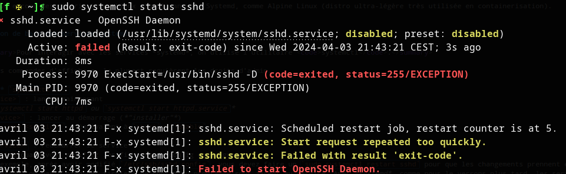
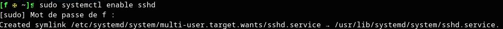
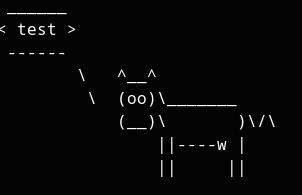

# 4.1 - Gestion des services avec systemd
## 4.1.1 - Concepts clefs
### 4.1.1.A - Services
Sur Linux, les **services** sont des processus qui s'exécutent en tâche de fond. On parle aussi de *daemons* pour désigner ces processus qui "hantent" en quelque sorte votre système.

Les services assurent une fonction particulière, qu'ils remplissent :
+ Soit pour le compte de clients :
    - Exemple : un serveur Web, un serveur SSH...
+ Soit pour le bon fonctionnement de l'hôte lui-même :
    - Exemple : *NetworkManager* qui gère les périphériques réseau et leur configuration, *firewalld* ou *iptables* qui gèrent le pare-feu de l'OS, les *daemons* d'interface graphique ...

Les services s'exécutent généralement en continu, dès le démarrage du système, quoique certains s'exécutent plutôt ponctuellement ou périodiquement.


### 4.1.1.B - Systemd
<details><summary><i>Systemd</i> (<i>system daemon</i>) est une suite de composants logiciels œuvrant pour la <b>gestion du système</b> et des <b>services</b>. Voici les principales missions de <i>systemd</i>...</summary>

+ **Initialisation du système**
    - `systemd` est le premier processus lancé par le noyau d'un système Linux qui l'utilise. Ce processus a toujours le **PID 1**.
    - Ce qu'il se passe lors du démarrage de l'OS :
        * Le firmware BIOS ou UEFI de la carte mère trouve et lance le *bootloader* (e.g. GRUB2)
        * Le *bootloader* trouve sur vos disques deux éléments, qu'il charge en mémoire :
            * Le noyau Linux
            * Le RAMdisk initial (*initrd*) : Une image disque qui contient des modules de kernel (contrôleurs de disques, systèmes de fichiers...) qui permettent de monter la partition racine afin de poursuivre le démarrage du système
        * Le noyau, grâce aux modules contenus dans l'*initrd*, monte alors la partition racine au sommet de son arborescence de fichiers.
        * **Le noyau localise et exécute le programme `init`** contenu sur cette partition racine. C'est le **premier processus**, qui porte le **PID 1**.
            * NB : sur une distribution utilisant *systemd*, `init` n'est autre qu'un lien pointant sur le programme `systemd`
        * Le programme `systemd` lance ensuite, dans un certain ordre, tous les autres programmes nécessaires au démarrage du système ou que vous aurez paramétrés pour se lancer au boot - *NetworkManager* pour se connecter au réseau, *OpenSSH-Server* pour écouter les connexions SSH...
            * Les services à démarrer font partie d'une __*target*__, un groupe de services formant un ensemble cohérent. 
                * Par exemple, `graphical.target` correspond au démarrage de l'OS en mode multi-utilisateurs et avec une interface graphique. `rescue.target` est quant à elle un mode de maintenance où seuls les services absolument indispensables sont lancés, un peu comme un mode sans échec sur Windows.
                * D'autres targets peuvent être plus spectaculaires : `shutdown.target`, `poweroff.target`, `reboot.target`, `hibernate.target` et `halt.target` permettent d'éteindre, redémarrer ou mettre en hibernation le système.
                * NB : Une *target* est l'équivalent d'un *runlevel SysV Init*.
    - Vous pouvez ensuite toujours interagir avec *systemd* pour basculer sur une autre *target*, par exemple pour mettre le système en mode de maintenance ou pour l'éteindre proprement.
+ **Gestion des services**
    - En plus de démarrer certains services au boot, *Systemd* vous permet ensuite de gérer vos services manuellement :
        * Démarrer/Redémarrer,
        * Arrêter,
        * Surveiller,
        * Rafraîchir la config...
    - *Systemd* démarre les services dans un **certain ordre** pour **satisfaire les dépendances entre services**
        * Par exemple, un serveur Web aurait intérêt à être démarré uniquement une fois la connexion réseau démarrée.

La suite *Systemd* est extrêmement complète et dispose d'autres prérogatives, qui sont mentionnées en [partie 4.4](#44---pour-aller-plus-loin---systemd--bien-plus-quun-orchestrateur-de-services).

</details>

<details><summary>Bien que relativement récent, <i>Systemd</i> est aujourd'hui utilisé par l'écrasante majorité des distributions Linux.</summary>

*Systemd* est paru en 2010, puis a été rapidement adopté par la majorité des distributions Linux (RHEL, Debian/Ubuntu, SUSE, Arch...)

Sa vocation était de remplacer *SysV Init*, l'**initiateur de système** et **gestionnaire de services** utilisé jusqu'alors. *SysV Init* était en effet difficile à administrer (notamment en ce qui concerne la gestion des dépendances entre services), peu maintenable (écriture de scripts pour démarrer, arrêter, redémarrer chaque service) et inefficace (par exemple, il démarrait les services séquentiellement plutôt que de paralléliser leur démarrage). Sur les systèmes utilisant *SysV Init*, le premier processus lancé par le système (PID 1) était donc `init`, là où il s'agit aujourd'hui de `systemd` sur la plupart des systèmes modernes.

NB : L'on trouve encore des distributions Linux n'utilisant pas Systemd, comme Alpine Linux (distro ultra-légère très utilisée en containerisation).
</details>

## 4.1.2 - Gestion de base des services systemd
### 4.1.2.A - Systemctl
<details><summary>Pour interagir avec les services *systemd*, on utilise l'utilitaire <code>systemctl</code>.</summary>

NB : hormis les commandes d'affichage, la plupart requièrent les droits d'admin.

**Commandes :** `systemctl ...`
+ **`start <service>` : lancer maintenant**
    - *E.g. `systemctl start httpd` ou `systemctl start httpd.service`*
+ **`enable <service>` : lancer au démarrage** (*"installer"*)
    - `enable --now <service>` : équivalent à `start` + `enable`

+ **`restart <service>` : redémarrer le service**
    - Comme un `stop` + `start`. Très utilisé quand vous **modifiez les fichiers de config** du programme.
        * Par exemple, après avoir modifié `/etc/ssh/sshd_config`, vous devez faire un `sudo systemctl restart sshd` pour que les changements prennent effet.
    - Parfois nécessaire suite à une mise à jour pour que les changements apportés par la màj prennent effet 
    - Termine puis relance le service.
        * Toutefois, lorsque c'est possible, les services sont conçus pour causer le moins d'interruption possible lors d'un redémarrage. Par exemple, redémarrer un serveur SSH n'interrompra pas les connexions existantes à ce serveur.
+ **`reload <service>` : demande au programme de ré-interpréter ses fichier de config du service sans interruption d'activité**. Pas supporté par tous les *daemons*, mais cause moins d'interruption d'activité qu'un `restart`.
+ __`daemon-reload` : Demande à *systemd* de recharger tous les fichiers d'*unit*'__ - nécessaire dès que vous modifiez un fichier d'*unit* pour que les changements soient pris en compte.
  

+ **`stop <service>` : Arrêter un service**
+ **`disable <service>` : Ne pas exécuter un service au démarrage** (*"désinstaller"*)
    - `disable --now <service>` : comme `stop` + `disable`

+ **`status <service>` : Afficher le statut d'un service**
    - Droits d'admin non nécessaires
        * (Mais peuvent parfois donner plus d'infos)
    - `status --type=service` (sans préciser de service) : statut de tous les services 
    - `status --state=<state...>` : statut de tous les services à l'état *state*, parmi :
        * `running` 
        * `active` *(running+exited avec succès)*
        * `inactive`=`dead` *(pas installé, et jamais exécuté depuis le démarrage)*
        * `exited`
        * `failed`
    - Exemple : un service en échec
        * 
        * On voit que le service n'est pas installé (**disabled**). On voit aussi qu'il est marqué comme **failed** et qu'il affiche le code d'erreur de son programme. *Systemd* a en effet tenté de redémarrer le service 5 fois de suite, sans succès - par défaut, au-delà de ce seuil, il considère que le service est en échec et ne tente plus de le démarrer.
    - Cette commande **peut afficher les derniers logs d'un service**, ce qui peut être très utile à des fins de dépannage. Pour certains services potentiellement sensibles, il faudra utiliser les droits d'admin pour avoir accès à tous les logs.
        * NB : pour consulter **tous les logs d'un service**, l'idéal est de faire un <u>**`journalctl -xeu <service>.service`**</u>
          * *E.g. `journalctl -xeu NetworkManager.service`*
+ `list-units --type=service`
    - Là encore, vous pouvez filtrer avec `--state`, par exemple : `systemctl list-units --type=service --state=exited,failed`
+ `whoami <PID>` : Afficher le service dont fait partie le PID indiqué
+ `is-active` : Indique si un service est *active* (running/exited) et renvoie dans ce cas un code de retour égal à 0. Autrement, indique un code de retour correspondant à l'état du service.
    - Utile dans les scripts

+ `mask <service>` : "masquer" un service pour qu'il ne puisse pas être démarré ou installé accidentellement
+ `unmask <service>` : Dé-masquer un service pour le rendre utilisable.

<br/>

Pour d'autres commandes, jetez évidemment un œil à `systemctl --help` ou `man systemd`.

</details>

TL;DR ? **Retenez surtout les commandes suivantes** :
+ `start` / `stop`
+ `enable` / `disable`
+ `restart`, `reload`
+ `status`

### 4.1.2.B - Service units
*Systemd* gère des objets appelés _**"units"**_, représentés chacun par un fichier de config.

<u>Un **service** est un type d'*unit* parmi d'autres</u> (timers, mounts...). 

Il est important de savoir interpréter une *service unit*, voire d'être en mesure de modifier ou écrire soi-même une *service unit*.

<details><summary>Concernant les <b>fichiers d'<i>units</i></b> :</summary>

+ Ils se trouvent sous `/etc/systemd/system/` et `/usr/lib/systemd/system/`. 
    - Pour vos propres *units*, utilisez **`/etc/systemd/system/`**.
    - Note concernant la structure des deux dossiers et la définition des *targets* :
        * `/etc/systemd/system/*.target.wants` sont des dossiers qui contiennent des liens vers les *units* appartenant à chaque *target*. 
        * `/usr/lib/systemd/system/*.target` sont des fichiers d'*unit* définissant les *targets* elles-mêmes.
+ Leur extension de fichier indique le type d'*unit* qu'ils définissent :
    - **`.service`** pour une *service unit* ...
    - Mais vous verrez aussi des `.timer`, `.socket`, `.mount` ...
+ Lorsqu'une *unit* est *installée* (avec `systemctl enable`), __elle est symlinkée__ dans un répertoire correspondant à la *target* pour laquelle elle est installée.
    - Par exemple, *sshd.service* est démarré par la *target* `multi-user.target` (la *target* par défaut pour un serveur sans interface graphique). `sudo systemctl enable sshd[.service]` créée donc un symlink `/etc/systemd/system/multi-user.target.wants/sshd.service` pointant sur le fichier d'*unit* du service *sshd*. Ainsi, lorsque l'OS démarre en ciblant l'état `multi-user.target`, il démarrera le service *sshd*.
    - 

</details>

<details><summary>Penchons nous sur un exemple de fichier d'<i>unit</i> :</summary>

+ Le fichier d'unit du serveur OpenSSH est à `/usr/lib/systemd/system/sshd.service` et s'installe à `/etc/systemd/system/multi-user.target.wants/sshd.service`.
+ Voici son contenu sur ma distribution :
    - ```ini
        [Unit]
        Description=OpenSSH Daemon
        Wants=sshdgenkeys.service
        After=sshdgenkeys.service
        After=network.target

        [Service]
        ExecStart=/usr/bin/sshd -D
        ExecReload=/bin/kill -HUP $MAINPID
        KillMode=process
        Restart=always

        [Install]
        WantedBy=multi-user.target
        ```
    - Section `[Unit]` : paramètres généraux de l'*unit*, qui définissent notamment des dépendances ou des conflits vis-à-vis d'autres *units*, voire des conditions de manière plus générale, que `systemd` interprètera pour lancer l'*unit*.
        * `Wants=<unit2>` : quand cette *unit* est lancée, lance également *unit2* si elle n'est pas déjà active. Cette directive peut apparaître plusieurs fois.
            * *Ici, lorsque `sshd.service` est lancée, on démarre aussi `sshdgenkeys.service` qui va générer des paires de clefs pour le serveur si elles n'existent pas encore.*
        * `After=<unit2>` : ne procède au démarrage de cette *unit* qu'une fois que *unit2* est démarrée. Cette directive peut apparaître plusieurs fois.
            * *Ici, `sshd.service` ne sera démarré qu'une fois que `sshdgenkeys.service` (assurer la présence de paires de clefs SSH) et `network.target` (connectivité) auront été démarrés.*
    - Section `[Service]` *(propre aux unités de type '.service')* : définition du service en lui-même.
        * `ExecStart=<commande>` : A quel processus correspond le service. **Indispensable**.
            * *Ici, lancer `sshd.service` exécutera la commande `/usr/bin/sshd -D`, qui lance le serveur OpenSSH en mode interactif*
            * *Si on avait voulu exécuter `sshd` avec d'autres options et des arguments personnalisés, par exemple pour qu'il se base sur d'autres fichiers de config que ses fichiers de config par défaut, c'est cette ligne-là que l'on amenderait*
        * `ExecReload` : Pour un service supportant le *reload*, quelle commande exécuter quand il est *reload* ?
            * *Ici, `systemd` enverra le signal `SIGHUP` au processus `sshd` principal, un signal utilisé par la plupart des daemons pour indiquer qu'ils doivent recharger leur configuration sans interrompre leur activité. C'est mieux que de `restart` le service, ce qui causerait une courte interruption de son activité. $MAINPID est une variable spéciale définie par systemd qui désigne le processus lancé par `ExecStart`.*
    - Section `[Install]` : paramètres d'installation de l'*unit* - concerne `systemctl enable` et `systemctl disable`.
        * `WantedBy=<target>` : Cette *unit* sera membre de *target*.
            * *Ici, on demande à `systemctl` de symlinker notre unit dans `/etc/systemd/system/multi-user.target.wants` pour que `sshd.service` soit exécuté lorsque l'on démarre en ciblant la target `multi-user.target`.*

</details>

<details><summary><b>Directives essentielles des <i>service units</i></b> :</summary>

+ Section `[Unit]`
    - `Description` : un court texte qui explique ce qu'est le service voire ce qu'il fait
    - **`After`** : Le service doit s'exécuter après une autre *unit* (multiplicité possible)
    - **`Before`** : Le service doit s'exécuter avant une autre *unit* (multiplicité possible)
    - **`Wants`** : Dépendance faible ; Ce service essaye de lancer une autre *unit* avant de se lancer lui-même. (multiplicité possible)
        * Si l'autre service échoue, on continue quand même.
        * Si l'autre service était déjà actif, pas besoin de le lancer
        * Souvent utilisé avec `After` pour ne pas lancer les deux en même temps.
    - `Requires` : Dépendance forte ; Ce service doit lancer avec succès une autre *unit* avant de se lancer lui-même. (multiplicité possible)
        * Si l'autre service échoue, ce service échoue
        * Si l'autre service était déjà actif, pas besoin de le lancer
        * Souvent utilisé avec `After` pour ne pas lancer les deux services en même temps. 
    - `Conflicts` : Interdit de lancer ce service si l'autre service est actif.
    - `ConditionPathExists`, `ConditionDirectoryNotEmpty`, `ConditionPathIsReadWrite`, `ConditionMemory`, `ConditionEnvironment` ... : Conditions à respecter pour lancer l'unit'. Vous pouvez 
+ Section `[Service]`
    - **`ExecStart`** : Commande correspondant au service
        * Vous pouvez préfixer la commande par un symbole spécial :
            * `-` : Un non-zero exit code est ignoré et ne sera pas considéré comme un échec du service
            * `+` : Exécute la commande avec les privilèges de *root*
    - **`ExecStartPre`**/`ExecStartPost` : Commande à exécuter avant/après `ExecStart`. Pour chaîner plusieurs commandes, utiliser un script ou `sh -c 'commande_1; commande_2; ... commande_n`
    - `ExecStop` : Commande à exécuter pour arrêter le service. Par défaut, c'est un `kill -SIGTERM $MAINPID`.
    - **`ExecCondition`** : Avant de lancer le service, exécute une commande arbitraire et poursuivre seulement si elle a un code de retour égal à 0.
    - `ExecStopPost` : Commande a exécuter une fois le service arrêté - par exemple, pour du nettoyage.
    - `ExecReload` : Pour un service qui supporte le rechargement de config sans interruption d'activité, quelle commande utiliser pour indiquer au programme qu'il doit recharger sa config.
    - **`User`, `Group`**, `SupplementaryGroups` : En tant que quel utilisateur, groupe principal et groupes supplémentaires s'exécutent les programmes lancés par l'unité
    - `Restart` : Quand redémarrer le service automatiquement. Les valeurs qu'on rencontre le plus souvent sont :
        * `on-failure` : lorsqu'il se termine mal
        * `always` : tenter de redémarrer le service dès qu'il se termine
        * `no` : jamais
        * `on-success` : lorsqu'il se termine bien
    - `WorkingDirectory` : Le working directory dans lequel les commandes lancées par ce service sont exécutées
    - `RestartSec` : Temps de pause à respecter entre les redémarrages d'un service
    - `TimeoutStartSec` : Combien de temps on laisse au service pour démarrer avant de considérer qu'il a échoué.
    - `RuntimeMaxSec` : Temps maximum d'exécution du service, après lequel on l'arrête automatiquement.
    - **`Environment`** : Définit des variables d'environnement pour toutes les commandes exécutées par le service. (multiplicité possible)
    - `EnvironmentFile` : Spécifie un fichier contenant des variables d'environnement pour les commandes exécutées par le service (multiplicité possible).
    - `Type` : Définit l'instant où l'on considère que le service est actif. Les plus fréquemment rencontrés sont :
        * `simple` : par défaut ; Le service est considéré actif dès que le programme est lancé par `systemd`
        * `notify` : Le service est considéré actif seulement une fois qu'il indique de lui-même qu'il est prêt via la fonction `sd_notify` de la bibliothèque `libsystemd-dev`.
        * `notify-reload` : Comme `notify`, mais le service saura en plus dire quand il a fini de recharger sa configuration lors d'un `reload`.
        * `oneshot` : on considère le service actif une fois le programme terminé. Utile pour les services qui doivent accomplir une tâche ponctuelle de vérification ou de préparation dans le temps - comme `sshdgenkeys.service`. On l'associe souvent à la directive `RemainAfterExit`.
    - **`StandardOutput` & `StandardError`** : Où rediriger la sortie standard *stdout* / d'erreur *stderr* du programme. Les plus utiles sont :
        * `null` : sortie muette
        * `file:<path>` : vers un fichier, overwrite
        * `append:<path>` vers un fichier, append **(à privilégier pour vous faire un fichier de logs)**
        * `journal` : vers `systemd-journald` (par défaut). Lisible avec la commande `journalctl -xeu <unit>`
        * `kmsg` : vers le ring-buffer du kernel, lisible avec la commande `dmesg`. Attention, il s'agit de mémoire volatile qui sera perdue entre deux boots.
        * *NB: La plupart des services n'utilisent pas ces directives, car l'emplacement de logging est géré directement par le programme. Par exemple, un programme enverra souvent directement ses messages au démon `syslog` local, qui saura quoi faire avec, à un fichiers de logs défini dans sa config, voire à un fichier de logs spécifié en argument de la ligne de commande indiquée pour `ExecStart`.*
    - `OOMPolicy` : Que faire de ce service lorsque le système n'a plus assez de RAM
        * `stop` : arrêter proprement
        * `kill` : laisser le kernel arrêter le processus méchamment
        * `continue` : ne pas toucher à ce service
+ Section `[Install]`
    - **`WantedBy`**, `RequiredBy` : Directives réverses de `[Unit].Wants` et `[Unit].Requires` : cette *unit* devient la dépendance d'une autre *unit* (le plus souvent, une *target*).
        * Par exemple, `WantedBy=multi-user.target` tentera de démarrer le service lorsque le système atteindra la *target* `multi-user.target` au cours du processus de démarrage.
    - `Alias` : donner des surnoms au service. Activés par `systemctl enable`
    - `Also` : Autres unités à installer / désinstaller avec cette unité.
        * Par exemple, désinstaller *NetworkManager.service* vous fera désinstaller deux autres unités qui fonctionnent de concert avec lui, et vice-versa.

`systemctl show <unit>` affiche les valeurs de toutes les directives d'une *unit*, y compris celles qui ne sont pas explicitement renseignées dans le fichier d'*unit* et prennent donc une valeur par défaut.

Il y a de nombreuses autres directives utilisées dans les *service units* et chacune a ses subtilités. Référez-vous à la doc :
+ [`man systemd.unit`](https://www.freedesktop.org/software/systemd/man/latest/systemd.unit.html)
+ [`man systemd.service`](https://www.freedesktop.org/software/systemd/man/latest/systemd.service.html)
+ [`man systemd.exec`](https://www.freedesktop.org/software/systemd/man/latest/systemd.exec.html)

</details>

### Exercices
#### Exercice 1 - Systemctl (Débutant)
<details>

+ Affichez toutes les *service units* à l'état *active*
+ Affichez le statut du service *systemd-journald*
+ Regardez les logs du service *NetworkManager*
+ Rafraîchissez la config de *NetworkManager* sans interruption d'activité
+ Affichez le contenu de l'*unit file* du service *NetworkManager*
+ Désactivez *NetworkManager* au démarrage, puis réactivez-le
+ Démarrez le service *systemd-resolved*

</details>

#### Exercice 2 - Modifier une service unit (Intermédiaire)
<details>

Il arrive parfois de faire tourner deux serveurs SSH simultanément sur un serveur : l'un est exposé aux admins et sert à administrer le serveur, l'autre est exposé publiquement à des clients qui ont un compte sur le serveur et accèdent à un shell restreint ou peuvent télécharger des fichiers avec `scp`, `rsync` ou `sftp`. Par exemple, les repos `git` font tourner un serveur SSH qui donne accès à un shell restreint capable d'interpréter des commandes *git*.

Nous allons nous inspirer du service `sshd` pour créer une deuxième instance basique de serveur SSH.

+ Si ce n'est pas déjà fait, installez le serveur OpenSSH.
+ Faites une copie de la *service unit* `sshd.service` nommée `mysshd.service`, qui doit être placée dans le dossier approprié pour les *units* personnalisées.
+ Créez le dossier `/srv/mysshd`
+ Créez l'utilisateur `guest` avec le home directory `/srv/mysshd/guest` et le mot de passe *"guest"*.
+ En tant que `root`, créez une paire de clef SSH ed25519 nommée *id_mysshd* et stockée sous `/srv/mysshd/keys`. La clef privée doit avoir les permissions 0600 et appartenir à `root:root`.
+ <u>Sans toucher aux fichiers de config du serveur SSH</u>, modifiez la *service unit* `mysshd.service` pour respecter les exigences suivantes :
    - Description explicite permettant de différencier ce service du `sshd.service` original
    - Ecoute sur le port TCP `2222`
        * Pensez à configurer votre pare-feu et vos éventuelles règles de redirection de port en conséquence
        * Si votre distribution utilise un module de sécurité comme SELinux, désactivez-le temporairement.
    - Exécution par l'utilisateur `mysshd` et le groupe `mysshd`, que vous avez créé.
    - Utilisation de la hostkey `/srv/mysshd/keys/id_mysshd`.
        * Le service ne doit pas s'exécuter si ce fichier n'est pas accessible en lecture et en écriture - utilisez une condition.
    - Lancement avec écriture des logs de débug dans le fichier `/var/log/mysshd/mysshd.log`. Le dossier doit exister, avoir les permissions 0750 et l'ownership `root:root`
    - Lancement avec les option SSH :
        * `LogLevel=INFO` pour un niveau de détails raisonnable dans les logs
        * `AllowUsers=guest` pour accepter uniquement les connexions de l'utilisateur *"guest"*
    - *Indice : `man sshd`*
+ Avec `systemctl`, rechargez les *units*. Puis, lancez `mysshd.service`. Une fois qu'il fonctionne, installez-le.
    - Le service doit être actif.
    - Vous devez pouvoir vous connecter avec l'utilisateur *guest* sur le port `2222`. (`ssh -p 2222 guest@<host>`)
    - Vous ne devez pas pouvoir vous connecter avec d'autres utilisateurs que *guest*
    - `/var/log/mysshd/mysshd.log` doit exister et contenir les logs de connexion.
    - Une condition doit empêcher le service de démarrer si `/opt/mysshd/keys/id_mysshd` n'existe pas
    - Vous devez pouvoir faire fonctionner `sshd` et `mysshd` en parallèle.
    - *Indices : `systemctl status mysshd.service` et `journalctl -eu mysshd.service`*
+ Eteignez `mysshd.service` et désinstallez-le. Supprimez son fichier d'*unit*.

*NB : Nous avons utilisé uniquement des options en ligne de commande pour customiser une instance de `/usr/bin/sshd`. En pratique, passé cette phase de tâtonnement au travers de laquelle on détermine les options à utiliser pour le service, on préfèrerait mettre toutes ces options dans un fichier de config (e.g. `/etc/ssh-pub/sshd_config`) et __garder notre unit file le plus simple possible__ en utilisant uniquement l'option `-f <fichier-de-config>`.*.

<details><summary><i>Correction :</i></summary>


</details>
</details>

#### Exercice 3 - Créer un service de toutes pièces (Intermédiaire/Avancé)
<details>

Vous allez créer un service fait maison à partir d'un serveur simple créé avec `socat`.

Vous aurez besoin des programmes `cowsay` et `socat`.

+ Créez l'utilisateur `moo` avec le home directory `/opt/moo/` et le shell `/usr/bin/nologin`. Créez les dossiers `/var/log/moo` et `/var/run/moo` avec les permissions 0750 et l'ownership `moo:moo`.
+ Créez le script `/opt/moo/moo.sh` avec les permissions 0550, l'ownership `moo:moo` et le contenu suivant :
```bash
    SOCK="$1"
    PORT="$2"

    echo "Une erreur..." >&2

    clean () {
        echo "Nettoyage en cours ..." >&2
        echo "Nettoyage terminé" >&2
    }

    cat "$SOCK" \
    | socat - TCP-LISTEN:$PORT,fork,reuseaddr \
    | { while read -r line; do cowsay $line; done; } \
    | tee "$SOCK" &

    trap clean TERM
    
    sleep 10
```
+ Créez la *service unit* d'un service qui s'appelle *moo* et placez-la dans le dossier approprié aux services fait maison. Elle doit respecter les spécifications suivantes :
    - Description : *"Meuuh"*
    - Démarre seulement après que le réseau soit configuré.
  
    - Le service doit connaître les variables d'environnement suivantes :
      * `MOO_PORT=3310` 
      * `MOO_SOCK=/var/run/moo/moo.sock`
    - Le service éxécute la commande `sh /opt/moo/moo.sh ${MOO_RUNTIME_DIR}/moo.sock ${MOO_PORT}`
    - Exécution en temps que l'utilisateur *moo* et le groupe principal *moo*
    - Avant le démarrage du service, il faut vérifier que la commande `sh -c '[ ! -z "$(which cowsay)" ]'` renvoie un code de retour nul.
    - Avant le démarrage du service, LES commandes `rm -f ${MOO_SOCK}` et `mkfifo ${MOO_SOCK}` doivent être exécutées.
    - Après l'arrêt du service, la commande `rm -f ${MOO_RUNTIME_DIR}/moo.sock` doit être exécutée.
    - La sortie standard est append dans le fichier `/var/log/moo/moo.out` et la sortie d'erreur est append dans `/var/log/moo/moo.err`
  
    - Redémarrage dès que le service est terminé, avec un délai de 1 seconde entre chaque redémarrage

    - Installation à la *target* `multi-user.target`
+ Vérifiez que vous avez bon.
    - Vous devez pouvoir lancer le service.
    - Le service doit redémarrer de lui-même toutes les 10 secondes
    - `echo "test" | socat - tcp:localhost:3310` doit vous afficher une vache disant *"test"*.
        * `/var/log/moo/moo.out` doit contenir le même message. Lorsque vous refaites le test, le nouveau message ne doit pas être écrasé dans le fichier de log, mais ajouté à la fin.
        * 
    - `/var/log/moo/moo.err` doit contenir *"Une erreur"*.
    - Lorsque vous arrêtez ou redémarrez manuellement le service, `/var/log/moo/moo.err` doit contenir *"Nettoyage en cours ...."* et *"Nettoyage terminé"*, et le fichier `/var/run/moo/moo.sock` ne doit plus exister.
+ Une fois que vous avez bon, installez le service et redémarrez votre OS. `systemctl status moo` doit indiquer que le service est actif sans que vous n'ayez besoin de le démarrer manuellement.

<details><summary><i>Indices :</i></summary>

+ [`man systemd.unit`](https://www.freedesktop.org/software/systemd/man/latest/systemd.unit.html)
+ [`man systemd.service`](https://www.freedesktop.org/software/systemd/man/latest/systemd.service.html)
+ [`man systemd.exec`](https://www.freedesktop.org/software/systemd/man/latest/systemd.exec.html)


</details>
</details>

## 4.1.3 - Gestion de base des timers systemd

`list-timers`

## 4.1.4 - Pour aller plus loin - Systemd : bien plus qu'un gestionnaire de services
