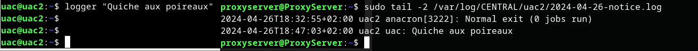

# 7.1 - Logging

Les programmes en ligne de commande produisent tout un tas de messages plus ou moins utiles, que l'on ignore bien souvent mais qui peuvent s'avérer indispensables pour le debugging ou la traçabilité.

Le problème, c'est que les *daemons* tournent par définition en tâche de fond, donc leurs journaux ne sont pas directement affichés dans votre terminal. Certains écrivent dans des fichiers rien que pour eux spécifiés dans leur configuration, d'autres envoient leurs journaux à des services spécialisés...

Nous allons donc nous intéresser à ces fameux *logs*, qui nous paraissent encombrants jusqu'au moment où on a besoin d'eux.

+ [7.1.1 - Syslog](logging.md#711-syslog)
+ [7.1.2 - Inspection des logs](logging.md#712-inspection-des-logs)
+ [7.1.3 - Rotation des logs](logging.md#713-rotation-des-logs)
+ [7.1.4 - Pour aller plus loin - Aggrégation et analyse des logs](logging.md#714-pour-aller-plus-loin---aggrégation-et-filtrage-des-logs)


## 7.1.1 - Syslog
*Syslog* est un service et un protocole réseau de courtage de *logs*. 

Il est incontournable en admin sys et réseau.

### Principe

+ Les applications qui tournent sur ton OS envoient leurs messages **à un démon Syslog local**, qui sait ensuite quoi faire avec ces messages :
    - Les stocker dans des fichiers, localement ...
    - Les ignorer ...
    - Les transférer à un autre serveur Syslog ...
+ Sur une infrastructure avec plusieurs serveurs, on choisit généralement de rediriger les logs vers un serveur central dédié au *logging*, tout en gardant, éventuellement, une copie locale des logs directement sur le serveur.
    - Cette architecture centralisée permet :
        * D'avoir accès aux **journaux de tous les hôtes en un même endroit** - pratique pour le débugging et l'aggrégation de logs lorsque plusieurs services dépendent les uns des autres
        * De mettre en place des **politiques de [rotation](#713---rotation-des-logs), de stockage et de sauvegarde très poussées pour les logs**
        * D'appliquer une **même config Syslog simpliste** à tous les autres hôtes de l'infra : "remonte tous tes logs au serveur central" - et d'avoir une **configuration complexe à maintenir uniquement au niveau du serveur central**.
    - Garde à l'esprit qu'un serveur de *logging* central peut avoir des **besoins colossaux** en termes **d'espace de stockage** et de **bande passante**.

#### Severity et Facility
*Syslog* classe les événements par gravité (**_severity_**) et source (**_facility_**, en quelque sorte la "partie du système" .concernée par le message).

Cela permet ensuite au service de **sélectionner tels messages** pour leur **appliquer telle action**. Par exemple ...

+ En distinguant par *facility*, on pourrait **écrire séparément, dans des fichier spécifiques**, tous les messages concernant les services mail, et tous les messages concernant des connexions d'utilisateurs au système.
+ En distinguant par *severity*, on pourrait être encore plus granulaires, en rangeant dans un fichier les messages d'erreur concernant les mail, et dans un autre tous les messages informationnels.


+ Il y a **8 niveaux de _severity_**. Classés par ordre de gravité décroissante, cela donne :
    - 0 : *emergency* - urgence, système inutilisable
    - 1 : *alert* - alerte, une action doit être prise immédiatement
    - 2 : *crit* - critique
    - 3 : *err* - erreur 
        * Le type de message auquel vous vous intéresserez le plus souvent
        * (Typiquement, une erreur qui empêche un service de démarrer)
    - 4 : *warn* - avertissement
    - 5 : *notice* - événement normal mais significatif
    - 6 : *info* - informationnel
    - 7 : *debug* - débogage. 
        * En général, cela correspond aux messages émis uniquement quand le programme est lancé ponctuellement dans le mode le plus "verbose" possible, à des fins de débugging (comprendre ce qu'il se passe quand un utilisateur se connecte ...).
        * Il faut éviter de logger trop d'informations inutiles - cela occupe beaucoup d'espace disque sur les serveurs de logs ainsi que de la bande passante.
+ Quelques exemples de *facilities* :
    - 0 : *kern* - messages du kernel
    - 2 : *mail*
    - 3 : *daemon* - facility utilisée par défaut par de nombreux *daemons* qui n'ont pas leur facility dédiée (*freeradius* par exemple)
    - 13 : *security* - messages de sécurité
    - 16-23 : *local0*-*local7* - réservées à un usage personnalisé
    - [Liste des facilities :](https://techdocs.broadcom.com/us/en/symantec-security-software/web-and-network-security/security-analytics/8-2-1/_reference_home/syslog.html)

### Aspects réseau
+ **Port** et protocole de **transport**
    - Historiquement, Syslog utilisait *514/udp*
        * Livraison en mode non-fiable. Des messages peuvent être perdus
        * Plus performant
        * Peut provoquer de la congestion sur le réseau
    - Aujourd'hui, on préfère utiliser __*514/tcp*__
        * Livraison fiable
        * Délais plus importants
        * Contrôle de congestion
+ Les flux de logs sont un **flux sensible**.
    - Les messages de logs peuvent révéler des informations sensibles sur votre SI ou des informations personnelles appartenant à vos utilisateurs.
    - Ils devraient transiter sur le **réseau d'administration** (celui que vous utilisez pour SSH) et non par le réseau de production.
    - On peut éventuellement sécuriser le trafic Syslog en utilisant **TLS**.
+ Un logging excessif peut nuire au performances du réseau. A surveiller !

### Configuration (rsyslog)
<details><code>rsyslog</code> (<i>Rocket-fast Syslog</i>) est l'implémentation de <i>daemon</i> <i>Syslog</i> la plus populaire.

Une alternative est `syslog-ng` - mais préférez `rsyslog`.
</details>

<details>Nous allons voir, à travers un exemple, comment configurer un <i>"client"</i> Syslog, qui ne fera que remonter des logs, et un <i>"serveur central"</i> <i>Syslog</i>, qui leur appliquera des <b>actions</b>.

+ Pour cet exemple, je supposerai que tu disposes de **deux systèmes** (pourquoi pas deux VMs) capables de **communiquer entre eux**.
+ Tu auras besoin du paquet `rsyslog` 
+ Les fichiers de config d'`rsyslog` sont `/etc/rsyslog.conf` et `/etc/rsyslog.d/*.conf`
+ Après toute modification des fichiers de config, redémarre le service `rsyslog` pour qu'elles soient prises en compte.
    - Pense à vérifier le statut du service avec `systemctl` et ses journaux avec `journalctl` en cas de problème.

#### Comprendre la syntaxe des règles rsyslog
<details>

+ La syntaxe de base d'une règle est **`<facility>.<severity> <action>`**.
    - NB : Les niveaux de sévérité sont **hiérarchiquement inclusifs**. En effet, `.<severity>` va sélectionner les logs A PARTIR d'une sévérité *severity*, c'est à dire avec le niveau *severity* OU PIRE.
      * Par exemple, `*.err` (3) sélectionnera aussi les messages de severity `crit` (2), `alert` (1) et `emerg` (0). 
      * Pour sélectionner EXACTEMENT un niveau de sécurity, il faut utiliser l'opérateur `.=` : `<facility>.=<severity> <action>`
    - `mail.err -/var/log/mail.err`
      * Envoie tous les logs de la facility mail, ayant la sévérité `err` ou pire, dans le fichier `/var/log/mail.err`
      * NB : précéder un chemin de fichier par le caractère `-` rend l'**écriture asynchrone.**
        * Le démon bufferise les logs en mémoire pour batcher leur écriture, c'est-à-dire qu'il n'écrit plus directement le message dès qu'il le reçoit, mais attend un court instant au cas où il recevrait d'autres messages. Ainsi, il peut écrire plusieurs messages en une seule opération d'écriture sur disque.
        * **Avantage** : Meilleure durée de vie pour les disques, surtout les SSD dont les performances se dégradent au fil des écritures.
        * **Inconvénient** : Les logs sont seulement en mémoire vive pendant un court instant. Si jamais un incident causait le crash du service, du système ou l'extinction de la machine, les logs seraient perdus à jamais.
    - `security,authpriv.* -/var/log/security`
        * Tous les logs des *facilities* `security` et `authpriv`, quelle que soit leur sévérité, écrits dans le fichier `/var/log/security` de manière asynchrone.
    - `*.err @@syslog.lab.local:514`
        * Envoie tous les logs de sévérité *err* ou pire au serveur Syslog `syslog.lab.local` sur le port 514/**tcp**.
        * Pour du UDP, on mettrait une seule arobase `@`.
+ On peut combiner plusieurs sélections en une seule règle avec l'opérateur `;` :
    - `kern.err;mail.info;daemon,ftp.warn @@syslog.lab.local:514`
+ On peut aussi utiliser le niveau de sévérité `none` pour déselectionner des logs sélectionnés par les expressions précédentes, pour exprimer un "SAUF" :
    - `*.*;auth,authpriv.none -/var/log/messages`
        * Inscrit tous les logs, SAUF ceux des facilities `auth` et `authpriv`, dans `/var/log/messages` de façon asynchrone.
+ Enfin, des *property-based filters* offrent d'autres possibilités de filtrage des logs :
    - `:msg, contains, "certificate" <action>` : *exact match* sur le contenu du message
    - `:msg, !contains, "SUCCESS" <action>` : négation avec l'opérateur `!`
    - `:msg, eregex, "gid=2[0-9][0-9]" <action>` : *Extended regex match* sur le contenu du message
    - `:fromhost-ip, startswith, "172.16." <action>` : *Match* sur les deux premiers octets de l'@IP source du message
    - Pour voir toutes les propriétés disponibles : `man rsyslog.conf | grep -A100 'PROPERTY REPLACER'`

</details>


#### "Client" rsyslog
<details>

Modifier `/etc/rsyslog.conf` :

+ Les modules `imuxsock` et `imklog` doivent être activés :
    - ```s
            module(load="imuxsock")     # recueillir les logs locaux arrivant sur le socket /dev/log
            module(load="imklog")       # recueillir les logs du kernel arrivant sur le buffer de messages du noyau /dev/kmsg
        ```
    - Si ces lignes sont présentes dans la config par défaut, mais commentées avec un '#', vous devez les décommenter.
+ Trouver la section *"Rules"* du fichier. Définir une règle qui remonte tous les messages au serveur de logs central :
    - ```s
            ###############
            #### RULES ####
            ###############
            *.* @@syslog.lab.local:514  # "Quelle que soit la facility, quelle que soit la severity, envoyer le message au serveur Syslog syslog.lab.local:514 (TCP)"
            # Remplacez par l'IP ou le FQDN de votre serveur de logs central

                # @@ : transport TCP
                # ç'aurait été juste @ si le serveur central utilisait UDP
        ```

</details>

#### "Serveur central" rsyslog
<details>

Créer un dossier `/var/log/CENTRAL` (root:root, 0750). Sous ce répertoire, nous allons stocker les logs de chaque serveur surveillé dans un dossier portant son nom, grâce à une règle Syslog.

Créer le fichier `/etc/rsyslog.d/remote.conf`. Y inscrire le contenu suivant :

+ ```s
        $ModLoad imtcp.so 
        #charger le module : Input Module TCP
        # (recueillir des logs Syslog arrivant sur une socket TCP)

        $InputTCPServerRun 514 # Lancer le serveur TCP, en écoutant sur le port 514
    ```
+ ```s
        $template RemoteLogs,"/var/log/CENTRAL/%HOSTNAME%/%$NOW%-%syslogseverity-text%.log"
        # Définir un modèle de chemin "RemoteLogs", de la forme :
            # /var/log/CENTRAL/<nom-du-serveur-surveillé>/<yyyy-mm-dd>-<severity>.log
    ```
+ ```s
        ###############
        #### RULES ####
        ###############
        *.* -?RemoteLogs 
        & stop
    ``` 
    - `?RemoteLogs` : applique l'action *"écrire dans le fichier dont le chemin est obtenu en évaluant le template RemoteLogs"*
    - Préfixer un fichier avec `-` : permet d'**écrire de manière asynchrone**, c'est-à-dire, **ne pas écrire directement quand on reçoit le message** mais attendre un peu au cas où il y en ait d'autres pour pouvoir **en écrire plusieurs en une seule opération de disque**. C'est capital pour allonger la durée de vie des disques durs !
    - `& stop` : indiquer qu'on en a terminé avec les logs sélectionnés, pour éviter qu'ils ne soient traités par d'autres règles (en l'occurence, les règles de logging locales définies dans `/etc/rsyslog.conf`).
+ N'oubliez pas d'**ouvrir le port 514/tcp** sur le pare-feu de l'hôte qui joue le rôle de serveur central.

</details>


#### Vérifier la configuration

<details>

+ Emettre un message bidon côté "client" : `logger "Quiche aux poireaux"`
    - La commande `logger` sert à envoyer un message au démon Syslog local - pratique pour tester vos règles.
    - La *severity* par défaut est *notice* (5). Vous pouvez spécifier une *priority* de votre choix : `logger -p err "Pizza à l'ananas"`
+ Côté "serveur central", vous devez pouvoir trouver le fichier `/var/log/CENTRAL/<hostname-client>/$(date +%Y-%m-%d)-notice.log`
+ Il doit contenir le message de test que vous avez envoyé.
    - 

</details>

**NB :** Cette configuration n'était qu'un exemple simpliste. Dans une vraie configuration, on pourrait avoir des fichiers distincts pour chaque *facility*, grouper plusieurs niveaux de sévérité ensemble, envoyer les logs de sécurité à un serveur différent, ignorer certaines classes logs ...

</details>

#### Cohabitation entre Rsyslogd et Journald
<details>

En plus de Syslog, il faut connaître l'existence de `journald`, qui est un autre démon de journalisation fourni par la suite *Systemd* et qui cohabite la plupart du temps avec un démon *Syslog*. Nous avions déjà écrit quelques paragraphes sur `journald` dans la partie [*4 - Gestion des services*](#../4-gestion-des-services/services.md#journald).

Contrairement à `rsyslogd`, `journald` ne stocke pas les messages au format texte mais dans un format tabulaire - les logs ne sont donc pas directement lisibles en ouvrant un fichier, il faut utiliser l'utilitaire `journalctl`. 

`journald` a sa propre configuration indépendante de celle de Syslog, et son propre système de [rotation](#713---rotation-des-logs).

Sur presque toutes les distributions modernes, `journald` est installé par défaut, et recueille exactement les mêmes logs qu'une installation vierge d'`rsyslogd` (à savoir, les messages du kernel et les logs arrivant sur `/dev/log`). De plus, les deux services loggent par défaut localement - il y a donc une copie redondante des mêmes données, ce n'est pas optimal.

Il est possible de **<u>modifier la manière dont `journald` et `rsyslogd` cohabitent</u>** :
+ (**Désactiver le stockage persistent des logs `journald`**)[https://access.redhat.com/articles/4058681] car on a stocke autrement une copie locale des logs envoyés au serveur de logs central et déjà stockés localement par le démon syslog local.
    - Ainsi, c'est uniquement `rsyslog` qui s'occupera du stockage persistent des logs locaux. `journalctl` sera toujours utilisable mais que sur les données du boot actuel, en mémoire vive.
    - Ne désactivez tout de même pas complètement `journald` car il est pratique pour le troubleshooting.
+ **Désactiver le stockage persistent des logs `rsyslog`** : il suffit de ne préserver dans la configuration d'`rsyslog` que les règles qui envoient les logs au serveur de logs central, et de supprimer toutes les autres règles qui écrivent dans des fichiers locaux. 
    - Vous pouvez très bien procéder au cas par cas si vous souhaitez garder certains fichiers locaux tenus par `rsyslog`.
    - Ainsi, c'est uniquement `journald` qui s'occupera du stockage persistent des logs locaux et `rsyslogd` ne fera qu'en transférer une copie au serveur de log central.
    - *Personnellement, c'est la méthode que je préfère car je trouve `journald` plus pratique pour du troubleshooting rapide grâce à son format de données structuré.*
+ Il est <u>déconseillé de désactiver complètement le stockage persistent de logs locaux</u>. C'est pratique d'avoir accès aux logs directement lorsque l'on est connecté au serveur qui pose problème.

</details>

## 7.1.2 - Inspection des logs
### Commandes utiles
<details>

+ `tail -f`
    - Pour suivre un fichier de logs en live
    - `sudo tail -f /var/log/messages`
+ `tail -10`
    - Afficher seulement les 10 lignes les plus récentes
+ `grep`
    - Pour **filtrer** les logs avec des mots-clefs ou des expressions régulières
    - `sudo cat /var/log/messages | grep cert` : messages contenant `cert`
    - `sudo cat /var/log/messages | grep -E 'Apr 27 19:[0-9][0-9]:[0-9][0-9]'` : messages du 27 Avril entre 19 et 20h
    - `sudo dmesg | grep -i usb` : messages du kernel contenant "USB", insensible à la casse
+ `more`, `view` :
    - Pager, pour naviguer dans les logs. 
    - Possibilités de scroll, de recherche de mots clefs ...
+ `journalctl` : Consulter et gérer les logs journald. Voir [4 - Gestion des services : journald](#../4-gestion-des-services/services.md#journald).
    - `journalctl -feu <unit>` : logs d'un service , timer, socket ... *systemd*, en live
    - `journalctl -p err` : *Severity* `err` ou pire.
    - `journalctl --since 2024-04-25 --until 2024-04-28` : Entre deux dates
    - `journalctl --since 10:00 --until 10:30`
    - `journalctl _UID=1000` : logs concernant l'utilisateur d'UID 1000. De nombreux autres paramètres comme celui-ci sont disponibles, cf manpages.
    - `journalctl -n10` : 10 derniers messages
    - `journalctl -k` ou `--dmesg` : messages du *kernel*
    - `journalctl -b-2` : logs de l'avant, avant dernière session (-2 : deux boots avant)
        * Pour afficher la liste des boots : `journalctl --list-boots`
</details>

### Principaux fichiers de logs
<details>

`/var/log/`...

+ Informations/debug
    - `syslog`
        * Tout sauf les logs des facilities *authpriv* et *auth*
    - **`messages`**
        * Tout jusqu'à la sévérité `info` (6), sauf pour certaines facilities comme *cron* et *authpriv*. Se référer aux règles de `/etc/rsyslog.conf`
    - `debug`
        * Tous les log avec la sévérité `debug`
+ Kernel, Boot
    - `kern.log` : kernel
      * NB : Il est plus pratique de rechercher des messages du kernel à l'aide des commandes `dmesg` ou `journalctl -k`
    - `boot.log` : messages générés durant le boot, y compris ceux du kernel. Couvre les messages générés entre le démarrage du noyau et le moment où le système atteint la *target systemd* par défaut.
+ Daemons/services
    - **`daemon.log`** (services qui n'ont pas leurs propres fichiers de log)
    - `mail.log` (services mail)
    - **`apache/access.log`** (exemple de service avec son propre fichier voire son propre répertoire de logs, défini par la config du service)
    - Utiliser **`journalctl`** peut être très pratique pour consulter les logs des services `systemd` : `journalctl -feu <service>`
+ Auth/Login
    - **`auth.log`** : **tentatives de login** (succès & échec), utilisations de la commande `sudo`, cronjobs
    - `utmp`, `wtmp` : logins réussis (format binaire, il faut utiliser la commande `who`)
    - `btmp` : déconnexions, logins échoués (e.g. bruteforce via ssh) (format binaire, il faut utiliser la commande `utmpdump` ou `last -f`)
    - `faillog` : logins échoués (format binaire, il faut utiliser la commande `faillog -a`)
    - `lastlog` : logins récents (format binaire, il faut utiliser la commande `lastlog`)
+ Sécurité avancée
    - `audit/audit.log` : logs du service `auditd`, qui recueille avec un très haut niveau de détail les événements qui se passent sur le système (accès aux fichiers, commandes exécutées, appels systèmes ...). Si vous utilisez un module de sécurité comme SELinux ou AppArmor, leurs logs se trouvent aussi ici et vous aurez très, très souvent besoin de les consulter, souvent avec des outils spéciaux plutôt qu'à la main.
        * NB : si SELinux est utilisé mais pas `auditd`, le fichier de logs utilisé est `/var/log/avc`

NB : Selon votre distribution, vous n'aurez pas forcément tous ces fichiers, ou bien ils peuvent porter un autre nom.
</details>

## 7.1.3 - Rotation des logs
<details><summary>C'est bien beau d'emmagasiner dans les moindres détails tout ce qu'il se passe sur votre serveur ... mais tout ça finit par s'accumuler, jusqu'au trop plein.</summary>

La rotation de logs est là pour ça. Ils s'occuperont automatiquement des problèmes suivants :
+ **Tous les combien faut-il créer un nouveau fichier**/dossier de logs ?
    - (NB : Vous pouvez aussi vous occuper de ce problème directement avec Syslog, grâce aux Templates)
    - On peut aussi choisir de créer un nouveau fichier de logs lorsqu'il dépasse une certaine taille sur disque ou un certain nombre de lignes plutôt qu'un âge.
+ **Comment nommer les anciens fichiers** de logs ?
    - Ils peuvent être nommés avec une date, avec un indice d'ancienneté (`mail.log`, `mail.log.1`, `mail.log.2` ...)
+ A partir de quel âge et comment **compresser** les anciens logs ?
    - Par exemple : "garder les 5 derniers fichiers de logs en texte clair et compresser les autres avec l'algorithme GZip"
+ A partir de quel âge peut-on carrément **supprimer les anciens logs** ?

Tous ces problèmes peuvent bien sûr avoir des réponses différentes pour différentes classes de logs.

### Configuration
#### Syntaxe
<details>

Jetez un œil aux fichiers de config `/etc/logrotate.conf` et `/etc/logrotate.d/rsyslog`.

Analysons ce second fichier de config (le contenu peut varier selon votre distribution) :
```s
/var/log/syslog # sélection de plusieurs fichiers pour leur appliquer de mêmes directives
/var/log/mail.log
/var/log/kern.log
/var/log/auth.log
/var/log/user.log
/var/log/cron.log
{
	rotate 4 # garder 4 fichiers de log max, les plus anciens seront supprimés
	weekly # rotation une fois par semaine
	missingok # ne pas lever d'erreur si un fichier est manquant
	notifempty # ne pas provoquer de rotation du fichier s'il est vide
	compress # compresser les anciens fichiers au format GZip
	delaycompress # repousser la compression à la prochaine rotation
	sharedscripts # Les scripts 'postrotate' seront exécutés une seule fois pour tous les logs au lieu de une fois pour chaque log
	postrotate # Invocation de scripts personnalisés à exécuter après la rotation, par exemple pour sauvegarder les logs qui vont être supprimés sur un autre serveur
		/usr/lib/rsyslog/rsyslog-rotate # un script qui prévient rsyslog qu'une rotation a eu lieu
	endscript # fin des scripts post-rotation
}

```
</details>


#### Exemple
<details>

Nous allons utiliser `logrotate` pour faire la rotation des logs sur notre serveur de logs central.

Le paquet `logrotate` doit être installé. Le service `logrotate` doit être démarré et installé.

La config par défaut se trouve dans `/etc/logrotate.conf` et la config spécifique à chaque fichier de log dans `/etc/logrotate.d/*.conf`.

Premièrement, nous allons changer la config `rsyslog` du serveur de logs central pour ne plus avoir la date dans les noms de fichiers - ce sera `logrotate` qui ajoutera une date et uniquement pour les anciens logs.

+ @`/etc/rsyslog.d/remote.conf`
    - ```s
        $template RemoteLogs,"/var/log/CENTRAL/%HOSTNAME%/%syslogseverity-text%.log
            # on a enlevé "%$NOW%-" du chemin
        ```
    - Il faut redémarrer le service `rsyslog`

Supprimons le contenu de `/var/log/CENTRAL/` pour repartir sur ces nouvelles bases.

+ `rm -rf /var/log/CENTRAL/*`

Vérifions que les noms des fichiers de logs ne contiennent maintenant plus de date.

+ `logger "Toast"` sur le "client" Syslog
+ `ls -l /var/log/CENTRAL/<hostname-client>/` sur le serveur
  
Créons maintenant une règle `logrotate` pour le répertoire de logs central.
+ Créer le fichier `/etc/logrotate.d/central` et y inscrire :
    - ```s
        /var/log/CENTRAL/*/*.log
        {
            daily # rotation journalière
            rotate 5 # garder seulement les 5 derniers fichiers de log. Les plus anciens seront supprimés.
            compress # compresser les fichiers plus anciens
            delaycompress # repousser la compression des anciers fichiers à la prochaine rotation au lieu de les compresser directement
            dateext # écrire la date dans le nom des anciens fichiers
            dateformat -%Y-%m-%d # date au format yyyy-mm-dd
            notifempty #ne pas rotate si le fichier est vide
            missingok #ne pas remonter d'erreur si un fichier est manquant
            postrotate 
		        /usr/lib/rsyslog/rsyslog-rotate
            endscript
	        endscript
        }
        ```
+ Redémarrer le service `logrotate`.

Pour tester votre configuration sans attendre 5 jours, vous pouvez procéder comme suit en changeant la date du serveur central et en forçant l'exécution de logrotate (attention, méthode peu orthodoxe à proscrire en situation réelle).

+ Client :
    - `logger 28/04` 
+ Serveur :
    - `logrotate --force /etc/logrotate.conf`
    - `timedatectl set-time 2024-04-29`
    - `ls -l /var/log/CENTRAL/<hostname-client>/`
+ Client :
    - `logger 29/04`  ...

</details>

</details>

## 7.1.4 - Pour aller plus loin : Aggrégation et analyse des logs
Tout Doux

+ Graylog, Splunk
+ ELK
+ SIEMs
+ Kafka