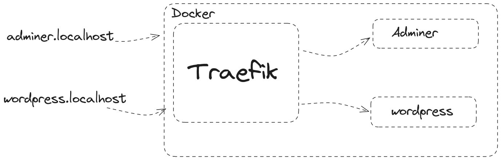
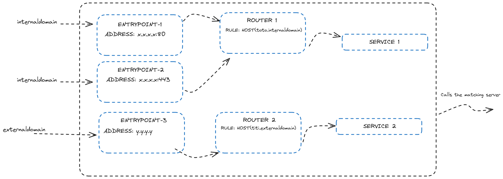

# 8.2 Docker Compose

## 8.2.1 Les bases de Docker Compose

<details><summary>Détails</summary>

Docker compose permet de définir et de gérer des applications multi-conteneurs. Il permet de définir les services, les réseaux et les volumes dans un fichier YAML.  

Il permet donc de configurer les paramètres d'un conteneur, de définir les dépendances entre les conteneurs et de les lancer en une seule commande, d'avoir plusieurs conteneurs.

#### La structure de base d'un fichier `docker-compose.yml`

```yaml
version: '3.8'

x-common-varibles:

services:
  service1:
    image: image1
    ports:
      - "8080:80"
    volumes:
      - /path/to/volume:/container/path
    networks:
      - network1
    depends_on:
      - service2

  service2:
    image: image2
    ports:
      - "8081:80"
    volumes:
      - /path/to/volume:/container/path
    networks:
      - network1

networks:
    network1:
        driver: bridge

volumes:
    volume1:
        driver: local
```

Explications:
- `version`: la version de la syntaxe de Docker Compose
- `services`: les services à lancer
- `service1`, `service2`: les noms des services
- `image`: l'image à utiliser
- `ports`: les ports à exposer
- `volumes`: les volumes à monter
- `networks`: les réseaux à utiliser
- `depends_on`: les dépendances entre les services
- ...
  
#### Les commandes de base

- `docker compose up`: pour lancer les services
- `docker compose down`: pour arrêter les services
- `docker compose ps`: pour afficher les services
- `docker compose logs`: pour afficher les logs des services
- `docker compose exec`: pour exécuter une commande dans un service
- ...

Il existe aussi des options (comme avec la commande docker):

- `docker compose up -d`: pour lancer les services en arrière-plan
- `docker compose up --build`: pour construire les images avant de lancer les services
- ...

> Vous pouvez consulter la documentation officielle de Docker Compose pour plus d'informations.
> [Docker Compose](https://docs.docker.com/compose/)

</details>

<details><summary>Le format `yaml`</summary>

Docker compose utilise le format `yaml` pour définir les services, les réseaux et les volumes.

Le format `yaml` est un format de sérialisation de données qui est facile à lire et à écrire pour les humains. Il est souvent utilisé pour écrire des fichiers de configuration.

#### Les règles de base

- Les données sont indentées pour définir la structure
- Les données sont séparées par des deux-points `:`
- Les listes sont définies par des tirets `-`
- Les commentaires commencent par un dièse `#`
- Les chaînes de caractères sont définies par des guillemets simples `'` ou doubles `"`
- ...

</details>

---

<details><summary>Exercices</summary>

<details><summary>Exercice 1</summary>

Créez un fichier `docker-compose.yml` pour lancer un serveur web (Nginx) et un serveur de base de données (MySQL).

<details><summary>Solution</summary>

```yaml
version: '3.8'

services:
  web:
    image: nginx:latest
    ports:
      - "8080:80"
    volumes:
      - /path/to/volume:/usr/share/nginx/html
    networks:
      - network1

  db:
    image: mysql:latest
    ports:
      - "3306:3306"
    volumes:
      - /path/to/volume:/var/lib/mysql
    networks:
      - network1

networks:
    network1:
        driver: bridge
```

</details>

</details>

</details>

## 8.2.2 Projet WordPress

Le but de cet exercice sera de déployer un site WordPress avec une base de données MySQL (mariadb) et un outil de gestion graphique de la base de données (adminer) et l'utilisation d'un reverse proxy (traefik).

Avec l'utilisation d'un fichier `docker-compose.yml`.
### MariaDB

Créez le service `db` pour la base de données MariaDB.
Avec comme consignes :
- Utilisez l'image `mariadb:latest`
- Créez un volume pour la base de données (`/var/lib/mysql`)
- Nommez le conteneur par exemple `dbdocker`
- Nommez le service `db`

Il ne faut pas oublier d'utiliser les variables d'environnement pour configurer la base de données :

- `MYSQL_ROOT_PASSWORD`: le mot de passe de l'utilisateur root
- `MYSQL_DATABASE`: le nom de la base de données
- `MYSQL_USER`: le nom de l'utilisateur
- `MYSQL_PASSWORD`: le mot de passe de l'utilisateur

### Adminer

Créez le service `adminer` pour l'outil de gestion graphique de la base de données.
Avec comme consignes :
- Utilisez l'image `adminer:latest`
- Nommez le conteneur par exemple `adminerdocker`
- Utilisez l'option `depends_on` pour définir la dépendance avec le service `db`
- Exposez le port `8080`

### WordPress

Créez le service `wordpress` pour le site WordPress.
Avec comme consignes :

- Utilisez l'image `wordpress:latest`
- Créez un volume pour le site (`/var/www/html`)
- Nommez le conteneur par exemple `wordpressdocker`
- Utilisez l'option `depends_on` pour définir la dépendance avec le service `db`
- Exposez le port `80`

Il ne faut pas oublier d'utiliser les variables d'environnement pour configurer WordPress :

- `WORDPRESS_DB_HOST`: le nom du service de la base de données
- `WORDPRESS_DB_NAME`: le nom de la base de données
- `WORDPRESS_DB_USER`: le nom de l'utilisateur
- `WORDPRESS_DB_PASSWORD`: le mot de passe de l'utilisateur

### Traefik

> Vous allez mettre à jour le fichier `docker-compose.yml` pour ajouter le service `traefik`. Qui est un reverse proxy.

> Un reverse proxy est un serveur qui se situe entre les clients et les serveurs. Il permet de rediriger les requêtes des clients vers les serveurs appropriés, ce qui permet de répartir la charge entre les serveurs ou d'avoir plusieurs serveurs web sur une seule adresse IP.

La documentation de Traefik est disponible sur le site officiel : [Traefik](https://doc.traefik.io/traefik/)

Créez le service `traefik` pour le reverse proxy Traefik.
Avec comme consignes :

- Utilisez l'image `traefik:v2.10`
- Nommez le conteneur par exemple `traefikdocker`
- Exposez le port `80`, `443` et `8080` (pour le pannel)
- Vous devez donner à Traefik un accès au socket Docker pour qu'il puisse écouter les événements Docker et mettre à jour sa configuration automatiquement. Pour cela, vous devez monter le socket Docker dans le conteneur Traefik. Vous pouvez utiliser le volume `/var/run/docker.sock:/var/run/docker.sock`
- Vous pouvez utiliser les labels pour configurer Traefik. Par exemple, pour configurer le service `wordpress`, vous pouvez ajouter les labels suivants :

  ```yaml
  labels:
  - "traefik.enable=true"
  - "traefik.http.routers.wordpress.rule=Host(`wordpress.localhost`)"
  - "traefik.http.services.wordpress.loadbalancer.server.port=80"
  - "traefik.http.routers.wordpress.entrypoints=web"
  ```
  > Cela ajoute pour l'entrypoint `web` un routeur pour le service `wordpress` avec la règle `Host('wordpress.localhost')` et le port `80`.

- Rajouter les labels pour les services `adminer` et `wordpress` pour les exposer. (Avec par exemple comme host `adminer.localhost` et `wordpress.localhost`)
  

- Vous pouvez ajouter cette commande pour le service traefik afin d'activer le pannel et d'exposer les ports:
  
    ```yaml
    command: --api.insecure=true --providers.docker=true --providers.docker.exposedbydefault=false --entrypoints.web.address=:80 --entrypoints.websecure.address=:443
    ```


> Traefik est un outil puissant pour gérer les routes et les services. Vous pouvez consulter la documentation officielle pour plus d'informations.
> 