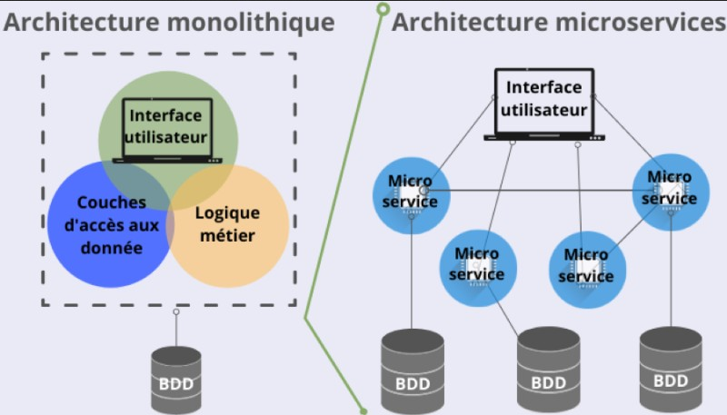
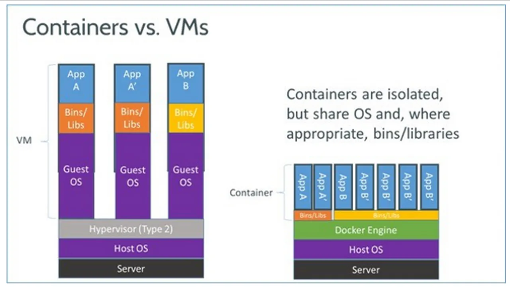

# 8.1 - Introduction à l'architecture microservices

## 8.1.1 Qu'est-ce qu'une architecture microservices

<details><summary>Principe <b> général </b> d'une architecture microservices</summary>

Un microservice est une application qui est conçue pour être déployée et gérée de manière indépendante. Chaque microservice est une application autonome qui peut être déployée, mise à jour, et équilibrée de manière **indépendante**. Les microservices sont généralement conçus pour être **petits et spécialisés**, et ils communiquent entre eux via des API. 

On le compare souvent à une architecture monolithique, où toutes les fonctionnalités sont regroupées dans **une seule application**. Les microservices permettent de découper une application en plusieurs services indépendants, ce qui facilite la maintenance, le déploiement, et l'évolutivité de l'application. 

Jusqu'à présent, nous avons principalement travaillé avec des applications monolithiques, mais les microservices sont de plus en plus populaires, car ils permettent de développer des applications plus flexibles, évolutives, et résilientes.



</details>

#### Pourquoi utiliser une architecture microservices ?

- **Flexibilité** : Les microservices permettent de découper une application en plusieurs services indépendants, ce qui facilite la maintenance, le déploiement, et l'évolutivité de l'application.
- **Évolutivité** : Les microservices permettent de développer des applications plus flexibles, évolutives, et résilientes.
- **Résilience** : En cas de panne d'un microservice, les autres services continuent de fonctionner normalement.
- **Déploiement continu** : Les microservices permettent de déployer et mettre à jour des services de manière indépendante.
- ...

> Nous allons voir dans les prochaines parties comment **Docker** peut vous aider à mettre en place une architecture microservices.

## 8.1.2 Introduction à Docker

Docker est une plateforme open-source qui permet de **développer**, **déployer**, et **exécuter** des applications dans des conteneurs. 

<details><summary>C'est quoi un <b> conteneur </b> ?</summary>

Un conteneur est une unité logicielle qui contient une application et toutes ses dépendances. Les conteneurs sont légers, portables, et sécurisés, et ils permettent d'isoler une application de son environnement. 

Les conteneurs sont similaires aux machines virtuelles, mais ils sont plus légers et plus rapides à démarrer. Les conteneurs partagent le noyau (*kernel*) de l'hôte, ce qui les rend plus efficaces en termes de ressources. (*Bien évidemment, ça n'empêche pas les *kernel panic*...*)  



Il existe plusieurs technologies de conteneurisation, mais Docker est l'une des plus populaires. (et son deamon containerd)

* De façon plus fondamentale, docker utilise un outil appelé `containerd` pour gérer les conteneurs. Ce *runtime* est responsable de la création, de la gestion, et de la destruction des conteneurs. Ce dernier est lui-même géré par un *deamon* appelé `dockerd`.  

   * `containerd` est un *runtime* de conteneurs open-source qui fournit une interface de bas niveau pour gérer les conteneurs, pour cela il vient interfacer avec le *kernel* de l'hôte en utilisant les fonctionnalités de conteneurisation du *kernel* Linux telles que `cgroups` et `namespaces`. Il le fait à travers la librairie `libcontainer` appelée par `runc`.
     * Les `cgroups` permettent de limiter les ressources utilisées par les conteneurs, tandis que les `namespaces` permettent d'isoler les processus et les ressources des conteneurs, ce sont des fonctionnalités du *kernel* Linux.

</details>

<details><summary>Principe <b>d'images</b> Docker</summary>

Une image Docker est un modèle de conteneur qui contient une application et toutes ses dépendances. Les images Docker sont créées à partir d'un fichier appelé `Dockerfile`, qui décrit comment construire l'image.

Les images Docker sont stockées dans un registre Docker, qui est un service qui permet de stocker et de partager des images Docker. Le registre Docker le plus connu est Docker Hub, qui est un service public qui permet de stocker et de partager des images Docker.

Pour exécuter une image Docker, on crée un conteneur à partir de l'image. Un conteneur est une instance d'une image Docker qui peut être exécutée, arrêtée, et supprimée.

</details>


### Installation de Docker

Pour installer Docker, vous pouvez suivre les instructions sur le site officiel de Docker : [https://docs.docker.com/get-docker/](https://docs.docker.com/get-docker/)

<details><summary>Détails</summary>

Pour installer Docker ainsi que Docker Compose le plus simplement possible, vous pouvez utiliser les commandes suivantes :

```bash
$ curl -fsSL https://get.docker.com -o get-docker.sh
$ sudo sh ./get-docker.sh
```

On peut tester l'installation de Docker en exécutant la commande suivante :

```bash
$ docker --version
Docker version 20.10.7, build f0df350
```
> La version est susceptible de changer.

</details>

### Les bases de Docker

<details><summary>Détails</summary>

#### Les commandes de base

Voici une liste des commandes Docker les plus courantes :
- `docker run` : Exécute une image Docker dans un conteneur.
- `docker search` : Recherche une image Docker dans un registre Docker.
- `docker pull` : Télécharge une image Docker depuis un registre Docker.
- `docker build` : Construit une image Docker à partir d'un fichier `Dockerfile`.
- `docker push` : Envoie une image Docker vers un registre Docker.
- `docker ps` : Affiche les conteneurs en cours d'exécution.
- `docker images` : Affiche les images Docker disponibles.
- ...

Pour plus d'informations sur les commandes Docker, vous pouvez consulter la documentation officielle : [https://docs.docker.com/engine/reference/commandline/docker/](https://docs.docker.com/engine/reference/commandline/docker/)

#### Le fichier `Dockerfile`

Le fichier `Dockerfile` est un fichier texte qui décrit comment construire une image Docker. Le `Dockerfile` contient une série d'instructions qui sont exécutées séquentiellement pour construire l'image.
Liste des instructions les plus courantes :
- `FROM` : Spécifie l'image de base.
- `RUN` : Exécute une commande dans l'image.
- `COPY` : Copie des fichiers dans l'image.
- `WORKDIR` : Définit le répertoire de travail.
- `EXPOSE` : Expose un port.
- `CMD` : Spécifie la commande par défaut à exécuter.
- ...

Pour plus d'informations sur les instructions Dockerfile, vous pouvez consulter la documentation officielle : [https://docs.docker.com/engine/reference/builder/](https://docs.docker.com/engine/reference/builder/)

</details>

<details><summary>Exercices</summary>

<details><summary>Exercice  <b> très basique </b> </summary>

1. Lancer un conteneur Docker avec l'image `hello-world` :
   ```bash
   $ docker run hello-world
   ```
   > Que fait cette commande ?

2. On peut afficher tous les conteneurs en cours d'exécution avec la commande suivante :
   ```bash
   $ docker ps -a
   ```
   > Qu'est-ce que vous voyez ? Que fait l'option `-a` ?

Bon après cette courte introduction à Docker, nous allons voir comment Docker peut vous aider à mettre en place une architecture microservices.

</details>

<details><summary>Exercice  <b> serveur web basique</b> </summary>

Vous devez déployer un serveur web; avec **persistance des données.**  

Pour cela on va utiliser deux principes de Docker : **les volumes et les réseaux.**  

<details><summary>Réponse:</summary> 

```bash
$ docker run -d --name webserver -p 80:80 -v /path/to/your/html:/usr/share/nginx/html nginx
```

Les options utilisées dans cette commande sont les suivantes :
- `-d` : Exécute le conteneur en arrière-plan.
- `--name webserver` : Donne un nom au conteneur.
- `-p 80:80` : Mappe le port 80 du conteneur sur le port 80 de l'hôte.
- `-v /path/to/your/html:/usr/share/nginx/html` : Monte un volume pour persister les données du serveur web.

</details>
</details>

<details><summary>Exercice <b> Images Docker </b> </summary>

On va crée une image Docker à partir d'un conteneur existant.  

**Objectif**: 
* Crée un conteneur à partir de l'image `nginx`.
* Ajoute un fichier `index.html` personnalisé.
* Crée une image Docker à partir du conteneur.

On peux utiliser la commande `docker commit` pour créer une image Docker à partir d'un conteneur existant.  
La commande `docker exec` permet d'exécuter une commande dans un conteneur en cours d'exécution.

<details><summary>Réponse:</summary>

1. Créez un conteneur à partir de l'image `nginx` :
   ```bash
   $ docker run -d --name webserver nginx
   ```
2. Exécutez un shell interactif dans le conteneur :
   ```bash
   $ docker exec -it webserver /bin/bash
   ```
3. Ajouter un fichier `index.html` dans le répertoire `/usr/share/nginx/html` du conteneur :
   ```bash
   $ echo "Hello, World!" > /usr/share/nginx/html/index.html
   ```
4. Quittez le shell interactif :
   ```bash
   $ exit
   ```
5. Créez une image Docker à partir du conteneur `webserver` :
   ```bash
   $ docker commit webserver mynginx
   ```
6. Exécutez un conteneur à partir de l'image `mynginx` :
   ```bash
   $ docker run -d --name mywebserver -p 80:80 mynginx
   ```
7. Testez le serveur web en accédant à l'URL `http://localhost` dans votre navigateur.
   Ou avec la commande `curl` :
   ```bash
   $ curl localhost
   Hello, World!
   ```

</details>

---

Vous allez maintenant apprendre à créer une image Docker à partir d'un fichier `Dockerfile` et à exécuter un conteneur Docker à partir de cette image.

**Objectif**:
* Créez un fichier `Dockerfile` pour construire une image Docker personnalisée.
* Construisez l'image Docker à partir de l'image de base `ubuntu`.
* Installez un serveur web `nginx` dans l'image.
* Mettre à jour le fichier `index.html` du serveur web.
* Exécutez un conteneur à partir de l'image personnalisée.

On peut utiliser la commande `docker build` pour construire une image Docker à partir d'un fichier `Dockerfile`.

<details><summary>Réponse:</summary>

1. Créez un fichier `Dockerfile` avec le contenu suivant :
   ```Dockerfile
   FROM ubuntu
   RUN apt-get update && apt-get install -y nginx
   COPY index.html /var/www/html/index.html
   CMD ["nginx", "-g", "daemon off;"]
   ```
2. Créez un fichier `index.html` avec le contenu suivant :
   ```html
   <h1>Hello, World!</h1>
   ```
3. Construisez l'image Docker à partir du fichier `Dockerfile` :
   ```bash
   $ docker build -t mynginx .
   ```
   > Le point `.` à la fin de la commande indique que le `Dockerfile` se trouve dans le répertoire courant.
4. Exécutez un conteneur à partir de l'image `mynginx` :
   ```bash
   $ docker run -d --name mywebserver -p 80:80 mynginx
   ```
5. Testez le serveur web en accédant à l'URL `http://localhost` dans votre navigateur.
   Ou avec la commande `curl` :
   ```bash
   $ curl localhost
   <h1>Hello, World!</h1>
   ```

</details>

</details>
</details>